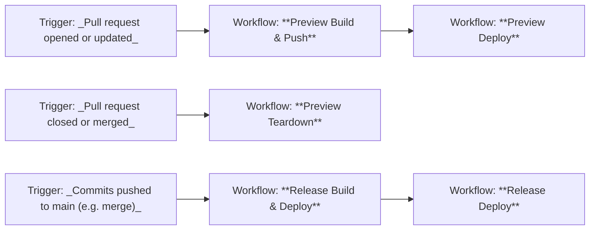

# GitHub workflows

## Table of contents

* [Overview](#overview)
* [Workflow relationships](#workflow-relationships)
* [Pull request workflows](#pull-request-workflows)
    - ["Preview Build & Push" (`preview-build.yml`)](#preview-build--push-preview-buildyml)
    - ["Preview Deploy" (`preview-deploy.yml`)](#preview-deploy-preview-deployyml)
    - ["Preview Teardown" (`preview-teardown.yml`)](#preview-teardown-preview-teardownyml)
* [Release workflows](#release-workflows)
    - ["Release Build & Push" (`release-build.yml`)](#release-build--push-release-buildyml)
    - ["Release Deploy" (`release-deploy.yml`)](#release-deploy-release-deployyml)
* [Workflow summary table](#workflow-summary-table)
* [Example usage](#example-usage)
* [Troubleshooting](#troubleshooting)
* [References](#references)

## Overview

The provider data API's CI/CD process is implemented using GitHub Actions.
Deployment into Cloud Platform is implemented using `helm` and a Helm chart.

## Workflow relationships

The workflows interact as follows:



## Pull request workflows

There are `preview-*.yml` workflows to automatically build, deploy and clean up preview
apps for each pull request. This helps developers to test their changes and PR reviewers
to review them before the pull request gets merged into `main`.

There are also `release-*.yml` workflows to automatically version, build and deploy
release apps built from `main` for shared or production usage.

### "Preview Build & Push" ([`preview-build.yml`](./preview-build.yml))

When a pull request is opened or updated, this workflow builds the project using Gradle,
runs tests, and builds a Docker image. The image is pushed to Amazon ECR container
registry so it can be deployed as a preview app.

If the pull request has the special label `no-preview`, then the process ends there,
otherwise the **"Preview Deploy"** workflow is called automatically to deploy the preview
app into the `uat` namespace.

#### Gradle build

The Gradle root project and subprojects are built using the same command-line that
developers use for local development:

```shell
  ./gradlew clean build integrationTest
```

which causes compilation, packaging (`assemble`), style-checking (`checkstyleMain`), unit
tests (`test`), and integration tests (`integrationTest`) to execute.

#### OCI image

The Docker image (which is OCI-compatible) is built using the command-line:

```shell
  ./gradlew bootBuildImage --imageName="host/namespace/repository:tag"
```

which can also be run by developers doing local development.

This is then pushed using the `docker push` command-line into Amazon ECR with two tags.
These tags are named like `pr-999` (this tag is moveable and moves each time the PR is
updated) and `pr-999-c033174` (this tag is immutable and always points at the same
version build), given that the pull request is [#999](#) with tip commit `c033174`.

#### Calling deploy

If the pull request was labelled with the label `no-preview` at the time that it was
created or updated, then the **"Preview Deploy"** workflow is not called. Otherwise,
it is called as a reusable workflow with appropriate parameters to deploy the just-built
artefacts (using the immutable tag).

### "Preview Deploy" ([`preview-deploy.yml`](./preview-deploy.yml))

After a successful build, this workflow deploys the Docker image as a temporary preview
app, allowing the changes to be tested and reviewed in a dedicated instance of the app.

#### Manual dispatch parameters

This workflow can also be invoked manually (workflow dispatch) in case, for example, you
want to deploy a preview app without needing to push a change to it (uses the latest movable
tag). When invoked manually, you choose which pull request to install.

- **PR number:** Number of the pull request to deploy as a preview app (e.g., '893' -
  no leading 'PR' or '#' needed).


### "Preview Teardown" ([`preview-teardown.yml`](./preview-teardown.yml))

When the pull request is closed or merged, this workflow removes the preview app from
the `uat` namespace and cleans up associated resources.

#### Manual dispatch parameters

This workflow can also be invoked manually (workflow dispatch) in case, for example, you
want to remove a preview app without needing to close or merge the PR. When invoked
manually, you can choose which pull request to uninstall.

- **PR number:** Number of the pull request to uninstall as a preview app (e.g., '893').


## Release workflows

Once a PR is merged into the `main` branch, the release app is tagged, built and deployed
into environments on demand. New versions of the release app are automatically deployed
into the `uat` environment if there has been any change worth deploying and, if that
deployment succeeds, into the `staging` environment. However, deployment into the `prod`
environment is currently triggered manually.

### "Release Build & Push" ([`release-build.yml`](./release-build.yml))

When the `main` branch is updated (for example, a PR is merged), this workflow examines
the set of commits since the last release tag:

* any breaking changes = **major** version increment
* any "`feat: `" commits = **minor** version increment
* any "`fix: `" commits = **patch** version increment
* no matching commits = **none** - i.e. don't build and deploy

If there is a version increment, then the workflow builds the project using Gradle, runs
tests, and builds a Docker image. The image is pushed to the Amazon ECR container
registry so it can be deployed.

If a build and push succeeds, then a Git tag is pushed to the origin and a GitHub release
with automatic release-notes is created to describe the release. Also, the
**"Release Deploy"** workflow is called as a reusable workflow with appropriate parameters
to deploy the just-built artefacts into the **uat** and **staging** environments.

#### Manual dispatch parameters

There is also the option to manually **force** a new patch release build if there have not
been any significant commits since the last release build.


#### Gradle build

Works the same as in preview apps.

#### OCI image

Works the same as in preview apps, but the only image tag pushed is `vX.Y.Z`, which is
immutable, and a Git tag and GitHub release are also created.

### "Release Deploy" ([`release-deploy.yml`](./release-deploy.yml))

After a successful build, this workflow deploys the Docker image as a release app,
intended for shared testing or production usage, depending on the environment.

#### Manual dispatch parameters

This workflow can also be invoked manually (workflow dispatch) in case, for example, you
want to deploy a release app - for example, to **prod** (which is not deployed to
automatically). When invoked manually, you specify the release tag and can choose which
environment(s) to install into.

- **Tag name:** Release tag to deploy (e.g., `v1.2.3`)
- **Environments:** Select from `uat`, `staging` and/or `prod`


## Workflow summary table

| Workflow Name            | Filename               | Trigger(s)                                        | Parameters (Manual)                                       | Variables & Secrets           | Permissions Needed                                     |
|--------------------------|------------------------|---------------------------------------------------|-----------------------------------------------------------|-------------------------------|--------------------------------------------------------|
| **Preview Build & Push** | `preview-build.yml`    | -&nbsp;PR&nbsp;opened/updated                     | - N/A                                                     | - ECR<br>- GH token           | - contents:read<br>- id-token:write<br>- packages:read |
| **Preview Deploy**       | `preview-deploy.yml`   | - Called from build<br>- Manual dispatch          | - PR num                                                  | - ECR<br>- K8s                | - contents:read<br>- id-token:write                    |
| **Preview Teardown**     | `preview-teardown.yml` | -&nbsp;PR&nbsp;closed/merged<br>- Manual dispatch | - PR num                                                  | - ECR<br>- K8s                | - contents:read                                        |
| **Release Build & Push** | `release-build.yml`    | - Push to `main`<br>- Manual dispatch             | - Force                                                   | - ECR<br>- GH token           | - contents:write<br>- id-token:write                   |
| **Release Deploy**       | `release-deploy.yml`   | - Called from build<br>- Manual dispatch          | - Tag name<br>- **uat**?<br>- **staging**?<br>- **prod**? | - ECR<br>- GH token<br>- K8s  | - contents:read<br>- id-token:write                    |

**Notes:**
- *Parameters (Manual)* lists user-selectable options in workflow dispatch.
- *Variables & Secrets* used groups of variables or secrets from GitHub repo settings.
- *Permissions Needed* describes minimum GitHub permissions required.

## Example usage

### Pull request workflows

1. Developer opens a pull request.
2. `preview-build.yml` runs: builds and pushes Docker image tags (`pr-999`, `pr-999-abc123`).
3. If PR is labeled `uat-preview` or `staging-preview`, `preview-deploy.yml` deploys app to selected environment(s).
4. Reviewer tests preview app.
5. On PR merge/close, `preview-teardown.yml` cleans up preview app.

### Release workflows

1. PR merged to `main`.
2. `release-build.yml` checks commit messages:
    - `feat:` → minor version bump
    - `fix:` → patch bump
    - breaking change → major bump
3. If bumped, builds and pushes Docker image and tags release.
4. `release-deploy.yml` called: deploys to `uat` and `staging`. `prod` is manual.

---

## Troubleshooting

**Problem:** _Preview app did not deploy._
**Solution:**
- Ensure there is not the `no-preview` label on the PR.
- If you removed the label, confirm the GitHub Actions workflow ran. Note that it is
  necessary to push a commit (after removing the label) to cause the workflow to run.
- Check [workflow logs for errors](#references).

---

**Problem:** _Release workflow did not trigger after merging to `main`._
**Solution:**
- Check if your commit message matches the expected [conventional commits](#references)
  type (`feat:`, `fix:`, etc.) for the version bump.
- If no version increment was detected, try manual dispatch with the `force` option.

---

**Problem:** _Docker image build or push failed._  
**Solution:**
- Look for errors in Gradle or Docker steps in the workflow logs.
- Ensure your branch has not exceeded the [ECR tag limit](#references).

---

**Problem:** _Preview or release app is stuck in previous state or not updated after
              workflow finishes._  
**Solution:**
- Check if the correct immutable or movable image tag was used by the deployment workflow.
- Look for [deployment errors or timeouts](#references) in workflow logs.
- Manually run teardown workflow to clean up old deployments, then redeploy.

---

**Problem:** _Release tags or GitHub Releases are not created / are missing._  
**Solution:**
- Ensure your commit messages match the expected [conventional format](#references) for
  version bumps.

---

## References

- [Conventional commits](https://www.conventionalcommits.org/en/v1.0.0/)
- [GitHub Actions documentation](https://docs.github.com/en/actions)
- [Gradle documentation](https://docs.gradle.org/)
- [Docker documentation](https://docs.docker.com/)
- [Amazon ECR documentation](https://docs.aws.amazon.com/AmazonECR/latest/userguide/what-is-ecr.html)
- [Amazon ECR tag limit documentation](https://docs.aws.amazon.com/AmazonECR/latest/userguide/tagging.html)
- [Kubernetes documentation](https://kubernetes.io/docs/home/)
- [Kubernetes troubleshooting tips](https://kubernetes.io/docs/tasks/debug/)
