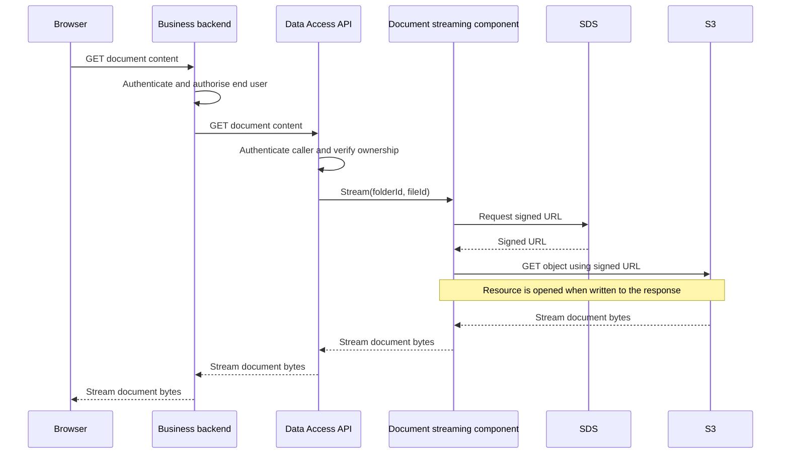
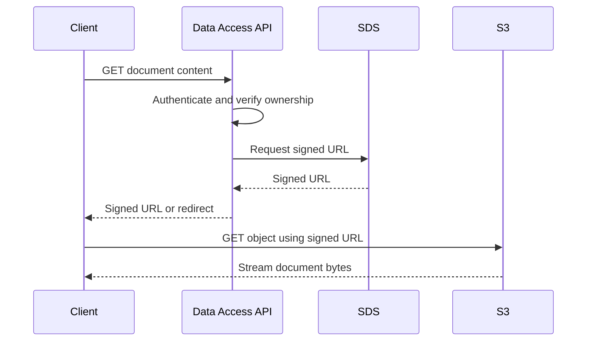

# ADR 0004: Proxy Prior Authority Document Downloads

- Status: Proposed
- Date: 2026-09-24
- Scope: `data-access-service-axon`

## Context

Prior Authority documents are stored in an S3-backed SDS bucket. SDS currently returns a
short-lived signed URL for a document rather than streaming document content from an SDS endpoint.
SDS does not plan to provide a streaming endpoint.

The Data Access API must not expose a signed storage URL to its clients. A client must download a
document through an API endpoint that authenticates the caller and verifies that the requested
document belongs to the requested Prior Authority before any document content is retrieved.

The clients of this service are business-team backend applications, not browsers or other
end-user clients. When a business team needs to make a document available to an end user, its
backend must call this endpoint and proxy the streamed content through its own authorised
application boundary. That downstream application remains responsible for its user-facing
authorisation and for any browser-specific response behaviour.

S3 can stream an object without loading the complete object into memory. However, direct S3
streaming would require exposing a signed URL, AWS credentials, or another client-facing S3 access
mechanism. Those options do not meet the API constraint.

## Decision drivers

- Do not expose S3 or SDS signed URLs to API clients.
- Authorise access and verify document ownership before document bytes are read.
- Preserve the original filename, media type, and content length in the API response.
- Avoid buffering complete documents in application memory.
- Reuse the storage-streaming implementation for every API endpoint that serves a document.
- Keep the SDS storage contract unchanged while SDS has no streaming endpoint.
- Make download capacity and failures observable.

The initial implementation will not include rate limiting or active-download capacity management.
That is a known, accepted risk rather than an oversight: see "Capacity and rate limiting" for the
design this ADR commits to for a follow-up delivery, and "Consequences" for the exposure this creates
until that follow-up lands.

## Proposed decision

The Data Access API will proxy document downloads through a reusable document-streaming component.

The component will accept a storage `folderId` and `fileId`, obtain the corresponding SDS signed URL,
and return a streamable resource. It will not know which API endpoint called it, load domain state,
or make authentication and ownership decisions. This boundary lets other document endpoints reuse
the same SDS lookup, URL validation, streaming, timeout, and resource-cleanup behaviour.

Each endpoint-specific use case remains responsible for authorisation and for verifying that the
requested file belongs to the requested domain resource before it invokes the component. For Prior
Authority documents, the folder ID is the Prior Authority ID and the file ID is the stored document
key. The endpoint-specific use case also supplies the metadata used for the HTTP response. If the
document is removed or replaced between the ownership check and the SDS signed-URL request, SDS will
return a not-found or invalid-URL response, which the API must map to a stable error rather than a
partial or corrupted stream.

For a request to download a document, the API will:

1. authenticate and authorise the caller;
2. load the Prior Authority and verify that the document ID belongs to it;
3. call the reusable document-streaming component with the folder ID and file ID;
4. request the document's signed URL from SDS and open a streaming resource backed by that URL; and
5. write that resource to the client response without buffering the complete document.

The API will return the document's stored filename in a `Content-Disposition: attachment` header,
forcing download rather than inline rendering, and so removing the browser MIME-sniffing risk of
an attacker-controlled document being rendered by a downstream application's browser client. It will
return the stored media type only when it matches the type recorded and validated at upload time,
and its stored content length when available. It will return `404 Not Found` when the
Prior Authority or document does not exist, without asking SDS for document content.

Documents are limited to 10 MB at upload. The download proxy must stream rather than buffer that
content. The size limit bounds bytes per download, but it does not bound how long a slow client can
hold an API connection or an S3 connection open.

The proxy is an interim architectural boundary. It remains in place until SDS offers an approved
streaming endpoint or another solution meets the requirement that clients cannot receive a signed
storage URL.

## Consequences

### Positive

- Clients never receive S3 or SDS signed URLs.
- The API performs authentication and ownership checks before it retrieves document content.
- Clients receive a stable API URL and response headers independent of SDS storage details.
- New endpoints can reuse the storage-streaming component without duplicating SDS and resource
  handling logic.
- Domain-specific authorisation and ownership remain visible at each endpoint boundary instead of
  becoming implicit in a generic storage component.
- `UrlResource` streams content when Spring writes the response, rather than buffering the full
  document in application memory.
- SDS requires no new endpoint or contract change.

### Negative

- Every active download consumes an inbound client connection, an outbound connection to S3, and
  bandwidth in the API service until the client finishes or disconnects.
- Large files, slow clients, or many concurrent downloads can compete with normal API traffic for
  pod network bandwidth, servlet capacity, HTTP client connections, and autoscaling capacity.
- The API receives document bytes from S3 and sends them to the client, increasing network transfer
  through the API compared with direct client-to-S3 download.
- The API must handle S3/SDS timeouts, failed streams, client disconnects, and resource cleanup.
- The endpoint cannot reliably support byte-range requests unless the proxy deliberately forwards
  range headers and response headers.
- When active-download or connection-pool limits are saturated, the API must continue to serve
  health, readiness, and non-document traffic; download limiting must not allow proxy workload to
  starve the servlet threads or connection pool that other endpoints depend on.
- The initial implementation ships with no rate limiting or active-download concurrency control. A
  caller (malicious or misbehaving) can open enough concurrent or slow downloads to exhaust servlet
  capacity, HTTP client connections, or pod bandwidth before the follow-up in "Capacity and rate
  limiting" is delivered. This risk is accepted for the initial release rather than blocking it.

## Capacity and rate limiting

The initial implementation does not enforce any of the limits described in this section. It is
follow-up work, tracked separately, and must land before download traffic is expected to reach a
volume or caller mix where the risk in "Consequences" becomes material. This section records the
agreed design for that follow-up so it does not need to be re-derived.

The proxy adds a long-lived workload to an API that also handles normal commands and queries. A
single 10 MB download consumes an inbound client connection, an outbound object-store connection,
and API bandwidth for its duration. With $n$ active downloads, the service can relay up to
$10 \text{ MB} \times n$ bytes. Slow clients make duration, rather than document size, the dominant
capacity risk.

The API must enforce both of the following limits at the HTTP boundary before it asks SDS for a
signed URL:

| Limit | Purpose | Key |
|---|---|---|
| Download start rate | Prevent a caller from rapidly creating new download work | Authenticated caller or service identity |
| Active download concurrency | Prevent long-running or slow streams from exhausting API connections and bandwidth | Authenticated caller or service identity, plus a deployment-wide limit |

The API will return `429 Too Many Requests` when either limit is exceeded. It must include
`Retry-After` when a meaningful wait period is known and return a stable Problem Detail response.
Limits must not be keyed only by source IP, because callers can share an egress address and a caller
can use several addresses.

The numeric limits remain to be set by load testing. They must reserve capacity for normal API
traffic and account for API pod bandwidth, servlet worker capacity, SDS/S3 connection-pool limits,
expected download duration, and autoscaling behaviour. A per-pod in-memory limiter is insufficient
when the API has multiple replicas; deployment-wide concurrency and per-caller limits require shared
state or an enforcement layer with equivalent distributed coordination.

### Deployment-wide enforcement options under consideration

This ADR does not fix the numeric limits, but it does not leave enforcement undecided: the API will
combine both options below rather than choosing one exclusively, because they cover different failure
modes. Gateway-level limiting bounds request bursts before they reach a pod; the application-level
limiter is required regardless, because it is the only layer that can track and release an
active-stream permit across the lifetime of a proxied download. The specific numeric thresholds and
the shared-state technology remain an operational and load-test decision before implementation.

#### 1. API gateway or ingress rate limiting

An API gateway or ingress can apply a distributed request-start limit before requests reach an API
pod. It is a suitable place to limit downloads started per authenticated caller or service identity
over a time window. This protects the API from bursts and centralises configuration at the platform
boundary.

The gateway or ingress may not know when a proxied stream completes, fails, or is abandoned by a
client. It is therefore not sufficient on its own to enforce an active-download concurrency limit.

#### 2. Application-level limiter with shared state

The API can acquire a caller-specific and deployment-wide permit before asking SDS for a signed URL.
A shared store such as Redis can coordinate permits across API pods. The application releases the
permit when the stream completes, fails, times out, or the client disconnects.

This option can enforce active-stream concurrency because the API owns the stream lifecycle. It
adds an operational dependency and requires atomic permit acquisition, expiry for failed pods, and
careful cleanup so abandoned permits do not reduce capacity indefinitely. The limiter belongs outside
the SDS client: SDS retrieves storage URLs and content, while the API owns caller policy and service
capacity.

## Failure, timeout, and cleanup requirements

- Apply separate connection, read, and response-write timeouts to the SDS URL request and object
  stream. A timeout must terminate the stream and release its concurrency permit.
- Release the active-download permit on successful completion, an upstream failure, a timeout, and a
  client disconnect. Permits must not remain held after a partially written response.
- Do not retry an object download after any response bytes have reached the client. Retrying would
  corrupt the response unless range semantics are deliberately implemented.
- Until range semantics are implemented, the proxy ignores any `Range` header and returns `200 OK`
  with the full body, rather than a `206 Partial Content` response or a silently truncated stream.
- Map failure before response commitment to a stable API error. After the response has started, log
  the failed stream with its caller and document identifiers and close the connection.
- Do not log signed URLs, document bytes, or credentials. Audit records may include the caller,
  folder ID, file ID, outcome, duration, and bytes relayed.
- Treat byte-range support as unsupported until the proxy explicitly forwards `Range`, `Accept-Ranges`,
  `Content-Range`, and relevant status codes and has tests for partial responses.

## Operational requirements

Before this ADR is accepted, define and implement:

- the 10 MB maximum document size and expected peak concurrent downloads;
- connection, read, and response-write timeouts for the SDS URL request and streamed object;
- HTTP client connection-pool limits and a policy for saturation;
- metrics for active downloads, bytes relayed, duration, failed streams, timeouts, and client
  disconnects;
- logs or audit events that identify the caller, Prior Authority ID, document ID, and outcome, but
  do not record signed URLs or document contents; and
- a decision on whether byte-range download support is required.

Tracked as follow-up work, not required before the initial release:

- a per-caller start-rate limit, per-caller active-stream limit, and deployment-wide active-stream
  limit, with a `429` and `Retry-After` response contract;
- distributed coordination for limits when more than one API pod can serve downloads;
- requests-rejected metrics for each limit; and
- load tests using 10 MB documents and slow clients while normal API traffic is active.

## Alternatives considered

### Return the SDS signed URL to the client

Rejected because the API must not expose signed storage URLs to clients.

### Return the signed URL and metadata to a business backend application

Rejected because it would make every business team implement and operate its own document proxy.
The Data Access API would authenticate the business backend application and return the signed URL,
stored filename, media type, and content length. That application would then retrieve the document
from S3 and proxy it through its own authorised boundary to its users.

This option keeps signed URLs away from end users and removes the Data Access API from the document
data path. A download would flow from S3 to the business backend and then to its user, instead of
passing through the Data Access API as an additional hop. Streaming capacity, slow-client failures,
and active-download limits would also be isolated to each business backend, so one team's download
traffic would not consume the Data Access API's servlet threads, outbound connections, or bandwidth.

However, it duplicates the storage access, streaming, timeout, cleanup, capacity-management, and
audit concerns in every consuming application. It also creates inconsistent implementation and
operational behaviour across business teams. The Data Access API would still need to rate-limit
signed-URL requests, and the shared SDS and S3 services would still need their own capacity limits.
Providing the proxy in the Data Access API centralises document-download behaviour while still
leaving end-user authorisation and user-interface behaviour with the downstream application.

### Redirect the client to an S3 signed URL

Rejected because a redirect still exposes the signed URL to the client.

### Ask SDS to proxy S3 content

Not currently available because SDS does not provide, and is not planning to provide, a streaming
endpoint. If that changes, this ADR must be revisited. SDS proxying would move one network hop and
some operational responsibility to SDS, but the API would still need either to proxy the SDS stream
or to expose an SDS URL.

### Buffer the document in the API before responding

Rejected because document size would directly consume heap memory and increase garbage collection
pressure. Streaming is required.

## Acceptance criteria

Before changing this ADR to Accepted:

- the endpoint has integration tests for successful content streaming, metadata headers, missing
  documents, unauthenticated access, and forbidden access;
- the reusable component has unit tests for folder/file lookup, absent or invalid signed URLs, and
  stream resource creation; and
- each endpoint using the component has tests that prove its own ownership check runs before the
  component is called;
- timeout, cleanup, and observability items in "Operational requirements" are implemented or
  explicitly accepted by the service owner; and
- the API contract states that the download response is streamed content and does not expose a
  storage URL.

Rate limiting and active-download capacity management are explicitly out of scope for this initial
acceptance. They are tracked as follow-up work under "Capacity and rate limiting", with its own
acceptance criteria before that follow-up is considered done:

- rate-limit tests cover `429`, per-caller isolation, deployment-wide saturation, and permit release
  after a successful stream, upstream failure, timeout, and client disconnect; and
- load testing with 10 MB files and slow clients demonstrates that expected download traffic does
  not breach normal API latency or error-rate objectives.

## Related documentation

- [Axon module developer guide](../README.md)
- [Failure behaviour](../failure-behaviour.md)
- [Running and operating](../running-and-operating.md)