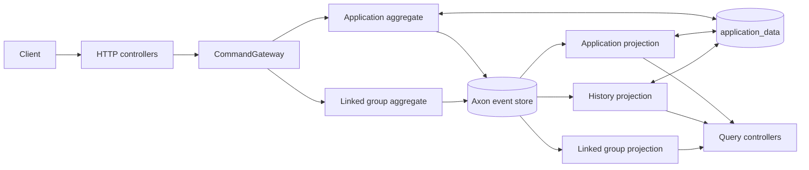

# Architecture Overview

The module uses Axon to separate writes from reads. Commands are handled by event-sourced
aggregates; events update independently rebuildable query projections.

## Write path

1. A controller maps the generated API request to a command.
2. `CommandGateway` routes the command using its `@TargetAggregateIdentifier`.
3. Axon loads the aggregate by replaying its events. A command targeting a missing aggregate fails
   with `AggregateNotFoundException` unless the handler uses `CREATE_IF_MISSING`.
4. The aggregate checks its rules and applies an event.
5. Axon persists the event and publishes it to event processors.

`ApplicationExceptionHandler` translates command failures into the public HTTP contract. For
example, a missing aggregate becomes a stable application-not-found response without exposing Axon
terminology.

Creation and linking handlers use `CREATE_IF_MISSING` because they need idempotent creation or a
custom missing-link response. Those handlers must explicitly distinguish a new empty aggregate from
a rebuilt existing one. Ordinary commands such as decision, assignment, and unassignment let Axon
fail naturally if the application stream does not exist.

## Consistency boundaries

There are two aggregate types:

- `ApplicationAggregate` owns one application's lifecycle, optimistic-lock version, current
  caseworker assignment, and pointer to its sensitive-data version.
- `LinkedApplicationGroupAggregate` owns one group's identity, single lead, and membership.

A caseworker is currently reference data, not an aggregate. `AssignCaseworkerService` checks that
the referenced row exists and then dispatches the application command. If caseworkers later gain
rules such as capacity, availability, or workload limits, they may justify their own consistency
boundary and a coordinated cross-aggregate workflow.

## Read path

Tracking event processors update database projections asynchronously. Queries read those
projections rather than loading aggregates. The application and history projections contain thin
state and hydrate sensitive fields from `application_data` when required.

Application creation opens a subscription query before dispatching the command. This prevents the
controller from missing a fast projection update. It returns:

- `201 Created` when the projection becomes readable within the configured timeout;
- `202 Accepted` with the same `Location` when projection processing takes longer.

## The two version numbers

These versions solve different problems and should not be combined:

| Field | Meaning | Changes when |
|---|---|---|
| `applicationVersion` | Public optimistic-lock version for application changes | A decision, assignment, or unassignment succeeds |
| `applicationDataVersion` | Internal pointer to an immutable `application_data` row | Sensitive/audit payload changes, including notes |

Decision requests supply the expected `applicationVersion` to prevent one caller silently
overwriting a decision based on stale state. The aggregate chooses the next
`applicationDataVersion`; callers never manage this internal storage detail.

## Transaction and processing choices

- The command bus uses Spring's transaction manager, so application-data appends and event writes
  participate in command processing.
- Normal projections use tracking processors. They may lag and can be reset and replayed.
- The linking router uses a subscribing processor with propagating errors. This is deliberate:
  linking must succeed or fail as part of the originating request.

See [Linked applications](linked-applications.md) and
[Projections and replay](projections-and-replay.md) for the detailed consequences.
