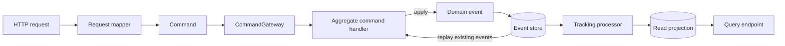

# Axon in This Module

This guide provides the minimum execution model needed to work safely in the Axon module. It uses
Axon Framework 4.11.2 and the terminology defined in the [glossary](glossary.md).

## The central idea

The write model and read model have different jobs:

- Aggregates decide whether a command is allowed and emit events.
- Events are the durable record of accepted changes.
- Event-sourcing handlers rebuild aggregate state from those events.
- Projection handlers turn events into database views designed for queries.



## One command from start to finish

### 1. The controller creates a command

The HTTP controller does not update a repository. A mapper converts a generated OpenAPI request to
an internal command:

```java
var command = mapper.toCommand(applicationId, request);
commandGateway.sendAndWait(command);
```

The field annotated with `@TargetAggregateIdentifier` tells Axon which event stream to load.

### 2. Axon loads the aggregate

Before invoking an ordinary command handler, Axon reads the target event stream and creates the
aggregate by replaying its events in sequence. Each event invokes an `@EventSourcingHandler`.

If the stream does not exist, the command fails with `AggregateNotFoundException`. Handlers using
`@CreationPolicy(CREATE_IF_MISSING)` are the exception: Axon may provide a new empty aggregate, so
those handlers must explicitly distinguish new and existing state.

### 3. The command handler decides

A `@CommandHandler` can:

- inspect current aggregate state;
- validate business rules;
- call an injected command-side service when the decision needs external persisted data;
- reject the command with an exception;
- apply one or more events.

It must not treat direct field mutation as the durable result. Only events can reproduce the change
when the aggregate is loaded again.

### 4. Applying the event changes aggregate state

Calling `apply(event)` records the new fact and invokes the matching event-sourcing handler. The
event-sourcing handler performs the state transition:

```java
@CommandHandler
void handle(AssignCaseworkerToApplicationCommand command) {
  apply(new ApplicationAssignedToCaseworkerEvent(...));
}

@EventSourcingHandler
void on(ApplicationAssignedToCaseworkerEvent event) {
  applicationVersion = event.applicationVersion();
  applicationDataVersion = event.applicationDataVersion();
  caseworkerId = event.caseworkerId();
}
```

The second method runs both when the event is first applied and on every future aggregate replay.
It must therefore be deterministic and perform no repository, network, clock, or command-gateway
calls.

## Three kinds of event reaction

The annotations look similar but serve different purposes:

| Code | Runs where | Purpose | External I/O? |
|---|---|---|---:|
| Aggregate `@EventSourcingHandler` | During initial apply and aggregate replay | Rebuild command-side state | No |
| Projection `@EventHandler` on tracking processor | Independently after event commit | Update query tables | Yes |
| Router `@EventHandler` on subscribing processor | In publishing command thread/unit of work | Dispatch the next linking command | Only deliberately, with synchronous failure semantics |

Confusing projection handlers with event-sourcing handlers is one of the most damaging Axon
mistakes. Both consume events, but only one rebuilds aggregate state.

## Commit and projection timing

The command bus is connected to Spring transaction management. A successful command commits its
event and any `application_data` append together. The normal projections are tracking processors,
so they update after the command and can temporarily lag.

```text
sendAndWait completed
  means: command handling and event commit completed
  does not mean: every query projection is already current
```

Application creation uses a subscription query to wait briefly for its projection. It returns
`202 Accepted` if the durable write succeeds but the projection is not visible within the timeout.

The linking router deliberately uses a subscribing processor. Its nested commands run before the
originating unit of work completes, and its errors propagate back to the original request. See
[ADR 0001](adr/0001-use-a-subscribing-event-router-for-application-linking.md).

## Command state versus query state

Aggregates must not query projections to make decisions. A tracking projection may be stale, and
doing so would make the aggregate's result depend on asynchronous read-side timing.

Similarly, query handlers should not load aggregates or dispatch commands. They read projections
and hydrate sensitive fields from the immutable data versions when required.

```text
Command decision → aggregate events and command-side data
API read         → projections and referenced application_data
```

## What replay does

Aggregate replay and projection replay are separate operations:

- Aggregate replay happens whenever Axon loads an aggregate. It invokes only that aggregate's
  event-sourcing handlers to rebuild in-memory command state.
- Projection replay is an administrative recovery operation. It resets a tracking processor and
  invokes projection event handlers for historical events to rebuild query tables.

Neither replay should call an external service. Aggregate replay does not load detailed application
payloads; it restores their version pointers from thin events.

## Where to go next

Follow the [worked decision example](worked-example-decision.md), then read
[Guardrails and common mistakes](guardrails.md) before changing aggregate or event code.
