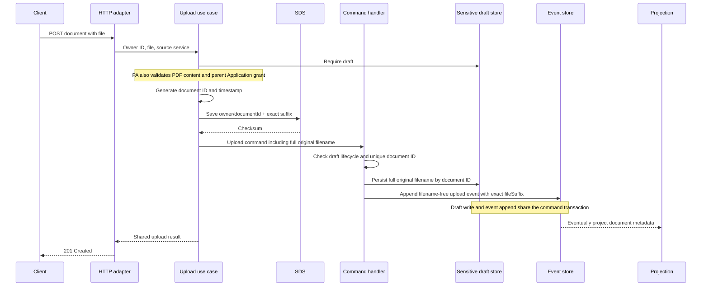
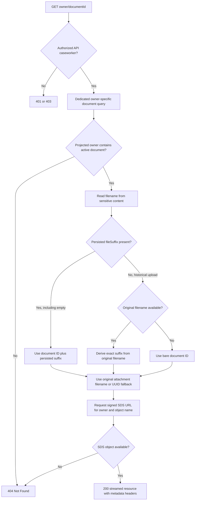
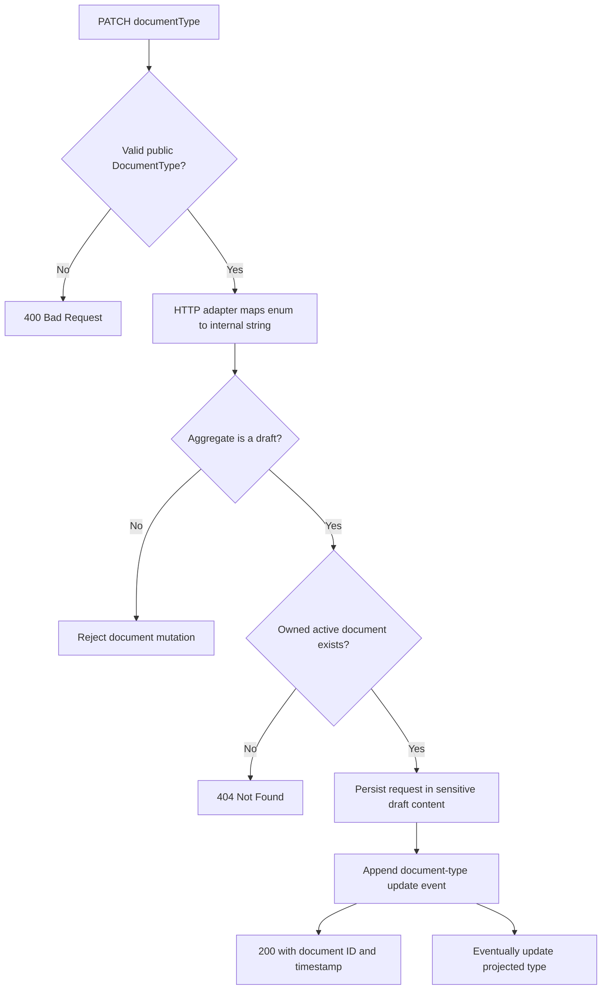
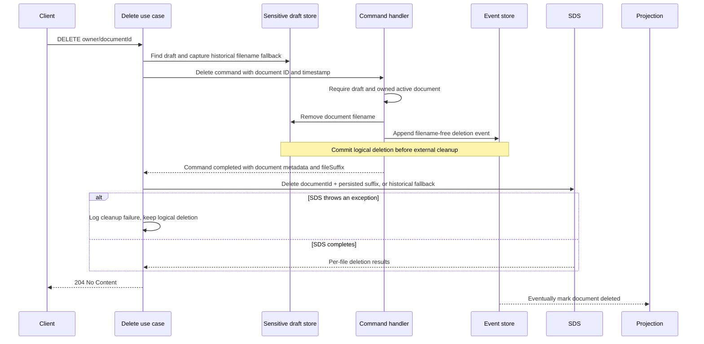

# Document Lifecycle

Application and Prior Authority documents share SDS storage and HTTP download behaviour. They keep
their own commands, aggregates, and dedicated document queries. This guide describes the UUID-keyed
document endpoints, not the legacy Application upload endpoint that uses the original filename.

## Storage and identity decisions

- `documentId` identifies a document within its owning Application or Prior Authority.
- The SDS folder is the owner's ID. The object name is `documentId + original filename suffix`.
- `SdsService` builds that object name identically for upload, download, and deletion.
- The suffix is case-sensitive and comes from the original filename, not `contentType` or
  `documentType`. A classification change must not change the SDS key.
- Upload events persist the non-sensitive suffix as `fileSuffix`. Aggregate state and projected
  `DocumentMetadata` retain it independently of sensitive content. Null means a historical unknown
  suffix; an empty string means a known extensionless upload.
- Upload command handlers persist the full original filename under
  `documentFilenames[documentId]` in sensitive draft content. Submission preserves that map in
  immutable content storage. Filenames do not appear in domain events or projected document metadata.
- GET and delete prefer the recorded suffix even when the full filename is missing or differs.
  Only historical uploads with null suffix fall back to the original filename, or the bare UUID
  when no filename is available. Download responses use the document ID as a missing attachment
  filename. Do not guess a suffix or probe other owners' folders.

| Recorded filename | SDS object name | Download attachment name |
|---|---|---|
| `evidence.pdf` | `<documentId>.pdf` | `evidence.pdf` |
| `evidence.PDF` | `<documentId>.PDF` | `evidence.PDF` |
| `image.png` | `<documentId>.png` | `image.png` |
| `evidence` | `<documentId>` | `evidence` |
| Missing or blank, suffix `.PDF` persisted | `<documentId>.PDF` | `<documentId>` |
| Missing or blank, suffix unknown or empty | `<documentId>` | `<documentId>` |

These key rules support future formats without changing deletion logic. Prior Authority upload
validation still accepts PDF content only; this change does not broaden the accepted formats.

## Upload

Application upload assigns `documentType` immediately. Prior Authority upload leaves it unset for
the separate type-update endpoint. Full filename persistence already occurs during upload; the
optional `fileSuffix` is now also persisted in both upload events. There is no suffix-normalisation
step or database migration. See [Event evolution](event-evolution.md#document-upload-suffix) for
the compatibility defaults and replay limitations.

SDS is external to the command transaction. If SDS accepts an upload and the subsequent command
fails, the stored object can remain orphaned. This existing failure boundary is unchanged.

## Dedicated document GET

Application uses `FindApplicationDocumentQuery`; Prior Authority uses
`FindPriorAuthorityDocumentQuery`. Each query contains the owner ID and document ID and returns only
an `EvidenceDocument`, rather than a full owner response. The download use case retains authorization
and retrieves an SDS-backed resource; the controller streams it without buffering the file.

For drafts, query handlers read the mutable draft filename map. For submitted owners, they read the
content version referenced by the projection. Prior Authority also uses that version after a
decision. Unknown or deleted documents are rejected before SDS is called.

Both controllers return `Content-Disposition: attachment`, the stored content type (or
`application/octet-stream` when absent or invalid), size when available, `X-Document-Uploaded-At`,
and `X-Document-Type` when assigned.

### Missing filename is not missing ownership

An active document ID and recorded suffix are sufficient to identify the SDS object; the full
filename is optional display metadata. Historical metadata with neither suffix nor filename still
uses the bare-ID fallback, which cannot recover an object stored with an unknown suffix. Missing sensitive content
rows are a separate storage-integrity problem, not automatically a retention outcome.

Queries remain eventually consistent. A download immediately after upload can return 404 until its
metadata is projected. After logical deletion, the filename map may already be empty while the
projection still shows an active document. During that interval GET uses the persisted suffix,
even though the sensitive filename is gone; SDS availability determines the result. Once deletion
is projected, GET returns 404 without SDS.
This design does not promise immediate read-after-write visibility or immediate revocation.

## Prior Authority type update

`documentType` classifies evidence; it is not the file format. Updates preserve the filename map,
SDS key, content type, and uploaded timestamp. The aggregate and projection apply the event without
calling SDS. Replay does not upload, download, or delete files.

## Prior Authority deletion

The command returns the active document metadata, including its replayed suffix. Capturing the
filename before dispatch is needed only for historical uploads whose suffix is null, because the
handler removes that filename. The same suffix rule handles `.pdf`, `.PDF`, extensionless names,
and future formats. Cleanup can therefore work without a sensitive filename. Only historical
uploads with neither a suffix nor a filename target the bare UUID; no MIME inference occurs.

If command validation or persistence fails, SDS deletion is not attempted. Once logical deletion
commits, an SDS exception does not reverse it. Cleanup is best-effort with no automatic retry;
per-file result handling retains its existing behaviour. Events retain deleted metadata for replay,
and read queries exclude it. Application document deletion remains unimplemented.

## Verification boundaries

- Upload handler tests assert exact suffixes are persisted in events and sensitive filenames remain separate.
- SDS tests compare upload, GET, and delete keys for uppercase, extensionless, and future suffixes.
- Projection tests cover draft/submitted hydration, missing filenames, ownership, deleted documents,
  and idempotent replay of metadata events.
- Download use-case and controller tests cover suffix-only lookup and attachment-name fallback.
- Compatibility tests deserialize historical event and metadata JSON with unknown suffixes.
- PostgreSQL-backed draft tests verify persisted suffixes and deletion without a full filename.

See [Testing Axon code](testing-axon-code.md) and [Projections and replay](projections-and-replay.md)
for processor recovery and transaction coverage.