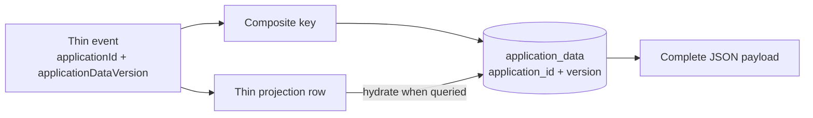

# Events and Sensitive Application Data

The module deliberately keeps detailed application content and free text out of the Axon event
payloads. Events record what changed and point to an immutable version in `application_data`, where
the complete payload for that point in time is stored.

This is a pragmatic POC design. It does not claim that the event stream alone can reconstruct every
piece of application data.

The architectural rationale and alternatives are recorded in
[ADR 0002](adr/0002-separate-sensitive-data-from-domain-events.md).

## How the records are connected



The join is always:

```text
event.applicationId          = application_data.application_id
event.applicationDataVersion = application_data.version
```

For example, a decision command:

1. loads the payload referenced by the aggregate's current `applicationDataVersion`;
2. creates a complete updated payload rather than a partial patch;
3. appends it as the next version in `application_data`;
4. emits `ApplicationDecisionMadeEvent` containing the new version number and non-sensitive
   control fields;
5. advances the aggregate and current-state projection to that version.

Creation, decisions, assignments, unassignments, and notes follow the same append-and-reference
pattern when their detailed payload changes.

## What is stored where

| Store | Typical contents | Purpose |
|---|---|---|
| Axon event store | IDs, timestamps, status/type, version pointers, decision outcome, group membership | Durable business timeline and aggregate control state |
| `application_data` | Application content, individuals, proceedings, certificates, notes, request JSON, free-text descriptions | Immutable versioned sensitive payloads |
| `application_current_state` | IDs, status, timestamps, versions, caseworker ID and other thin query state | Disposable current-state projection |
| `application_history` | Event type, service metadata, timestamp, thin event payload | Disposable audit projection, hydrated when queried |

“Thin” means data minimisation, not a guarantee that an event contains no personal data. Stable
identifiers, including application and caseworker IDs, may still be personal data depending on how
they can be linked elsewhere. New event fields should be reviewed rather than assumed safe.

## Immutability and retention

`application_data` has a primary key of `(application_id, version)`. PostgreSQL triggers reject:

- updates;
- direct deletes;
- truncation.

Retention deletion is intentionally separate. The restricted
`delete_application_data_for_retention(UUID)` database function enables deletion for one
application. Application code should append a new version for corrections; it must never update an
old row in place.

Deleting sensitive rows leaves the thin event history in place, but has consequences:

- the aggregate's control state can still replay from events;
- queries cannot hydrate fields whose referenced data has been deleted;
- future commands that require the current detailed payload cannot proceed normally;
- history hydration falls back to its thin stored event payload when detailed data is unavailable.

Retention therefore needs an application-level policy for what behaviour is expected after
deletion. It is not equivalent to resetting a projection. The proposed lifecycle and unresolved
product decisions are recorded in
[ADR 0003](adr/0003-define-application-behaviour-after-retention-deletion.md).

## Replay and failure behaviour

Aggregates rebuild identifiers, versions, assignment state, and other control fields from thin
events. They do not query `application_data` during event replay. A command handler queries it only
when the new decision needs the complete current payload.

Projections are different: replaying `ApplicationProjection` or `ApplicationHistoryProjection` may
need the referenced `application_data` versions to return fully hydrated results. See
[Projections and replay](projections-and-replay.md).

The command bus and JPA event store share Spring transaction management. The implementation writes
the new data version before applying its event; if the append fails, no event is emitted. Tests
cover this ordering and the append-only database controls.

## Adding a new event safely

When a new operation contains sensitive or free-text data:

1. add the complete new state to `ApplicationDataPayload`;
2. append a new `application_data` version in the command handler;
3. put only routing, concurrency, and non-sensitive control fields in the event;
4. include `applicationId` and `applicationDataVersion` when consumers need hydration;
5. update aggregate event-sourcing state;
6. update current-state and history projections, including replay tests;
7. verify the serialized event stored in PostgreSQL does not contain the sensitive fields.
