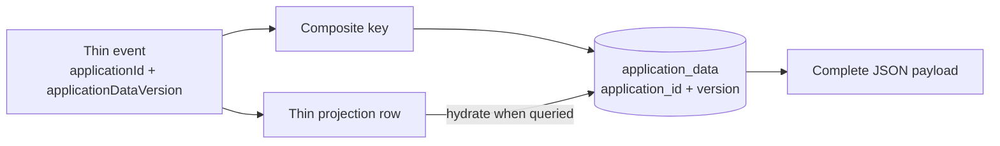

# Events and Sensitive Application Data

The module deliberately keeps detailed application content and free text out of the Axon event
payloads. Events record what changed and point to an immutable version in `application_data`, where
the complete payload for that point in time is stored.

This is a pragmatic POC design. It does not claim that the event stream alone can reconstruct every
piece of application data.

The architectural rationale and alternatives are recorded in
[ADR 0002](adr/0002-separate-sensitive-data-from-domain-events.md).

## How the records are connected


```mermaid
flowchart LR
    E[Thin event<br/>applicationId + applicationDataVersion]
    E --> K[Composite key]
    K --> D[(application_data<br/>application_id + version)]
    D --> P[Complete JSON payload]
    E --> R[Thin projection row]
    R -->|hydrate when queried| D
```

The join is always:

```text
event.applicationId          = application_data.application_id
event.applicationDataVersion = application_data.version
```

For example, a decision command:

1. loads the payload referenced by the aggregate's current `applicationDataVersion`;
2. creates a complete updated payload rather than a partial patch;
3. appends it as the next version in `application_data`;
4. emits `ApplicationDecisionMadeEvent` containing the new version number and non-sensitive
   control fields;
5. advances the aggregate and current-state projection to that version.

Application creation, decisions, and notes append application-data versions and carry the relevant
version pointer in the event/history row. Decision and note descriptions are hydrated when history
is queried. Assignment and unassignment history records do not point to application data; their
acting caseworker is recorded from event metadata when available.

Application document uploads are allowed only in the separate draft lifecycle, before
`ApplicationCreatedEvent`. A fully created Application cannot accept uploads, even when its business
status is `APPLICATION_IN_PROGRESS`. The draft payload's intended submission status is not the
lifecycle guard: the aggregate tracks the draft lifecycle with `state.status == null`.

The only document-specific sensitive value in draft content is `documentFilenames`, a map from
document ID to original filename. Uploads update that map in `application_draft` and emit filename-free
metadata events without a data-version pointer. Neither aggregate state nor the persisted document
metadata projection contains the filename. Submission copies the map into version 0 of immutable
`application_data` before emitting `ApplicationCreatedEvent` and deleting the draft row. Subsequent
immutable content updates preserve the filename map.

The exact file suffix, such as `.PDF`, is non-sensitive storage metadata. Application and Prior
Authority upload events persist it as optional `fileSuffix`; aggregate state and projected
`DocumentMetadata` retain it independently of the original filename. New extensionless uploads
record an empty string. Historical events without this field retain null (unknown), with filename
fallback when available. No MIME-based inference is used. This allows SDS retrieval and deletion
without retaining or hydrating the sensitive filename. See [Document lifecycle](document-lifecycle.md).

Both upload entry points look up the draft directly in `ApplicationDraftStore` before SDS is called.
An absent draft returns a not-found error without calling SDS or dispatching an upload command.
This is an existence check against authoritative draft storage, not a projection lookup or a guarantee
that the draft remains open throughout the external call. The upload command checks the aggregate
lifecycle before recording metadata, so submitting during an external upload
cannot attach a new document to the created Application. Any upload command whose document ID is
already recorded is rejected, including an identical retry, without writing draft content or emitting
an event. Draft content is written before the event in the shared database transaction. SDS remains
outside that transaction;
a race or command failure after SDS acceptance can still leave an external file needing cleanup.

Historical upload events with a data-version pointer still advance that version during replay.
Events without a pointer retain the preceding version, including all new draft uploads.
Older payloads without `documentFilenames` normalize to an empty map. Those documents remain visible
in application details without an original filename; the event stream cannot recover names that
were never persisted. Removing a document from the current response does not erase filenames from
historical sensitive-data versions. Application-level retention removes those versions together.

## What is stored where

| Store | Typical contents | Purpose |
|---|---|---|
| Axon event store | IDs, timestamps, status/type, version pointers, decision outcome, group membership | Durable business timeline and aggregate control state |
| `application_data` | Application content, individuals, proceedings, certificates, notes, request JSON, free-text descriptions | Immutable versioned sensitive payloads |
| `application_current_state` | IDs, status, timestamps, versions, caseworker ID and other thin query state | Disposable current-state projection |
| `application_history` | Event type, service/caseworker metadata, timestamp, nullable application-data version | Disposable audit projection; descriptions are hydrated when queried |

“Thin” means data minimisation, not a guarantee that an event contains no personal data. Stable
identifiers, including application and caseworker IDs, may still be personal data depending on how
they can be linked elsewhere. New event fields should be reviewed rather than assumed safe.

## Immutability and retention

`application_data` has a primary key of `(application_id, version)`. PostgreSQL triggers reject:

- updates;
- direct deletes;
- truncation.

Retention deletion is intentionally separate. The restricted
`delete_application_data_for_retention(UUID)` database function enables deletion for one
application. Application code should append a new version for corrections; it must never update an
old row in place.

Deleting sensitive rows leaves the thin event history in place, but has consequences:

- the aggregate's control state can still replay from events;
- queries cannot hydrate fields whose referenced data has been deleted;
- future commands that require the current detailed payload cannot proceed normally;
- history rows remain available, but descriptions that require a deleted application-data version
  are returned as `null`.

An absent referenced version is an expected consequence of retention. Other data-store failures are
not treated as missing data and continue to fail the query.

Retention therefore needs an application-level policy for what behaviour is expected after
deletion. It is not equivalent to resetting a projection. The proposed lifecycle and unresolved
product decisions are recorded in
[ADR 0003](adr/0003-define-application-behaviour-after-retention-deletion.md).

## Replay and failure behaviour

Aggregates rebuild identifiers, versions, assignment state, and other control fields from thin
events. They do not query `application_data` during event replay. A command handler queries it only
when the new decision needs the complete current payload.

Projections are different: replaying `ApplicationProjection` or `ApplicationHistoryProjection` may
need the referenced `application_data` versions to return fully hydrated results. See
[Projections and replay](projections-and-replay.md).

The command bus and JPA event store share Spring transaction management. The implementation writes
the new data version before applying its event; if the append fails, no event is emitted. Tests
cover this ordering and the append-only database controls.

## Adding a new event safely

When a new operation contains sensitive or free-text data:

1. add the complete new state to `ApplicationDataPayload`;
2. append a new `application_data` version in the command handler;
3. put only routing, concurrency, and non-sensitive control fields in the event;
4. include `applicationId` and `applicationDataVersion` when consumers need hydration;
5. update aggregate event-sourcing state;
6. update current-state and history projections, including replay tests;
7. verify the serialized event stored in PostgreSQL does not contain the sensitive fields.
