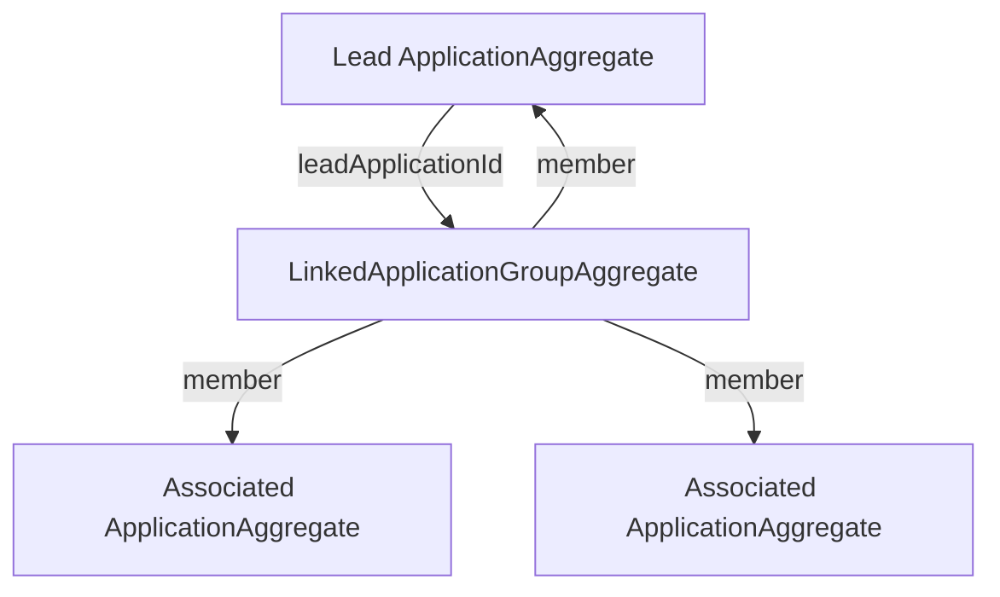

# Linked Applications

Linked applications are represented as a group with exactly one lead and one or more members. The
group is a separate aggregate because membership is a rule shared by several applications; no
single application should own the whole list.

## The model



The group ID is deterministic:

```text
UUID.nameUUIDFromBytes("linked-group:" + leadApplicationId)
```

Every application that names the same lead therefore targets the same group aggregate. The prefix
also ensures that the group ID differs from the lead's application ID. This matters because the
event store looks up a stream by aggregate identifier, not by Java aggregate class.

## Creating a linked application

1. `ApplicationAggregate` creates the associated application and emits `ApplicationCreatedEvent`.
   The thin event contains its lead ID and referenced associated IDs.
2. `ApplicationGroupEventRouter` ignores standalone applications. For a linked application, it
   first validates any other associated IDs named by the request.
3. The router sends `CreateLinkedApplicationGroupCommand` to the lead application.
4. The lead verifies that it exists and is not already an associated member of another group. It
   then emits `LinkedApplicationGroupRequested` with the deterministic group ID.
5. The router sends `InitialiseLinkedApplicationGroupCommand` to that group.
6. A new group emits `LinkedApplicationGroupCreatedEvent`. An existing group emits one
   `MemberAddedToGroupEvent` for each genuinely new member.

The detailed message order is shown in the [sequence diagrams](sequence-diagrams/README.md).

## Why the router is subscribing

`ApplicationGroupEventRouter` is a stateless event handler, not a saga. Its processing group is
explicitly registered as subscribing in `AxonCommandBusConfig`, with errors configured to
propagate.

That choice gives the API synchronous behaviour:

- the lead and other referenced applications are checked before creation returns;
- a missing reference produces a 404 on the original request;
- a group invariant failure rejects the original request;
- a failure rolls back the command's unit of work instead of leaving a partially completed
  workflow for later recovery.

A saga would be more suitable if linking became long-running, crossed service boundaries, needed
timeouts or compensation, or was allowed to complete after the HTTP request. It would also change
the API semantics if it used asynchronous processing: initial creation could succeed while linking
later failed. A saga can use a subscribing processor too, but that would add persistent saga state
without benefiting this currently stateless flow. The full rationale and revisit criteria are in
[ADR 0001](adr/0001-use-a-subscribing-event-router-for-application-linking.md).

## Important rules

- An application cannot name itself as its lead.
- A lead must exist before a linked application is accepted.
- Other associated applications explicitly named in the request must exist.
- An application already marked as an associated member cannot later act as a lead.
- Repeating group initialisation is idempotent; existing members do not produce duplicate events.
- Adding a later member targets the same deterministic group and emits only the membership delta.

## Where the resulting data appears

- The group event stream is the authoritative record of group membership.
- `linked_application_group_current_state` is the disposable group read model.
- Application list responses use the group projection to populate `linkedApplications`.
- `ApplicationHistoryProjection` writes `APPLICATION_GROUP_CREATED` for the lead and
  `APPLICATION_GROUP_JOINED` for each associated member.

When changing linking, update the aggregate/router tests and the matching sequence diagram. The
PostgreSQL integration test should continue to prove both projection state and public history.
