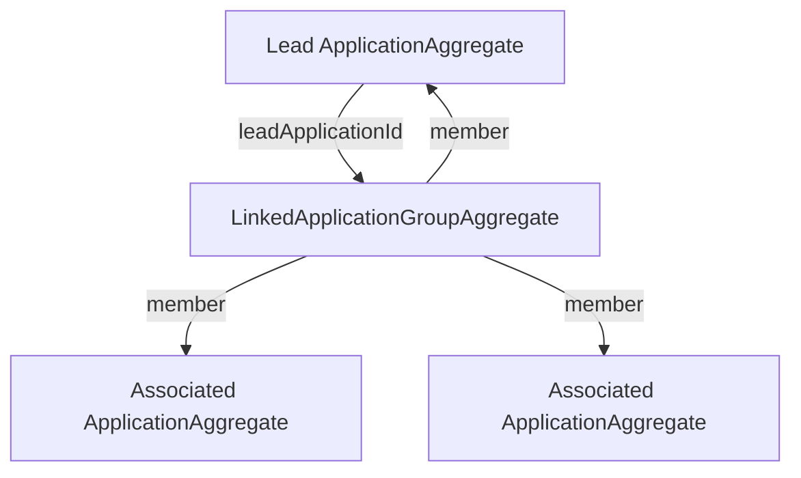

# Linked Applications

Linked applications are represented as a group with exactly one lead and one or more members. The
group is a separate aggregate because membership is a rule shared by several applications; no
single application should own the whole list.

## The model


```mermaid
flowchart TD
    L[Lead ApplicationAggregate]
    A1[Associated ApplicationAggregate]
    A2[Associated ApplicationAggregate]
    G[LinkedApplicationGroupAggregate]
    L -->|leadApplicationId| G
    G -->|member| L
    G -->|member| A1
    G -->|member| A2
```

The group ID is deterministic:

```text
UUID.nameUUIDFromBytes("linked-group:" + leadApplicationId)
```

Every application that names the same lead therefore targets the same group aggregate. The prefix
also ensures that the group ID differs from the lead's application ID. This matters because the
event store looks up a stream by aggregate identifier, not by Java aggregate class.

## Creating a linked application

1. `ApplicationAggregate` creates the associated application and emits `ApplicationCreatedEvent`.
   The thin event contains its lead ID and referenced associated IDs.
2. `ApplicationGroupEventRouter` ignores standalone applications. For a linked application, it
   first validates any other associated IDs named by the request.
3. The router sends `CreateLinkedApplicationGroupCommand` to the lead application.
4. The lead verifies that it exists and is not already an associated member of another group. It
   then emits `LinkedApplicationGroupRequested` with the deterministic group ID.
5. After the request event commits, `LinkedApplicationGroupInitializer` sends
   `InitialiseLinkedApplicationGroupCommand` to that group.
6. A new group emits `LinkedApplicationGroupCreatedEvent`. An existing group emits one
   `MemberAddedToGroupEvent` for each genuinely new member.

The detailed message order is shown in the [sequence diagrams](sequence-diagrams/README.md).

## Why linking uses two processors

`ApplicationGroupEventRouter` is a stateless event handler, not a saga. Its processing group is
explicitly registered as subscribing in `AxonEventProcessingConfig`, with errors configured to
propagate. This preserves synchronous validation of the lead and other referenced applications.

Axon 5 rejects re-entrant event-store writes, so the requested group cannot safely be initialised
from the handler that is still publishing the lead application's event. A separate pooled streaming
processor invokes `LinkedApplicationGroupInitializer` after that transaction commits.

The resulting behaviour is:

- reference validation completes before application creation returns;
- a missing reference produces a 404 on the original request;
- group creation or extension is retried by Axon's streaming processor if it fails;
- both stages remain stateless and idempotent, so no saga state is required.

The rationale is recorded in [ADR 0004](adr/0004-split-linked-group-initialisation-after-commit.md).

## Important rules

- An application cannot name itself as its lead.
- A lead must exist before a linked application is accepted.
- Other associated applications explicitly named in the request must exist.
- An application already marked as an associated member cannot later act as a lead.
- Repeating group initialisation is idempotent; existing members do not produce duplicate events.
- Adding a later member targets the same deterministic group and emits only the membership delta.

## Where the resulting data appears

- The group event stream is the authoritative record of group membership.
- `linked_application_group_current_state` is the disposable group read model.
- Application list responses use the group projection to populate `linkedApplications`.
- `ApplicationHistoryProjection` writes `APPLICATION_GROUP_CREATED` for the lead and
  `APPLICATION_GROUP_JOINED` for each associated member.

When changing linking, update the aggregate/router tests and the matching sequence diagram. The
PostgreSQL integration test should continue to prove both projection state and public history.
