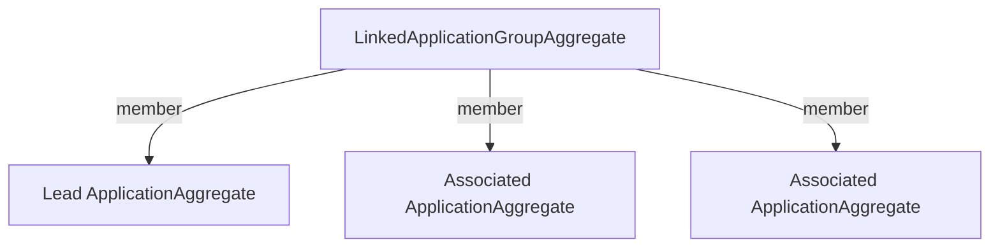

# Linked Applications

Linked applications are represented as a group with exactly one lead and one or more members. The
group is a separate aggregate because membership is a rule shared by several applications; no
single application should own the whole list.

## The model

```mermaid
flowchart TD
    L[Lead ApplicationAggregate]
    A1[Associated ApplicationAggregate]
    A2[Associated ApplicationAggregate]
    G[LinkedApplicationGroupAggregate]
    G -->|member| L
    G -->|member| A1
    G -->|member| A2
```

Application creation does not create or extend linked groups.

## Linking applications explicitly

1. Create each application normally with `POST /api/v0/applications`.
2. Call the explicit application-link endpoint for the source application with an
   `ApplicationLinkRequest`.
3. `LinkApplicationCommandHandler` validates the request and asks
   `ApplicationGroupRouteResolver` to lock the source and target routes.
4. If both applications are standalone, the handler dispatches
   `EstablishLinkedApplicationGroupCommand` with a new group ID. The target application becomes the
   lead and the source application becomes the first associated member.
5. If the target application already belongs to a linked group and the source is standalone, the
   handler dispatches `AddApplicationToLinkedGroupCommand`.
6. If both applications are already in the same group, the request is an idempotent success.
7. `LinkedApplicationGroupAggregate` emits `LinkedApplicationGroupCreatedEvent` or
   `MemberAddedToGroupEvent`; route, application, list-index, group, and history projections update
   from those events.

## Why linking uses durable routes

`ApplicationGroupRouteProjection` records a `STANDALONE` route for every
`ApplicationCreatedEvent` and transitions routes to `LINKED_GROUP` when group events commit.
The resolver locks the relevant route rows before choosing the link action, preventing concurrent
requests from placing one source application into multiple groups.

The resulting behaviour is:

- creation returns without waiting for or dispatching linked-group commands;
- a missing source or target route produces a 404 on the explicit link request;
- a source application already in a different group produces a link conflict;
- duplicate delivery remains idempotent in the group aggregate and route projection.

## Important rules

- An application cannot be linked to itself.
- Source and target applications must have the same non-null submission office code.
- Source and target applications must already have routes, which are created from
  `ApplicationCreatedEvent`.
- A standalone target becomes the group lead when the first group is established.
- A standalone source can join an existing target group.
- A source application already in another group cannot be moved by this command.
- Existing members do not produce duplicate group events.

## Where the resulting data appears

- The group event stream is the authoritative record of group membership.
- `application_group_route` is the durable write-side routing table for link commands.
- `linked_application_group_current_state` is the disposable group read model.
- Application list responses use the group projection to populate `linkedApplications`.
- `ApplicationHistoryProjection` writes `APPLICATION_GROUP_CREATED` for the lead and
  `APPLICATION_GROUP_JOINED` for each associated member.

When changing linking, update the command handler, route resolver/projection, aggregate, and
projection tests. Application creation tests should continue to prove create alone leaves a
standalone route and creates no linked group.
