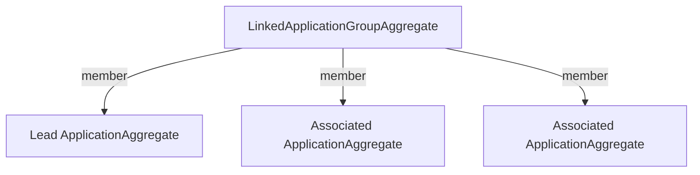

# Linked Applications

Linked applications are represented as a group with exactly one lead and one or more members. The
group is a separate aggregate because membership is a rule shared by several applications; no
single application should own the whole list.

## The model

```mermaid
flowchart TD
    L[Lead ApplicationAggregate]
    A1[Associated ApplicationAggregate]
    A2[Associated ApplicationAggregate]
    G[LinkedApplicationGroupAggregate]
    G -->|member| L
    G -->|member| A1
    G -->|member| A2
```

Application creation does not create or extend linked groups.

## Linking applications explicitly

1. Create each application normally with `POST /api/v0/applications`.
2. Call the explicit application-link endpoint for the source application with an
   `ApplicationLinkRequest`.
3. `LinkApplicationCommandHandler` validates the request and asks
   `ApplicationGroupRouteResolver` to lock the source and target routes. When the target is already
   linked, include its `linkedGroupVersion` as last read; omit that value when the target is
   standalone.
4. If both applications are standalone, the handler dispatches
   `EstablishLinkedApplicationGroupCommand` with a new group ID. The target application becomes the
   lead and the source application becomes the first associated member.
5. If the target application already belongs to a linked group and the source is standalone, the
   handler dispatches `AddApplicationToLinkedGroupCommand`.
6. If both applications are already in the same group, the request is an idempotent success.
7. `LinkedApplicationGroupAggregate` emits `LinkedApplicationGroupCreatedEvent` or
   `MemberAddedToGroupEvent`; route, application, list-index, group, and history projections update
   from those events.

Joining an existing group requires the target group's version. The aggregate checks that version
and rejects a stale request with 409. A successful membership change advances the version; an
already-linked request remains an idempotent success regardless of the supplied version.

## Why linking uses durable routes

`ApplicationGroupRouteProjection` records a `STANDALONE` route for every
`ApplicationCreatedEvent` and transitions routes to `LINKED_GROUP` when group events commit.
The resolver locks the relevant route rows before choosing the link action, preventing concurrent
requests from placing one source application into multiple groups.

The resulting behaviour is:

- creation returns without waiting for or dispatching linked-group commands;
- a missing source or target route produces a 404 on the explicit link request;
- a source application already in a different group produces a link conflict;
- duplicate delivery remains idempotent in the group aggregate and route projection.

## Important rules

- An application cannot be linked to itself.
- Source and target applications must have the same non-null submission office code.
- Source and target applications must already have routes, which are created from
  `ApplicationCreatedEvent`.
- A standalone target becomes the group lead when the first group is established.
- A standalone source can join an existing target group.
- A source application already in another group cannot be moved by this command.
- Existing members do not produce duplicate group events.
- The lead can change, but the current lead cannot be removed. Make another member the lead first.
- Removing an associate from a group of more than two members leaves the group intact. Removing an
  associate from a two-member group dissolves it instead of leaving a one-member group.
- A dissolved group is terminal and its group ID is never reused. Applications released from a
  group can subsequently be linked into a new group.

## Changing the lead

`POST /api/v0/applications/{id}/make-lead` makes the addressed associate the lead. The previous
lead remains a group member as an associate. Calling the endpoint for the current lead is an
idempotent success and does not append an event.

The request body supplies `linkedGroupVersion`. A successful lead change increments the group
version and emits `LinkedApplicationGroupLeadChangedEvent`. It does not change
`application_group_route`: routes identify group membership, not the current lead.

## Removing an application / dissolution

`POST /api/v0/applications/{id}/unlink` removes an associate from its group. The lead cannot be
removed; change the lead before unlinking that application. Removing an associate from a group
larger than two emits `MemberRemovedFromGroupEvent`. Removing one of exactly two members emits one
`LinkedApplicationGroupDissolvedEvent`, so projections never see an active one-member group.

The request body supplies the group's `linkedGroupVersion`. A successful removal or dissolution
advances that version. Once a group is dissolved, its former members have standalone routes and can
be linked again through the regular link endpoint.

## Linked-group version and concurrent changes

New groups start at version 0. Each subsequent group event that changes membership or leadership
(member added, lead changed, member removed, or dissolution) increments the version by one. The
version is exposed as `linkedGroupVersion` on application detail and list responses; it is absent
for a standalone application. Link requests use the target group's version and require it when
joining an existing group. Make-lead and unlink requests require the version the caller last read.

A version conflict returns 409. Since application and group query projections update independently,
a GET immediately after a successful command can briefly return the preceding version or membership.
Clients should re-fetch and retry using the latest `linkedGroupVersion` after a conflict.

Every group mutation locks all route rows for that group with `PESSIMISTIC_WRITE`, in ascending
application-ID order. Link/add also locks its target route. These locks serialize add, lead change,
and removal before the group command is dispatched; aggregate version validation remains the
authoritative backstop.

## Where the resulting data appears

- The group event stream is the authoritative record of group membership.
- `application_group_route` is the durable write-side routing table for link commands.
- `application_current_state.linked_group_id` identifies the group for application queries;
  membership and lead lookups use the group ID, not `lead_application_id`.
- `linked_application_group_current_state` is the disposable group read model and carries the
  public group version. Its row is deleted when the group is dissolved.
- Application detail and list responses use the group projection to populate `isLead`,
  `linkedApplications`, and `linkedGroupVersion`. These projections are asynchronous and may lag
  independently.
- `ApplicationHistoryProjection` writes `APPLICATION_GROUP_CREATED` for the lead and
  `APPLICATION_GROUP_JOINED` for each associated member, `APPLICATION_GROUP_LEAD_CHANGED` for
  both old and new leads, `APPLICATION_GROUP_LEFT` for a removed application, and
  `APPLICATION_GROUP_DISSOLVED` for the remaining former lead when a group dissolves.

When changing linking, update the command handler, route resolver/projection, aggregate, and
projection tests. Application creation tests should continue to prove create alone leaves a
standalone route and creates no linked group.

## Projection sequencing, lag, and list-index assessment

`ApplicationProjection` uses a bare class-level `@SequencingPolicy`; Axon's default
`SequentialPolicy` places all its event handlers in one lane. This serializes creation, membership,
notes, and other full-row writers within that projection. It prevents a group event from preceding
application creation in that projection, a stale non-group full-row save from overwriting newer
membership there, and membership events moving G1 to G2 from being applied out of order. Keep this
processor pooled and streaming; the policy is not a global event ordering mechanism.

The application and list-index policies serialize handlers only within their respective
processors. The group and history processors remain independent, and all these query models may lag
one another. Neither sequencing policy establishes a global order across processors.

A query-owned per-application membership model is an alternative: store a nullable group ID, a
removal tombstone, and event ordering, then hydrate group details from the group read model. It can
reject stale membership updates without serializing all application-row writes, but remains
eventually consistent. This model is distinct from `application_group_route`, the durable write-side
routing table for link commands; GET/list membership comes from query-side data.

`ApplicationListIndexProjection` has its own bare class-level `@SequencingPolicy` on its pooled
processor. This serializes its application-row event handlers across aggregate IDs, preventing the
tested creation/group-event overwrite and G1-to-G2 reordering within that index projection. It is
independent of `ApplicationProjection` and does not order the index against application, group, or
history projections. Those processors can still lag one another. The index's `stream_version` is
not a conditional write guard, and `projectionPosition` is a hash of the event identifier, not an
ordered event position. The list query uses the index for filtering and paging, while
linked-application summaries derive from separate application and group projections; do not infer
cross-processor freshness from the sequencing policies.
