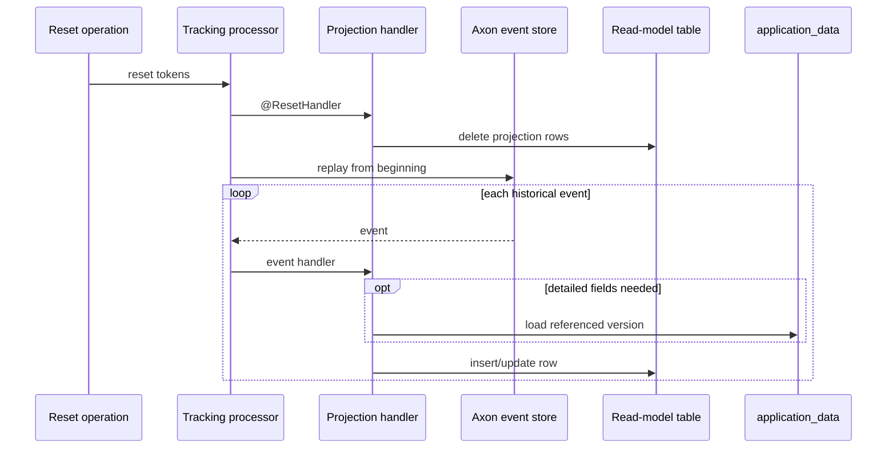

# Projections and Replay

Projections are query models derived from events. They are disposable: they can be cleared and
rebuilt without changing aggregate event streams or immutable application-data versions.

## Processing groups

| Processing group | Mode | Builds |
|---|---|---|
| `application-projection` | Tracking | `application_current_state` |
| `application-history-projection` | Tracking | `application_history` |
| `linked-application-group-projection` | Tracking | `linked_application_group_current_state` |
| `linked-application-group-router` | Subscribing | No read model; synchronously coordinates linking |

Tracking processors maintain tokens and run independently of the command thread. A failure stops
token progress past the failing event, allowing recovery without silently skipping it. The linking
router is intentionally different and is described in [Linked applications](linked-applications.md).

## Current application projection

`ApplicationProjection` stores thin, searchable control state and the current
`applicationDataVersion`. Query handlers hydrate detailed fields from `application_data`.

For a single application, a missing referenced payload means no hydrated application is returned.
For list queries, payloads are batch-loaded to avoid one lookup per row. Linked-group rows are also
batch-loaded for the result page.

## History projection

`ApplicationHistoryProjection` stores one public audit row per relevant event. Group events can
produce several rows: one for the lead and one for each member. Their IDs combine the Axon message
ID and application ID so each row remains unique and replay-idempotent.

Decision, assignment, unassignment, and note events contain version pointers rather than their
free-text details. When history is queried, the projection retrieves the matching
`application_data` payload and reconstructs the public request fragment. If hydration fails, it
returns the thin stored payload rather than failing the entire history query.

## Reset and replay

Each tracking projection has a `@ResetHandler` that clears only its own read table. After reset, its
processor replays events from the event store and rebuilds the rows.

Do not delete Axon event rows or `application_data` as part of a projection reset. Those are source
records, not projections.

## Development checklist

When adding or changing an event:

- update every projection that consumes it;
- make reset handlers clear any new read tables;
- make event handling idempotent where replay could encounter existing rows;
- test normal handling, reset, replay, transient failure recovery, and permanent failure token
  behaviour;
- decide whether query hydration needs an `applicationDataVersion` pointer;
- preserve event metadata such as `X-Service-Name` when it is part of audit history.

The module's in-memory recovery tests cover reset/replay and processor failure semantics. The
PostgreSQL integration tests prove that the same projections work against the real Axon/JPA schema.
