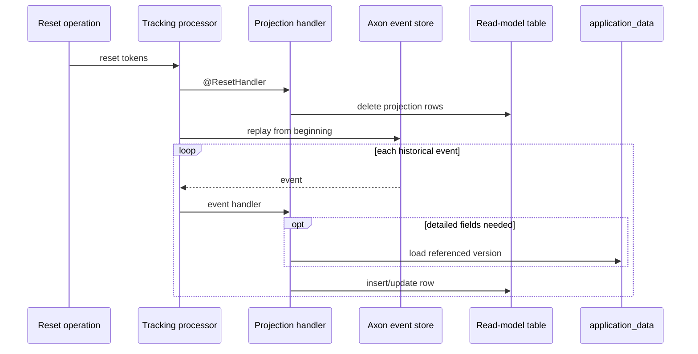

# Projections and Replay

Projections are query models derived from events. They are disposable: they can be cleared and
rebuilt without changing aggregate event streams or immutable application-data versions.

## Processing groups

| Processing group | Mode | Builds |
|---|---|---|
| `application-projection` | Pooled streaming | `application_current_state` |
| `application-history-projection` | Pooled streaming | `application_history` |
| `linked-application-group-projection` | Pooled streaming | `linked_application_group_current_state` |
| `application-list-index-projection` | Pooled streaming | `application_list_index` |
| `application-group-route` | Subscribing | `application_group_route`, synchronously in the command transaction |

Tracking processors maintain tokens and run independently of the command thread. A failure stops
token progress past the failing event, allowing recovery without silently skipping it. The
application command handler dispatches linked-group commands after locking the relevant routes;
the subscribing route projection updates those routes in the same transaction, as described in
[Linked applications](linked-applications.md).

## Current application projection

`ApplicationProjection` stores thin, searchable control state and the current
`applicationDataVersion`. Query handlers hydrate detailed fields from `application_data`.

Decision and manual-ready events both advance the public and data versions. A replay of
`ApplicationReadyForManualAssessmentEvent` therefore restores the pointer to the immutable payload
containing `autoGranted=MANUAL`; no command handler or external side effect is invoked during replay.
List queries can filter that hydrated value with `autoGranted=MANUAL`, which deliberately excludes
null outcomes, while identifier lookup remains unfiltered.

The aggregate event stream remains authoritative while this tracking projection catches up.
Repeating a stale Decision command after its event committed returns the public version-conflict
response without appending another event. Repeating manual readiness returns the idempotent
already-recorded response without appending another event. Consumers can therefore retry after a
stale read safely; once this processor advances, the query model exposes the one recorded outcome.

For a single application, a missing referenced payload means no hydrated application is returned.
For list queries, payloads are batch-loaded to avoid one lookup per row. Linked-group rows are also
batch-loaded for the result page by the `linked_group_id` stored on each application row. The
`isLead` value is derived by comparing the application ID with the lead ID on the group row; a
group row is deleted when its group is dissolved.

### Application projection sequencing

Use a bare class-level `@SequencingPolicy` on `ApplicationProjection` with Axon's default
`SequentialPolicy`, while keeping the `application-projection` processor pooled and streaming. A
shared lane prevents a membership event from preceding application creation, a stale non-group
full-row save from overwriting membership, and G1-to-G2 membership events from being applied out of
order.

This policy orders handlers only within `application-projection`. `ApplicationListIndexProjection`
also has its own sequencing policy, but its pooled processor remains independent of the
application, group, and history processors. Their query models may lag one another; neither policy
establishes a global event order.

A query-owned membership model can store a nullable group ID, removal tombstone, and event ordering,
then hydrate group details from the group read model. It remains eventually consistent and is
separate from `application_group_route`, the write-side routing table for link commands.

`ApplicationListIndexProjection` has its own bare class-level `@SequencingPolicy` on its pooled
processor. This serializes its application-row handlers across aggregate IDs; real-Axon/PostgreSQL
race tests verify that creation/group-event and G1-to-G2 membership races are ordered within the
index projection. This policy does not synchronize the index with the application, group, or
history processors, whose query models may lag independently. `stream_version` is not a
conditional write guard; `projectionPosition` is a hash of the event identifier, not an ordered
event position. The list query uses the index for filtering and paging, while linked-application
summaries derive from the separate application and group projections. Do not infer consistency
between these independently advancing projections.

## History projection

`ApplicationHistoryProjection` stores one public audit row per relevant event. Group events can
produce several rows: one for the lead and one for each member. Their IDs combine the Axon message
ID and application ID so each row remains unique and replay-idempotent.

Lead-change history is recorded against both the previous and new lead. A member removal records
`APPLICATION_GROUP_LEFT` for the removed application; dissolution also records
`APPLICATION_GROUP_DISSOLVED` for the remaining former lead. These linked-group records retain the
serialized thin event payload and do not require application-data hydration.

Decision, assignment, unassignment, and note events contain version pointers rather than their
free-text details. When history is queried, the projection retrieves the matching
`application_data` payload and reconstructs the public request fragment. If hydration fails, it
returns the thin stored payload rather than failing the entire history query.

## Reset and replay

Each tracking projection has a `@ResetHandler` that clears only its own read table. After reset, its
processor replays events from the event store and rebuilds the rows.

```mermaid
sequenceDiagram
    participant Admin as Reset operation
    participant Processor as Tracking processor
    participant Projection as Projection handler
    participant EventStore as Axon event store
    participant ReadDB as Read-model table
    participant Data as application_data

    Admin->>Processor: reset tokens
    Processor->>Projection: @ResetHandler
    Projection->>ReadDB: delete projection rows
    Processor->>EventStore: replay from beginning
    loop each historical event
        EventStore-->>Processor: event
        Processor->>Projection: event handler
        opt detailed fields needed
            Projection->>Data: load referenced version
        end
        Projection->>ReadDB: insert/update row
    end
```

Do not delete Axon event rows or `application_data` as part of a projection reset. Those are source
records, not projections.

## Development checklist

When adding or changing an event:

- update every projection that consumes it;
- make reset handlers clear any new read tables;
- make event handling idempotent where replay could encounter existing rows;
- test normal handling, reset, replay, transient failure recovery, and permanent failure token
  behaviour;
- decide whether query hydration needs an `applicationDataVersion` pointer;
- preserve event metadata such as `X-Service-Name` when it is part of audit history.

The module's in-memory recovery tests cover reset/replay and processor failure semantics. The
PostgreSQL integration tests prove that the same projections work against the real Axon/JPA schema.
