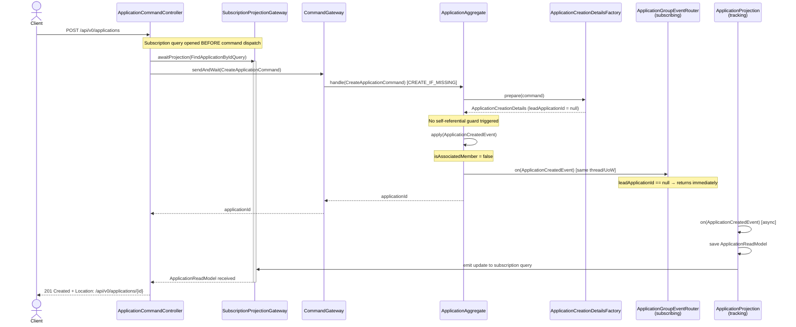

# Standalone Application Creation

An application submitted without a `leadApplicationId` — it is implicitly the lead of any future group.

```mermaid
sequenceDiagram
    actor Client
    participant Controller as ApplicationCommandController
    participant SubGateway as SubscriptionProjectionGateway
    participant CmdGateway as CommandGateway
    participant AppAggregate as ApplicationAggregate
    participant Factory as ApplicationCreationDetailsFactory
    participant Router as ApplicationGroupEventRouter<br/>(subscribing)
    participant Projection as ApplicationProjection<br/>(tracking)

    Client->>Controller: POST /api/v0/applications

    Note over Controller,SubGateway: Subscription query opened BEFORE command dispatch
    Controller->>SubGateway: awaitProjection(FindApplicationByIdQuery)
    activate SubGateway

    Controller->>CmdGateway: sendAndWait(CreateApplicationCommand)
    CmdGateway->>AppAggregate: handle(CreateApplicationCommand) [CREATE_IF_MISSING]
    AppAggregate->>Factory: prepare(command)
    Factory-->>AppAggregate: ApplicationCreationDetails (leadApplicationId = null)
    Note over AppAggregate: No self-referential guard triggered
    AppAggregate->>AppAggregate: apply(ApplicationCreatedEvent)
    Note over AppAggregate: isAssociatedMember = false

    AppAggregate->>Router: on(ApplicationCreatedEvent) [same thread/UoW]
    Note over Router: leadApplicationId == null → returns immediately

    AppAggregate-->>CmdGateway: applicationId
    CmdGateway-->>Controller: applicationId

    Projection->>Projection: on(ApplicationCreatedEvent) [async]
    Projection->>Projection: save ApplicationReadModel
    Projection->>SubGateway: emit update to subscription query

    SubGateway-->>Controller: ApplicationReadModel received
    deactivate SubGateway
    Controller-->>Client: 201 Created + Location: /api/v0/applications/{id}
```
