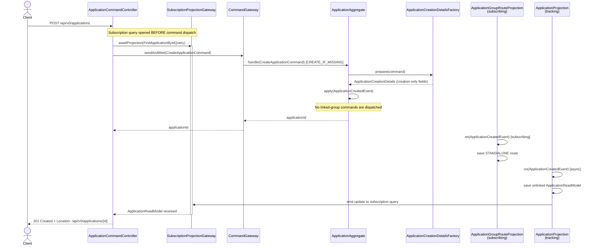

# Standalone Application Creation

Application creation always creates an unlinked application. Linking is performed later through the
explicit application-link endpoint.

```mermaid
sequenceDiagram
    actor Client
    participant Controller as ApplicationCommandController
    participant SubGateway as SubscriptionProjectionGateway
    participant CmdGateway as CommandGateway
    participant AppAggregate as ApplicationAggregate
    participant Factory as ApplicationCreationDetailsFactory
    participant RouteProjection as ApplicationGroupRouteProjection<br/>(subscribing)
    participant Projection as ApplicationProjection<br/>(tracking)

    Client->>Controller: POST /api/v0/applications

    Note over Controller,SubGateway: Subscription query opened BEFORE command dispatch
    Controller->>SubGateway: awaitProjection(FindApplicationByIdQuery)
    activate SubGateway

    Controller->>CmdGateway: sendAndWait(CreateApplicationCommand)
    CmdGateway->>AppAggregate: handle(CreateApplicationCommand) [CREATE_IF_MISSING]
    AppAggregate->>Factory: prepare(command)
    Factory-->>AppAggregate: ApplicationCreationDetails (creation-only fields)
    AppAggregate->>AppAggregate: apply(ApplicationCreatedEvent)
    Note over AppAggregate: No linked-group commands are dispatched

    AppAggregate-->>CmdGateway: applicationId
    CmdGateway-->>Controller: applicationId

    RouteProjection->>RouteProjection: on(ApplicationCreatedEvent) [subscribing]
    RouteProjection->>RouteProjection: save STANDALONE route
    Projection->>Projection: on(ApplicationCreatedEvent) [async]
    Projection->>Projection: save unlinked ApplicationReadModel
    Projection->>SubGateway: emit update to subscription query

    SubGateway-->>Controller: ApplicationReadModel received
    deactivate SubGateway
    Controller-->>Client: 201 Created + Location: /api/v0/applications/{id}
```
