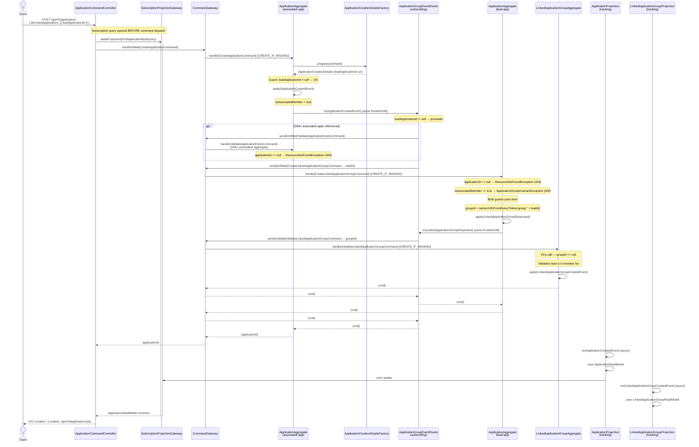

# Linked Application Creation (First Member Joining a New Group)

An application submitted with a `leadApplicationId` that has not yet formed a group.
The entire command chain — from `ApplicationCreatedEvent` through to group initialisation — runs
synchronously in a single Axon unit of work via the subscribing `ApplicationGroupEventRouter`.

