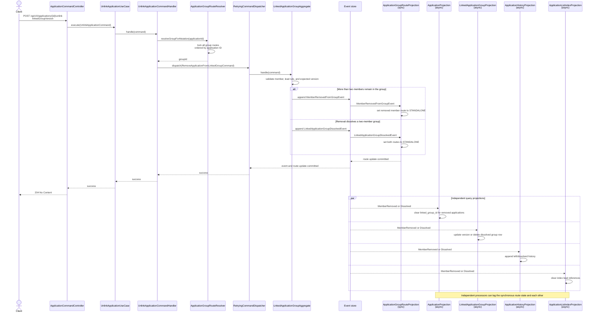

# Remove an Application from a Linked Group

The route rows for the complete group are locked before dispatch. A non-dissolving removal updates
the removed member's route synchronously with the event append. Removing one of two members emits a
single dissolution event; the synchronous route projection makes both routes standalone, while
read projections process the event asynchronously.

