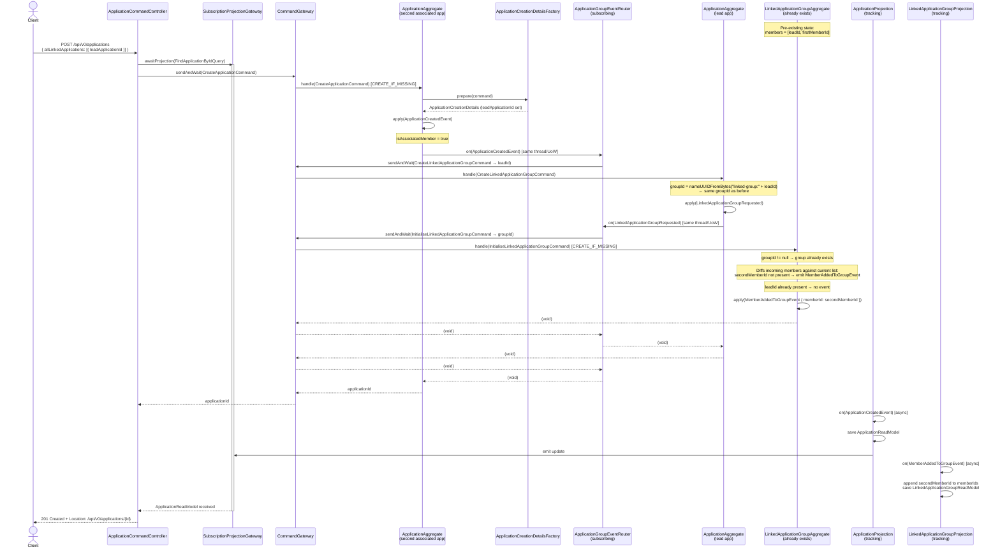

# Second Member Joining an Existing Group

A second associated application is submitted referencing the same `leadApplicationId` as a
previously created application. Because `groupId` is deterministic
(`nameUUIDFromBytes("linked-group:" + leadId)`), the command routes to the same
`LinkedApplicationGroupAggregate`, which diffs the incoming member list and emits
`MemberAddedToGroupEvent` only for the new member.

