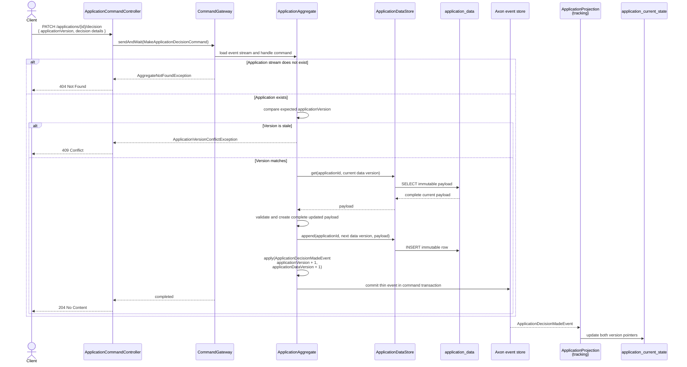

# Sensitive-Data Change and Thin Event

Decision, assignment, unassignment, and note commands use the same central pattern: load the
current immutable payload, append a complete next version, and emit a thin event that references
it. The example below uses a decision because it also demonstrates optimistic locking.

The data insert and event commit share command transaction management. If the data append fails, no
event is applied. If commit fails, the transaction rolls back the data insert.

Assignment and unassignment also advance `applicationVersion` and `applicationDataVersion`. Notes
advance only `applicationDataVersion`, because note creation is intentionally outside the decision
optimistic-lock contract.

Detailed query and history responses later join the thin state to `application_data` using
`(applicationId, applicationDataVersion)`. See
[Events and sensitive data](../events-and-sensitive-data.md).
