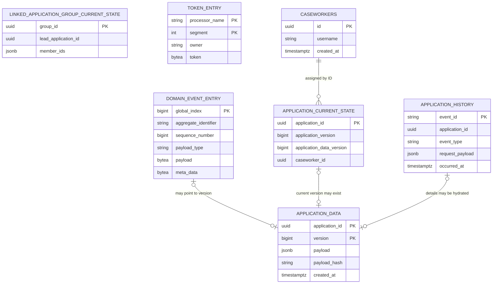

# Storage Model

The module uses one PostgreSQL schema, `axon`, for source records, versioned sensitive data, and
disposable query projections.

The relationships to `application_data` are logical, not database foreign keys. The event payload
contains `applicationId` and `applicationDataVersion`; the current-state row stores the same
pointer. Avoid adding a foreign key from the event store because event payload fields are serialized
data, and retention must be able to delete application rows while thin events remain.

## Ownership and lifecycle

| Table | Role | Authoritative? | Mutable? | Reset/replay? | Retention behaviour |
|---|---|---:|---:|---:|---|
| `domain_event_entry` | Aggregate event streams | Yes, for control state and transitions | Append-only | Source of replay | Retained by this design |
| `snapshot_event_entry` | Optional aggregate snapshots | No; optimization only | Replaceable | Rebuilt/discarded | Must not be the only source |
| `application_data` | Complete sensitive payload versions | Yes, for detailed content | Append-only | Not a projection | Deleted only through retention function |
| `application_current_state` | Current application query model | No | Yes | Yes | Pointer may outlive deleted payload |
| `application_history` | Public audit query model | No | Append during handling | Yes | Thin row may outlive deleted payload |
| `linked_application_group_current_state` | Group query model | No | Yes | Yes | Rebuilt from group events |
| `token_entry` | Tracking processor positions and claims | Operational state | Yes, via Axon | Reset through processor APIs | Not application retention data |
| `caseworkers` | Caseworker reference directory | Yes for caseworker existence | Yes | No | Requires its own policy |

## Event and data version relationship

An application event stream has Axon's `sequence_number`, while the application domain also uses
two explicit versions:

- `applicationVersion` implements the public optimistic-lock contract.
- `applicationDataVersion` selects a row from `application_data`.

These numbers can differ. Notes advance `applicationDataVersion` without advancing
`applicationVersion`, while Axon's event sequence advances for every event on the application
stream. Code must use the named field appropriate to its purpose rather than assuming the numbers
remain aligned.

## Projection data

`application_current_state` deliberately excludes most detailed application content. Query handlers
hydrate it from the referenced `application_data` row. `application_history` stores serialized thin
events, then reconstructs free-text descriptions and note content on query.

Group events are stored on their own event stream and projected into
`linked_application_group_current_state`. The history projection fans a group event out into one
public history row for the lead and one for each associated member.

## Database controls

The `application_data` migration installs triggers that reject:

- `UPDATE`;
- ordinary `DELETE`;
- `TRUNCATE`.

The security-definer retention function temporarily enables deletion for one application ID. Its
execution permission is revoked from `PUBLIC`; production use requires a deliberately granted role
and an audited workflow.

See [Events and sensitive data](events-and-sensitive-data.md) for the design and
[ADR 0002](adr/0002-separate-sensitive-data-from-domain-events.md) for the rationale.
