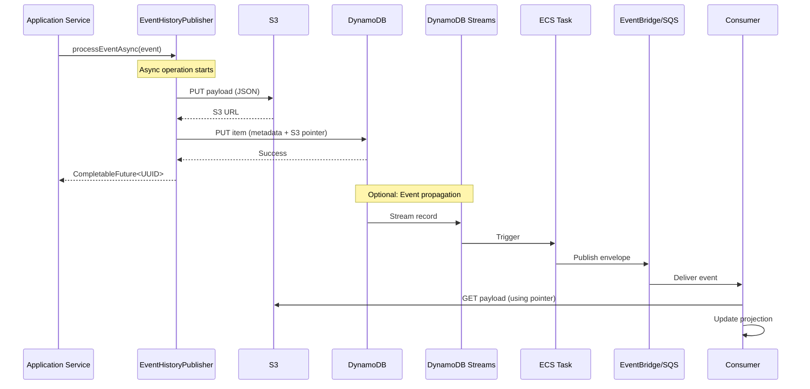
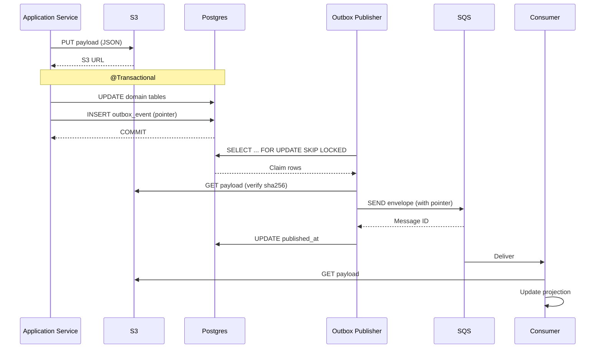
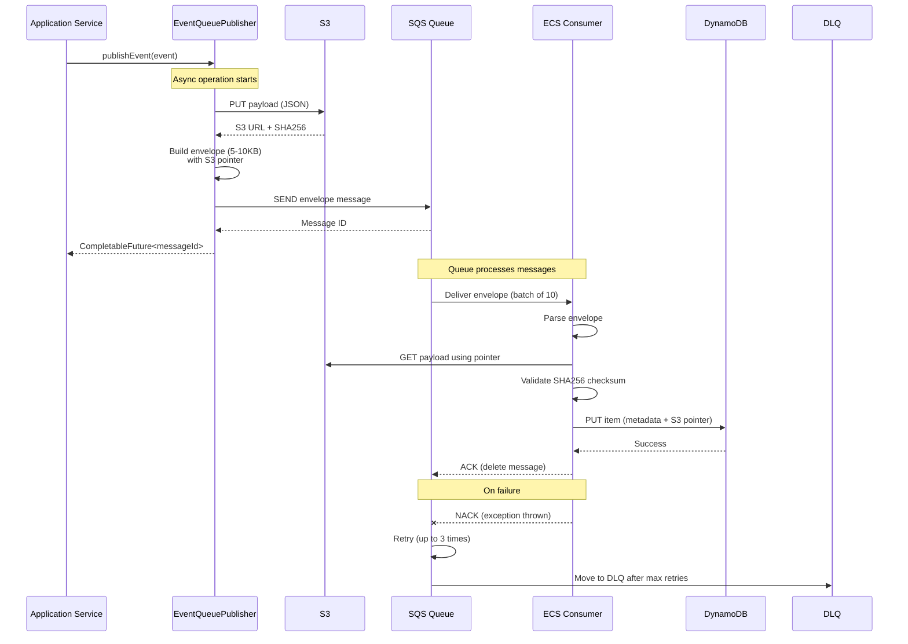
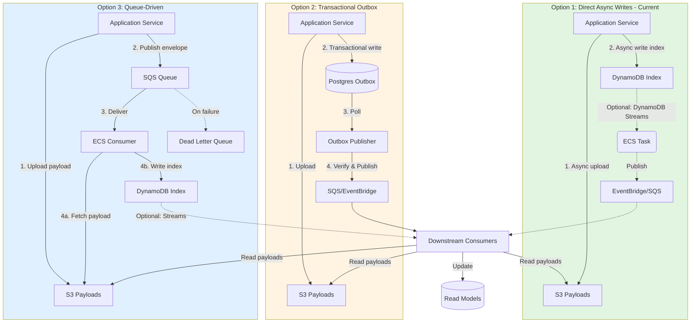

# Event-Driven System-of-Record — Design Summary (Version 2.1)

Date: 2026-01-14  
Last Updated: 2026-02-13 (Version 2.1)

This document summarizes a design discussion and recommendations for adopting an event-driven system-of-record for application history. It covers the event model, storage choices (S3 + DynamoDB), **three implementation approaches** (direct async writes, outbox pattern, and queue-driven processing), DynamoDB schema suggestions and trade-offs (hot partitions, GSIs), DynamoDB Streams integration, SQS/EventBridge integration, operational concerns, and migration guidance.

## Document Updates

**2026-02-13 (Version 2.1):**
- Updated SQS payload limit from 256KB to **1MB** (recent AWS increase)
- Revised guidance: Envelope pattern with S3 pointers recommended for payloads > 1MB
- Small to medium events (< 1MB) can now be sent inline to SQS
- Updated payload size analysis and recommendations throughout

**2026-02-13 (Version 2):**
- Added **Option 3: Queue-Driven Async Processing** using SQS/SNS/EventBridge
  - Detailed envelope pattern with S3 pointers for large payloads
  - Documented ECS consumer architecture
  - Added payload size analysis for legal aid applications (typically 50KB-2MB, some up to 5MB)
  - Explained built-in retry, DLQ, and auto-scaling benefits
  - Included comprehensive comparison table across all three options
- Updated all diagrams to include Option 3
- Added operational considerations specific to queue-driven approach

**2026-02-13 (Version 1):**
- Restructured document to clearly present **two implementation options**
- **Option 1 (Current Implementation):** Direct async writes to S3 and DynamoDB without outbox table
  - Detailed the async processing flow using `EventHistoryPublisher` and `DynamoDbService`
  - Documented advantages (simplicity, low latency) and disadvantages (no transactional guarantees)
  - Added operational considerations for monitoring and orphan object cleanup
- **Option 2:** Transactional Outbox pattern with Postgres for guaranteed delivery
  - Positioned as an alternative for systems requiring strict consistency
  - Included implementation details, schema, and tradeoffs
- Added comparison table between both options
- Updated all diagrams to show both approaches
- Clarified which sections apply to which option

## Quick executive summary

- Use an immutable event log as the system of record. Initially emit full-application JSON payloads (stored in S3) and evolve to smaller domain events (e.g., `IndividualAdded`, `ProceedingUpdated`).
- Store heavy payloads in S3 and reference them via pointers + metadata in DynamoDB.
- **Three implementation approaches are documented:**
  - **Option 1 (Current Implementation):** Direct async writes to S3 and DynamoDB without an outbox table. Simple, low-latency, suitable when you don't need transactional guarantees with domain writes.
  - **Option 2:** Transactional Outbox pattern with Postgres when your write path requires atomic consistency between domain data and event publishing.
  - **Option 3:** Queue-Driven async processing using SQS/SNS/EventBridge. Application publishes lightweight envelopes (with S3 pointers) to a queue, and ECS consumers handle S3 and DynamoDB writes. Provides built-in retries, DLQ, and auto-scaling.
- For all options using SQS: **Recommendation varies by payload size**. With the updated SQS limit of **1MB** (increased from 256KB), small to medium events (< 1MB) can be sent inline. For larger legal aid application payloads (often 1-5MB), use the **envelope pattern with S3 pointers**.
- If using DynamoDB as the event index, prefer single-table naming `pk` / `sk` and GS1 (`gs1pk` / `gs1sk`) for alternate access patterns. Keep items small; use S3 pointers for payloads.
- Consider DynamoDB Streams -> ECS Task -> EventBridge/SQS for event propagation to reduce custom polling, but ensure idempotency and checksum validation.

## Checklist (what this doc covers)

- [x] Event envelope and payload separation
- [x] S3 for heavy payloads and pointer model
- [x] DynamoDB schema recommendation for event index (single-table `pk`/`sk`)
- [x] **Option 1: Direct async writes to S3 and DynamoDB (current implementation)**
- [x] **Option 2: Outbox pattern with Postgres and SQS integration**
- [x] **Option 3: Queue-Driven async processing with SQS/EventBridge**
- [x] Payload size analysis and envelope pattern for SQS
- [x] DynamoDB Streams usage and caveats
- [x] Ordering, idempotency, and de-duplication
- [x] Security, retention, and operational monitoring
- [x] Migration and testing recommendations

---

## 1. Canonical event shape (envelope + payload pointer)

Keep a small, stable envelope that brokers and queues carry. Keep full payloads in S3 and reference them from the envelope.

Example envelope (JSON-like):

```json
{
  "eventId": "uuid",
  "occurredAt": "2026-01-01T12:34:56Z",
  "type": "APPLICATION_UPDATED",
  "aggregateType": "Application",
  "aggregateId": "application-uuid",
  "sequenceNumber": 42,
  "schemaVersion": 1,
  "producer": "access-service",
  "payloadPointer": {
    "storage": "s3",
    "bucket": "app-history-payloads",
    "key": "events/application/2026/01/01/<eventId>.json",
    "sha256": "..."
  },
  "metadata": {
    "createdBy": "user@example.com",
    "correlationId": "request-id",
    "traceId": "trace-id"
  }
}
```

Notes:
- Envelope fields should be small, stable and versioned (`schemaVersion`).
- Consumers use `payloadPointer` to fetch the full payload from S3 and validate using `sha256`.

---

## 2. Implementation Options: Three Approaches Compared

This section compares three approaches for persisting events to S3 and DynamoDB, and optionally propagating them to downstream consumers.

### Option 1: Direct Async Writes to S3 and DynamoDB (Current Implementation)

**Description:**

This is the current implementation. When a domain event occurs, the service directly writes to both S3 (for the full payload) and DynamoDB (for the event index) using asynchronous methods. There is no intermediate outbox table or transactional coordination between these writes.

**Implementation Flow:**

1. **S3 Upload First:** The event payload (full JSON) is uploaded to S3 asynchronously via `S3Service.upload()`.
2. **DynamoDB Write Second:** Once the S3 upload succeeds and returns the S3 URL, a DynamoDB item (containing metadata + S3 pointer) is written asynchronously via `DynamoDbService.saveDomainEvent()`.
3. **Both operations run in async threads** managed by Spring's `@Async` executor.
4. **No transactional guarantees:** If S3 succeeds but DynamoDB fails (or vice versa), you may have orphan S3 objects or missing index entries.

**Code Example (Current Implementation):**

```java
@Component
public class EventHistoryPublisher {
  
  @Async
  public CompletableFuture<UUID> processEventAsync(Event event) {
    return CompletableFuture.supplyAsync(() -> uploadToS3(event), executor)
        .thenComposeAsync(s3Url -> {
          if (s3Url == null) {
            return CompletableFuture.completedFuture(null);
          }
          return dynamoDbService.saveDomainEvent(event, s3Url)
              .thenApply(__ -> event.domainEventId());
        }, executor);
  }
  
  private String uploadToS3(Event event) {
    S3UploadResult result = s3Service.upload(event.requestPayload(), bucketName, key);
    return result.isSuccess() ? result.getS3Url() : null;
  }
}
```

**Advantages:**

- **Simple:** No additional outbox table or polling infrastructure required.
- **Low Latency:** Events are published immediately upon domain write completion.
- **Serverless-Friendly:** Works well with DynamoDB Streams -> ECS Task -> EventBridge for downstream event propagation without custom pollers.
- **Minimal Operational Overhead:** Fewer moving parts (no outbox poller).

**Disadvantages:**

- **No Transactional Guarantees:** S3 and DynamoDB writes are not atomic. Partial failures can lead to:
  - Orphan S3 objects if DynamoDB write fails
  - Missing event index entries if S3 succeeds but DynamoDB fails
- **No Automatic Retry for Partial Failures:** If DynamoDB write fails, you rely on application-level error handling and manual intervention.
- **No Built-in Event Ordering Guarantee:** If you don't enforce sequence numbers atomically, concurrent writes may result in out-of-order events.
- **Harder to Replay/Reconcile:** Without a durable outbox, identifying and replaying failed events requires custom tooling (e.g., scanning S3 for orphaned objects).

**When to Use:**

- You do **not** require strict transactional consistency between domain state and event publishing.
- Your system can tolerate occasional orphan S3 objects (which can be cleaned up via lifecycle rules or GC jobs).
- You prioritize simplicity and low latency over guaranteed delivery.
- You are building a greenfield system without existing Postgres domain writes.

**Operational Considerations:**

- **Implement S3 orphan detection and cleanup:** Periodically scan for S3 objects without corresponding DynamoDB entries and delete or retry.
- **Monitor async failures:** Track CompletableFuture failures and alert on high error rates.
- **Implement idempotency:** Ensure consumers can handle duplicate events (if retries are implemented).
- **Checksum validation:** Include SHA256 checksums in DynamoDB items and validate on read.

---

### Option 2: Transactional Outbox Pattern with Postgres

**Description:**

When your domain writes occur in a Postgres transaction, you can use the Outbox pattern to achieve transactional consistency between domain state changes and event publishing. An outbox table (in the same Postgres database) stores event pointers inside the same transaction that updates domain data. A separate publisher process polls the outbox and publishes events to SQS/EventBridge.

**Implementation Flow:**

1. **S3 Upload First:** Upload the event payload to S3 before starting the database transaction.
2. **Transactional Write:** Within a single `@Transactional` scope:
   - Update domain tables (e.g., applications, individuals)
   - Insert an outbox row with event metadata + S3 pointer
3. **Publisher Polls Outbox:** A background process (scheduled task or dedicated service) claims unpublished rows using `SELECT ... FOR UPDATE SKIP LOCKED` and publishes them to SQS/EventBridge.
4. **Mark Published:** After successful publish, update the outbox row with `published_at` timestamp.

**Code Example (Conceptual):**

```java
@Service
@Transactional
public class ApplicationService {
  
  public void updateApplication(Application app, JsonNode payload) {
    // 1. Upload to S3 first (outside transaction or with rollback compensation)
    String s3Url = s3Service.uploadSync(payload, bucketName, key);
    
    // 2. Update domain state
    applicationRepository.save(app);
    
    // 3. Insert outbox row (atomic with domain write)
    OutboxEvent outboxEvent = OutboxEvent.builder()
        .eventId(UUID.randomUUID())
        .aggregateId(app.getId())
        .eventType("APPLICATION_UPDATED")
        .payloadS3Bucket(bucketName)
        .payloadS3Key(key)
        .payloadSha256(calculateSha256(payload))
        .build();
    outboxRepository.save(outboxEvent);
    
    // 4. Commit transaction (both domain + outbox are atomic)
  }
}
```

**Publisher Poller:**

```java
@Scheduled(fixedDelay = 1000)
public void publishPendingEvents() {
  List<OutboxEvent> pending = outboxRepository.claimPending(BATCH_SIZE);
  for (OutboxEvent event : pending) {
    try {
      String envelope = buildEnvelope(event);
      sqsClient.sendMessage(queueUrl, envelope);
      outboxRepository.markPublished(event.getId());
    } catch (Exception e) {
      outboxRepository.incrementAttempts(event.getId(), e.getMessage());
    }
  }
}
```

**Advantages:**

- **Transactional Consistency:** Domain writes and event publishing are atomic. Either both succeed or both roll back.
- **Guaranteed Delivery:** Events in the outbox will eventually be published (with retries).
- **Built-in Retry Logic:** Failed publishes can be retried automatically by the poller.
- **Easier Replay:** The outbox serves as a durable event log for replay and reconciliation.
- **Ordering Control:** Use explicit sequence numbers or rely on insertion order to maintain event ordering per aggregate.

**Disadvantages:**

- **Increased Complexity:** Requires an additional outbox table, poller infrastructure, and monitoring.
- **Higher Latency:** Events are published after the transaction commits and the poller picks them up (typically 100ms to a few seconds delay).
- **Operational Overhead:** Must monitor outbox lag, poller health, and handle poison messages.
- **Database Load:** The outbox table adds write load to Postgres and requires regular cleanup of published events.
- **S3-First Complication:** If S3 upload fails after transaction commit, you have an outbox entry pointing to a non-existent S3 object (requires compensation logic).

**When to Use:**

- You **require strict transactional consistency** between domain state and event publishing.
- Your domain writes occur in Postgres (or another RDBMS).
- You can tolerate slightly higher latency (typically < 5 seconds).
- You need guaranteed event delivery and built-in retry logic.
- You want a durable, queryable event log for debugging and replay.

**Operational Considerations:**

- **Monitor outbox lag:** Alert if pending events exceed a threshold (e.g., > 1000 or > 60 seconds old).
- **Implement poison message handling:** Move repeatedly failing events to a DLQ after N attempts.
- **Cleanup published events:** Archive or delete old outbox rows to prevent unbounded growth.
- **Use SKIP LOCKED:** Ensure your poller query uses `SELECT ... FOR UPDATE SKIP LOCKED` to avoid lock contention.
- **Idempotency:** Include `eventId` in SQS messages and ensure consumers deduplicate.

---

### Option 3: Queue-Driven Async Processing (SQS/SNS/EventBridge)

**Description:**

Instead of directly writing to S3 and DynamoDB from the application (Option 1) or using a database outbox (Option 2), publish event envelopes to an AWS queue (SQS, SNS, or EventBridge) first. A separate consumer service (ECS task) processes messages from the queue and handles the S3 upload and DynamoDB writes.

**Important:** With AWS's recent increase of the SQS message size limit to **1MB** (from 256KB), you now have two approaches:

1. **Inline Payloads (< 1MB)**: For smaller events, send the full payload directly in the SQS message body. Simpler but limited to 1MB.
2. **Envelope Pattern with S3 Pointers (Recommended for > 1MB)**: Upload payload to S3 first, then send only a lightweight envelope with S3 pointer to the queue. Required for large legal aid applications (often 1-5MB).

**Recommendation:** Since legal aid application payloads vary widely (50KB to 5MB+), and many exceed 1MB, the **envelope pattern is still recommended** for consistency and to handle all payload sizes. However, for simpler events like status updates or small notifications, inline payloads are now viable.

**Decision Criteria: Inline vs Envelope Pattern**

| Criteria | Use Inline (< 1MB) | Use Envelope + S3 |
|----------|-------------------|-------------------|
| **Payload Size** | Guaranteed < 1MB | Variable or > 1MB |
| **Event Type** | Status updates, notifications | Full application data |
| **Consistency** | Different handling per event | Uniform handling all events |
| **Complexity** | ✅ Simpler (no S3) | ⚠️ More complex |
| **Cost** | ✅ Lower (SQS only) | ⚠️ Higher (SQS + S3 + ECS compute) |
| **Durability** | ⚠️ SQS retention (14 days max) | ✅ S3 long-term storage |
| **Replay** | ⚠️ Limited to retention window | ✅ Replay anytime from S3 |

**For Legal Aid Applications:** Use envelope pattern for all application events to ensure consistency.

**Implementation Flow (Envelope Pattern):**

1. **Application uploads to S3:** Upload the full event payload (JSON) to S3 and calculate SHA256 checksum.
2. **Application publishes envelope to queue:** Send a lightweight envelope (5-10KB) containing event metadata and S3 pointer to SQS/SNS/EventBridge.
3. **Consumer receives message:** ECS task or container picks up the message from the queue.
4. **Consumer fetches payload:** Download the full payload from S3 using the pointer.
5. **Consumer validates checksum:** Verify SHA256 to ensure data integrity.
6. **Consumer writes to DynamoDB:** Store event index with metadata and S3 pointer.
7. **ACK/NACK message:** On success, acknowledge/delete the message; on failure, rely on queue retries or send to DLQ.

**Code Example (Producer - Application Side):**

```java
@Service
public class EventQueuePublisher {
    private final S3Service s3Service;
    private final SqsClient sqsClient;
    private final ObjectMapper objectMapper;
    
    @Value("${aws.sqs.event-queue-url}")
    private String queueUrl;
    
    @Value("${aws.s3.bucket-name}")
    private String bucketName;

    public CompletableFuture<String> publishEvent(Event event) {
        return CompletableFuture.supplyAsync(() -> {
            try {
                // 1. Upload payload to S3 first
                String s3Key = buildS3Key(event);
                S3UploadResult uploadResult = s3Service.upload(
                    event.requestPayload(), 
                    bucketName, 
                    s3Key
                );
                
                if (!uploadResult.isSuccess()) {
                    log.error("S3 upload failed for event {}", event.domainEventId());
                    throw new RuntimeException("S3 upload failed");
                }
                
                String s3Url = uploadResult.getS3Url();
                String sha256 = uploadResult.getSha256(); // Calculate during upload
                
                // 2. Build lightweight envelope
                EventEnvelope envelope = EventEnvelope.builder()
                    .eventId(event.domainEventId().toString())
                    .eventType(event.eventType().name())
                    .aggregateType("APPLICATION")
                    .aggregateId(event.applicationId())
                    .occurredAt(event.timestamp().toString())
                    .payloadPointer(PayloadPointer.builder()
                        .storage("s3")
                        .bucket(bucketName)
                        .key(s3Key)
                        .sha256(sha256)
                        .sizeBytes(event.requestPayload().length())
                        .build())
                    .metadata(Map.of(
                        "caseworkerId", event.caseworkerId(),
                        "description", event.description()
                    ))
                    .build();
                
                // 3. Send envelope to SQS
                String messageBody = objectMapper.writeValueAsString(envelope);
                
                SendMessageRequest request = SendMessageRequest.builder()
                    .queueUrl(queueUrl)
                    .messageBody(messageBody)
                    .messageAttributes(Map.of(
                        "eventId", MessageAttributeValue.builder()
                            .dataType("String")
                            .stringValue(event.domainEventId().toString())
                            .build(),
                        "eventType", MessageAttributeValue.builder()
                            .dataType("String")
                            .stringValue(event.eventType().name())
                            .build()
                    ))
                    .build();
                
                SendMessageResponse response = sqsClient.sendMessage(request);
                log.info("Published event {} to SQS, messageId: {}, s3Url: {}", 
                         event.domainEventId(), response.messageId(), s3Url);
                
                return response.messageId();
                
            } catch (Exception e) {
                log.error("Failed to publish event {}", event.domainEventId(), e);
                throw new RuntimeException("Event publishing failed", e);
            }
        });
    }
    
    private String buildS3Key(Event event) {
        return String.format("%s/%s-%s.json",
            event.applicationId(),
            event.eventType().name(),
            event.timestamp().toString().replace(":", "-")
        );
    }
}
```

**Code Example (Consumer - ECS Task Service):**

```java
@Service
@Slf4j
public class EventConsumerService {
    private final S3Service s3Service;
    private final DynamoDbService dynamoDbService;
    private final ObjectMapper objectMapper;
    private final SqsClient sqsClient;
    
    @Value("${aws.sqs.queue-url}")
    private String queueUrl;
    
    @Value("${aws.sqs.max-messages:10}")
    private int maxMessages;
    
    @Value("${aws.sqs.wait-time-seconds:20}")
    private int waitTimeSeconds;

    @Scheduled(fixedDelay = 1000) // Poll every second
    public void processMessages() {
        try {
            ReceiveMessageRequest receiveRequest = ReceiveMessageRequest.builder()
                .queueUrl(queueUrl)
                .maxNumberOfMessages(maxMessages)
                .waitTimeSeconds(waitTimeSeconds) // Long polling
                .build();
            
            ReceiveMessageResponse response = sqsClient.receiveMessage(receiveRequest);
            
            for (Message message : response.messages()) {
                try {
                    processMessage(message);
                    
                    // Delete message after successful processing
                    sqsClient.deleteMessage(DeleteMessageRequest.builder()
                        .queueUrl(queueUrl)
                        .receiptHandle(message.receiptHandle())
                        .build());
                        
                    log.info("Successfully processed and deleted message: {}", 
                        message.messageId());
                        
                } catch (ChecksumMismatchException e) {
                    // Don't retry - payload is corrupted
                    log.error("Checksum validation failed for message: {}", 
                        message.messageId(), e);
                    // Move to DLQ manually or delete to prevent reprocessing
                    sqsClient.deleteMessage(DeleteMessageRequest.builder()
                        .queueUrl(queueUrl)
                        .receiptHandle(message.receiptHandle())
                        .build());
                        
                } catch (Exception e) {
                    log.error("Failed to process message: {}", message.messageId(), e);
                    // Don't delete - let SQS retry based on visibility timeout
                    // After maxReceiveCount attempts, SQS will move to DLQ automatically
                }
            }
            
        } catch (Exception e) {
            log.error("Error polling SQS queue", e);
        }
    }
    
    private void processMessage(Message message) throws Exception {
        // 1. Parse envelope
        EventEnvelope envelope = objectMapper.readValue(
            message.body(), 
            EventEnvelope.class
        );
        
        log.info("Processing event: {}", envelope.getEventId());
        
        // 2. Download payload from S3
        String s3Url = String.format("s3://%s/%s",
            envelope.getPayloadPointer().getBucket(),
            envelope.getPayloadPointer().getKey()
        );
        
        String payload = s3Service.downloadEventsAsStrings(s3Url);
        
        // 3. Validate checksum
        String actualSha256 = calculateSha256(payload);
        String expectedSha256 = envelope.getPayloadPointer().getSha256();
        
        if (!actualSha256.equals(expectedSha256)) {
            log.error("Checksum mismatch for event {}. Expected: {}, Actual: {}",
                envelope.getEventId(), expectedSha256, actualSha256);
            throw new ChecksumMismatchException("Payload corrupted");
        }
        
        // 4. Write to DynamoDB
        Event event = Event.fromEnvelope(envelope, payload);
        dynamoDbService.saveDomainEventSync(event, s3Url)
            .get(); // Wait for completion
        
        log.info("Successfully processed event: {}", envelope.getEventId());
    }
    
    private String calculateSha256(String content) {
        // Implementation of SHA256 calculation
        // ...
    }
}
```

**Event Envelope Schema:**

```json
{
  "eventId": "550e8400-e29b-41d4-a716-446655440000",
  "eventType": "APPLICATION_UPDATED",
  "aggregateType": "APPLICATION",
  "aggregateId": "application-uuid-123",
  "occurredAt": "2026-02-13T12:34:56.789Z",
  "payloadPointer": {
    "storage": "s3",
    "bucket": "laa-data-stewardship-access-bucket",
    "key": "application-uuid-123/APPLICATION_UPDATED-2026-02-13T12-34-56.789Z.json",
    "sha256": "abc123def456...",
    "sizeBytes": 524288
  },
  "metadata": {
    "caseworkerId": "caseworker-123",
    "description": "Application updated",
    "correlationId": "request-uuid",
    "traceId": "trace-uuid"
  }
}
```

**ECS Configuration (CloudFormation):**

```yaml
EventConsumerTaskDefinition:
  Type: AWS::ECS::TaskDefinition
  Properties:
    Family: event-consumer-task
    NetworkMode: awsvpc
    RequiresCompatibilities:
      - FARGATE
    Cpu: '512'
    Memory: '1024'
    ExecutionRoleArn: !GetAtt ECSTaskExecutionRole.Arn
    TaskRoleArn: !GetAtt ECSTaskRole.Arn
    ContainerDefinitions:
      - Name: event-consumer
        Image: !Sub ${AWS::AccountId}.dkr.ecr.${AWS::Region}.amazonaws.com/event-consumer:latest
        Essential: true
        LogConfiguration:
          LogDriver: awslogs
          Options:
            awslogs-group: /ecs/event-consumer
            awslogs-region: !Ref AWS::Region
            awslogs-stream-prefix: ecs
        Environment:
          - Name: AWS_SQS_QUEUE_URL
            Value: !Ref EventQueue
          - Name: AWS_SQS_MAX_MESSAGES
            Value: '10'
          - Name: AWS_SQS_WAIT_TIME_SECONDS
            Value: '20'
          - Name: DYNAMODB_TABLE_NAME
            Value: !Ref EventIndexTable
          - Name: S3_BUCKET_NAME
            Value: !Ref EventPayloadBucket

EventConsumerService:
  Type: AWS::ECS::Service
  Properties:
    ServiceName: event-consumer-service
    Cluster: !Ref ECSCluster
    TaskDefinition: !Ref EventConsumerTaskDefinition
    DesiredCount: 2  # Scale as needed
    LaunchType: FARGATE
    NetworkConfiguration:
      AwsvpcConfiguration:
        AssignPublicIp: DISABLED
        SecurityGroups:
          - !Ref ConsumerSecurityGroup
        Subnets:
          - !Ref PrivateSubnet1
          - !Ref PrivateSubnet2

ECSTaskRole:
  Type: AWS::IAM::Role
  Properties:
    AssumeRolePolicyDocument:
      Statement:
        - Effect: Allow
          Principal:
            Service: ecs-tasks.amazonaws.com
          Action: 'sts:AssumeRole'
    ManagedPolicyArns:
      - arn:aws:iam::aws:policy/service-role/AmazonECSTaskExecutionRolePolicy
    Policies:
      - PolicyName: EventConsumerPolicy
        PolicyDocument:
          Statement:
            - Effect: Allow
              Action:
                - sqs:ReceiveMessage
                - sqs:DeleteMessage
                - sqs:GetQueueAttributes
              Resource: !GetAtt EventQueue.Arn
            - Effect: Allow
              Action:
                - s3:GetObject
              Resource: !Sub '${EventPayloadBucket.Arn}/*'
            - Effect: Allow
              Action:
                - dynamodb:PutItem
                - dynamodb:GetItem
              Resource: !GetAtt EventIndexTable.Arn

EventQueue:
  Type: AWS::SQS::Queue
  Properties:
    QueueName: event-processing-queue
    VisibilityTimeout: 300  # 5 minutes
    MessageRetentionPeriod: 1209600  # 14 days
    ReceiveMessageWaitTimeSeconds: 20  # Long polling
    RedrivePolicy:
      deadLetterTargetArn: !GetAtt EventDLQ.Arn
      maxReceiveCount: 3  # Retry 3 times before DLQ

EventDLQ:
  Type: AWS::SQS::Queue
  Properties:
    QueueName: event-processing-dlq
    MessageRetentionPeriod: 1209600  # 14 days
```

**Advantages:**

- **✅ Decoupling:** Application doesn't directly manage S3/DynamoDB writes; clear separation of concerns.
- **✅ Built-in Retries:** SQS provides automatic retries with exponential backoff (up to maxReceiveCount).
- **✅ Dead Letter Queue:** Failed messages are automatically routed to DLQ for investigation and manual replay.
- **✅ Rate Limiting:** Control processing rate via ECS task count and SQS visibility timeout.
- **✅ Auto-Scaling:** ECS Service can auto-scale based on queue depth using CloudWatch alarms and Application Auto Scaling.
- **✅ Transaction Isolation:** Application commits domain changes without waiting for storage operations to complete.
- **✅ Monitoring & Observability:** Native CloudWatch metrics for queue depth, message age, DLQ messages, ECS task errors.
- **✅ Replay Capability:** Can replay messages from S3 or reprocess DLQ messages.
- **✅ No Payload Size Limit:** Envelope pattern allows payloads up to 5TB (S3 limit).
- **✅ Cost-Effective:** SQS charges per request (~$0.40 per million requests), not payload size.

**Disadvantages:**

- **⚠️ Additional Components:** Requires queue infrastructure, ECS tasks/services, and IAM roles.
- **⚠️ Higher Latency:** Message queuing adds 500ms-2s latency before processing.
- **⚠️ Operational Cost:** SQS + ECS compute add monthly costs (typically $50-200/month depending on task size and count).
- **⚠️ Eventual Consistency:** Events appear in DynamoDB after queue processing delay (1-5 seconds typically).
- **⚠️ Complexity:** More moving parts to monitor and debug compared to Option 1.
- **⚠️ Two-Phase Write:** S3 upload happens before queue publish; if queue publish fails, orphan S3 objects remain.
- **⚠️ ECS Configuration:** Requires task definitions, service configuration, networking, and security groups.

**When to Use:**

- You want **built-in retry logic and DLQ** without implementing custom async handling.
- You need **strong decoupling** between application and storage/processing layers.
- You want **visibility into processing failures** via DLQ and CloudWatch metrics.
- You can tolerate **1-5 second latency** for events to appear in DynamoDB.
- You want **auto-scaling consumers** based on queue depth without manual intervention.
- You need **rate limiting** for downstream systems or external APIs.
- You want **independent deployment** of producers and consumers.
- You're building a **microservices architecture** where services communicate via events.

**When NOT to Use:**

- You require **sub-second latency** for events to appear in indexes (use Option 1).
- You need **transactional consistency** between domain writes and events (use Option 2).
- You want to **minimize operational complexity** and have no downstream consumers yet (use Option 1).
- Your team lacks **AWS SQS/ECS expertise** and prefers simpler solutions.

**Operational Considerations:**

- **Monitor Queue Depth:** Alert if `ApproximateNumberOfMessagesVisible` exceeds threshold (e.g., > 1000 or increasing trend).
- **Monitor Message Age:** Alert if `ApproximateAgeOfOldestMessage` exceeds 60 seconds (indicates consumer lag).
- **DLQ Monitoring:** Alert immediately on messages in DLQ; investigate root cause and replay after fixing.
- **ECS Task Metrics:** Monitor task errors, health checks, CPU/memory utilization, and task count.
- **S3 Orphan Detection:** Periodically scan S3 for objects without DynamoDB entries (failed queue publishes).
- **Cost Monitoring:** Track SQS requests and ECS task compute hours; set budget alerts.
- **Idempotency:** Use `eventId` for DynamoDB conditional writes to prevent duplicate processing.
- **Checksum Validation:** Always validate SHA256 before processing to detect corruption.
- **Message Ordering:** Use SQS FIFO queue if strict per-aggregate ordering is required (MessageGroupId = aggregateId).
- **Payload Cleanup:** Implement S3 lifecycle rules to archive/delete old payloads based on retention policy.

**Payload Size Analysis:**

Legal aid application payloads typically range from:
- **Minimal Application:** 5-15 KB (basic applicant info, single proceeding)
- **Medium Application:** 50-150 KB (multiple individuals, 2-3 proceedings)
- **Large Application:** 300 KB - 2 MB (complex cases, multiple parties, extensive details)
- **Maximum Observed:** Up to 5 MB+ (highly complex cases)

**SQS Limits and Recommendations:**
- **SQS Message Limit:** 1 MB (updated from 256 KB as of 2024)
- **Under 1 MB:** Can send inline in SQS message body (simpler approach)
- **Over 1 MB:** Must use envelope pattern with S3 pointer (many legal aid cases fall here)
- **Recommendation:** Use envelope pattern consistently for all application payloads to handle the full range (5KB-5MB+) uniformly, even though smaller payloads could technically be sent inline.

**Conclusion:** While the increased 1MB SQS limit means ~60-70% of legal aid applications could be sent inline, using the envelope pattern for **all application events** provides consistency and handles edge cases (complex applications > 1MB) without special handling.

---

### Comparison Table: All Three Options

```sql
CREATE TABLE outbox_event (
  id              uuid PRIMARY KEY DEFAULT gen_random_uuid(),
  event_id        uuid NOT NULL UNIQUE,
  aggregate_id    uuid,
  aggregate_type  text,
  event_type      text,
  sequence_number bigint,
  payload_s3_bucket text,
  payload_s3_key   text,
  payload_sha256   text,
  payload_size     bigint,
  created_at      timestamptz NOT NULL DEFAULT now(),
  published_at    timestamptz,
  attempts        int NOT NULL DEFAULT 0,
  last_error      text
);

CREATE INDEX idx_outbox_pending ON outbox_event (created_at) WHERE published_at IS NULL;
CREATE INDEX idx_outbox_aggregate ON outbox_event (aggregate_id, sequence_number);
```

---

### Comparison Table: All Three Options

| Aspect | Option 1: Direct Async | Option 2: Outbox Pattern | Option 3: Queue-Driven |
|--------|------------------------|--------------------------|------------------------|
| **Transactional Consistency** | ❌ No | ✅ Yes (DB + events atomic) | ❌ No |
| **Guaranteed Delivery** | ❌ No (requires custom retry) | ✅ Yes (poller retries) | ✅ Yes (SQS retries + DLQ) |
| **Built-in Retries** | ❌ No | ✅ Yes (poller logic) | ✅ Yes (SQS native) |
| **Dead Letter Queue** | ❌ No | ⚠️ Manual implementation | ✅ Native SQS DLQ |
| **Latency** | ✅ Low (< 100ms) | ⚠️ Medium (1-5s poller) | ⚠️ Medium (1-5s queue) |
| **Complexity** | ✅ Simple | ⚠️ Complex (DB + poller) | ⚠️ Moderate (queue + ECS) |
| **Operational Overhead** | ✅ Low | ⚠️ High (poller monitoring) | ⚠️ Moderate (queue monitoring) |
| **Decoupling** | ⚠️ Tight (app writes directly) | ✅ Good (DB decouples) | ✅ Excellent (queue decouples) |
| **Auto-Scaling** | ❌ No (fixed thread pool) | ⚠️ Manual poller scaling | ✅ Yes (ECS auto-scales with queue) |
| **Rate Limiting** | ⚠️ Manual (thread pool size) | ⚠️ Manual (poller batch) | ✅ Easy (task count limits) |
| **Monitoring & Visibility** | ⚠️ App logs only | ⚠️ DB queries + logs | ✅ CloudWatch metrics built-in |
| **Orphan S3 Objects** | ⚠️ Possible (DDB write fails) | ⚠️ Possible (S3-first) | ⚠️ Possible (queue publish fails) |
| **Durable Event Log** | ⚠️ DynamoDB only | ✅ Postgres outbox | ⚠️ DynamoDB only |
| **Replay Support** | ⚠️ Custom tooling needed | ✅ Query outbox table | ✅ Replay from DLQ/S3 |
| **Message Ordering** | ⚠️ No guarantees | ✅ Sequence numbers | ✅ FIFO queue (optional) |
| **Cost** | ✅ Low (no extra infra) | ⚠️ Moderate (DB + compute) | ⚠️ Moderate (SQS + ECS) |
| **Independent Deployment** | ❌ No (tightly coupled) | ⚠️ Partial (poller separate) | ✅ Yes (producer/consumer) |
| **Multi-Consumer Support** | ❌ Hard to add | ⚠️ Requires fan-out logic | ✅ Easy (SNS fan-out/EventBridge) |
| **Payload Size Handling** | ✅ S3 (no limits) | ✅ S3 (no limits) | ✅ Inline (< 1MB) or S3 + envelope |
| **Best For** | Greenfield, eventual consistency OK | Transactional systems | Event-driven microservices |

---

### Decision Matrix

**Choose Option 1 if:**
- ✅ You want the simplest possible implementation
- ✅ You can tolerate eventual consistency and occasional orphan objects
- ✅ You need sub-second latency for event indexing
- ✅ You have no downstream consumers yet
- ✅ Your team is small and wants minimal operational overhead

**Choose Option 2 if:**
- ✅ You require atomic consistency between domain state and events
- ✅ You already use Postgres for domain writes
- ✅ You need a durable, queryable event log for auditing
- ✅ You can tolerate 1-5 second latency
- ✅ You have strong database expertise on your team

**Choose Option 3 if:**
- ✅ You want built-in retries and DLQ without custom implementation
- ✅ You need strong decoupling between producers and consumers
- ✅ You want auto-scaling consumers without manual management
- ✅ You plan to have multiple downstream consumers (fan-out)
- ✅ You're building a microservices or event-driven architecture
- ✅ You can tolerate 1-5 second latency
- ✅ You have AWS SQS/ECS expertise

---

### Hybrid Approaches

You can also combine options:

**1. Option 1 → Option 3 Migration Path:**
- Start with Option 1 for simplicity (current implementation)
- Add DynamoDB Streams → ECS Task → EventBridge later for downstream consumers
- ECS Task publishes to SQS for fan-out to multiple services
- No application code changes needed

**2. Option 2 + Option 3 (Best of Both Worlds):**
- Use Postgres Outbox for transactional consistency (Option 2)
- Outbox poller publishes to SQS (Option 3) instead of direct consumers
- Multiple consumers subscribe to SQS/SNS
- Combines consistency guarantees with scalable decoupling

**3. Option 1 for Writes + Option 3 for Reads:**
- Application writes directly to S3 + DynamoDB (Option 1 - simple, fast)
- DynamoDB Streams → ECS Task publishes to EventBridge (Option 3 - scalable)
- Downstream read models consume from EventBridge
- Separates write path (optimized for speed) from read path (optimized for scalability)

---

### Recommendation Summary

**For Current System:**

The current implementation uses **Option 1 (Direct Async Writes)**. To improve it:

1. **Add checksum validation** (SHA256) for S3 payloads
2. **Implement orphan object detection and cleanup** for S3
3. **Add monitoring and alerting** for async failures
4. **Ensure idempotent consumers** for any future downstream services

**Migration Path (if needed):**

If you need downstream consumers or fan-out capability in the future:
- Add **DynamoDB Streams → ECS Task → EventBridge** (becomes hybrid Option 1 + 3)
- This requires no changes to existing application code
- Provides decoupling and multi-consumer support without added complexity in the write path


---

## 3. Option 2 Implementation Details: Postgres Outbox + SQS integration

**Note:** This section provides implementation details for Option 2 (Outbox Pattern). The current system uses Option 1 (Direct Async Writes).

When your domain writes are in Postgres, use an Outbox table inserted inside the same transaction that mutates domain state. A publisher process claims outbox rows and publishes them to SQS/EventBridge.

Key patterns:
- Insert outbox row (pointer + metadata) in the same `@Transactional` scope as domain changes.
- Publisher uses `SELECT ... FOR UPDATE SKIP LOCKED` to claim rows safely across multiple workers.
- Use SQS FIFO for strict ordering when necessary. Use `MessageGroupId = aggregateId` and `MessageDeduplicationId = eventId` for per-aggregate ordering and de-dup.
- Make publishing idempotent (include `eventId`), and record `published_at` and `sqs_message_id` on success.
- Use DLQ and retry policies; keep `attempts` counter and last_error for poison handling.

Publisher algorithm (high-level): claim rows, verify S3 pointer + checksum, publish to SQS/EventBridge, mark published (conditional UPDATE).

**See Section 2 for the minimal `outbox_event` schema.**

---

## 4. DynamoDB as event index (Option 1 - Current Implementation)

**Note:** This section describes the current implementation (Option 1: Direct Async Writes).

DynamoDB is used as a serverless event index for storing pointers and metadata. Items are kept small with full payloads stored in S3.

Suggested primary key design for single-table:
- Partition Key (PK): `pk` (value pattern: `<ENTITY>#<id>` e.g., `APPLICATION#123`)
- Sort Key (SK): `sk` (value pattern: `SEQ#<zero-padded-seq>` or `TS#2026-01-01T12:34:56Z#<eventId>`)

Item attributes:
- `eventId`, `eventType`, `occurredAt`, `schemaVersion`
- `payloadPointer` (map: bucket/key/sha256), `payloadSize`
- `producer`, `createdBy`, `correlationId`, `traceId`, `idempotencyKey`
- `gs1pk`, `gs1sk` (used by GSIs for alternate access patterns)
- `publishedFlag` (`PENDING`/`PUBLISHED`) and `publishedAt`
- `ttl` for retention

Recommended GSIs (examples):
- `PublishQueueIndex`: PK = `gs1pk` (e.g. `PUBLISH#PENDING`), SK = `gs1sk` (e.g. `CREATED#2026-01-01T12:34:56Z`) — fast selection of pending events for publisher
- `AggregateTypeIndex`: PK = `gs1pk` (e.g. `AGGTYPE#Application`), SK = `gs1sk` (e.g. `OCCURRED#2026-01-01T12:34:56Z`) — query events by type/time
- `EventTypeIndex`: PK = `gs1pk` (e.g. `EVTYPE#APPLICATION_UPDATED`), SK = `gs1sk` (e.g. `OCCURRED#2026-01-01T12:34:56Z`) — filter by domain event type
- `CorrelationIndex`: PK = `gs1pk` (e.g. `CORR#<correlationId>`), SK = `gs1sk` (e.g. `OCCURRED#...`)

Hot-partition notes:
- Using per-aggregate `pk` values spreads writes broadly unless a single aggregate is extremely hot.
- For extremely hot aggregates, consider sharding (append suffix), rate-limiting, or using a different store.

Ordering notes:
- Prefer explicit per-aggregate sequence encoded in `sk` (e.g., `SEQ#0000000001`) when you need strict ordering. Use a counter item or DynamoDB transactions to generate it atomically.
- If you cannot get strict sequenceNumbers, use timestamp+eventId and make consumers tolerant of reordering and idempotent.

---

## 5. DynamoDB Streams -> EventBridge/SQS option (primarily for Option 1)

When using DynamoDB as your event index (Option 1), you can let Streams handle downstream messaging: write the DynamoDB item (pointer + metadata) and rely on DynamoDB Streams (consumed by ECS Task using Kinesis Client Library) to publish into EventBridge and/or SQS.

Benefits:
- No custom poller; near real-time propagation.
- Managed scaling of the streaming path.

Caveats & responsibilities:
- Streams retention window (24 hours default) — you must keep the canonical log in DynamoDB/S3 for long-term replay.
- Streams deliver at-least-once — consumers must be idempotent and deduplicate by `eventId`.
- Ensure S3 upload happens before DynamoDB write (S3-first) or have the Stream consumer validate presence and handle retry/backoff.
- Configure ECS Task retries and DLQ to avoid stalled shards.

---

## 6. Ordering, idempotency, and de-duplication

- Include `eventId` (UUID) and `idempotencyKey` in every event.
- Use `pk`/`sk` patterns with zero-padded sequences (or timestamp+eventId) for deterministic ordering; if using SQS FIFO, set `MessageGroupId = <entity>#<id>`.
- Make all consumers idempotent and durable; maintain last-processed event pointer in projection updaters.
- For at-least-once delivery modes (Streams, SQS Standard, publisher retries), dedupe using `eventId`.

---

## 7. Security, retention and compliance

- S3: enable SSE-KMS; restrict read access to the services that need it; log access via CloudTrail.
- DynamoDB: use fine-grained IAM; enable point-in-time recovery (PITR) if necessary.
- Retention / TTL: apply TTL in DynamoDB or lifecycle rules in S3 for archival/automatic deletion. Consider redaction workflows for PII.
- Audit: maintain immutable index (DynamoDB) + immutable S3 objects (object lock if required) to meet legal/audit needs.

---

## 8. Operational recommendations

- Monitoring: pending outbox count, publisher failure rate, SQS DLQ rates, Stream / ECS Task errors, DynamoDB GSI throttling.
- Alerts: high pending count, repeated publish failures, S3 missing objects, GSI throttling or hot partition warnings.
- Testing: unit tests for publisher logic, integration tests for S3 <-> outbox write sequence, replay tests for projections.
- Replays: provide tooling to replay events from DynamoDB/S3 into projections.

---

## 9. Migration & rollout plan (incremental)

**Current State (Option 1 - Direct Async Writes):**

1. ✅ S3 storage for event payloads implemented
2. ✅ DynamoDB event index with single-table design implemented
3. ✅ `EventHistoryPublisher` with async S3 + DynamoDB writes implemented
4. ✅ `DynamoDbService` with query capabilities implemented
5. ✅ DynamoDB Enhanced Client with `DomainEventDynamoDB` entity

**Next Steps (Enhancing Option 1):**

1. Add checksum (SHA256) calculation and storage for S3 payloads
2. Implement orphan S3 object detection and cleanup job
3. Add monitoring and alerting for async failures
4. Build replay tooling for projections from S3 + DynamoDB
5. Consider DynamoDB Streams -> ECS Task -> EventBridge for event propagation
6. Add snapshots and projection snapshots for fast rehydration
7. Gradually evolve event payloads from full JSON to domain-specific deltas

**Migration to Option 2 (if needed):**

1. Create `outbox_event` table in Postgres
2. Implement `@Transactional` services that write domain + outbox atomically
3. Build outbox poller with `SELECT ... FOR UPDATE SKIP LOCKED`
4. Integrate with SQS/EventBridge for event publishing
5. Migrate existing events from DynamoDB to outbox (backfill)
6. Deploy projection updater consumers
7. Deprecate direct DynamoDB writes

---

## 10. Diagrams

### Option 1: Direct Async Writes (Current Implementation)



### Option 2: Transactional Outbox Pattern



### Option 3: Queue-Driven Async Processing



### Architecture Overview (All Three Options)



DynamoDB table schema (Option 1):DynamoDB table schema (Option 1):

DynamoDB table schema (Option 1):

```mermaid
erDiagram
  EVENTTABLE {
    pk PK
    sk PK
    eventId
    eventType
    occurredAt
    schemaVersion
    payloadPointer
    payloadSize
    payloadSha256
    gs1pk
    gs1sk
    publishedFlag
    publishedAt
  }

  EVENTTABLE ||--|| S3 : "payloadPointer -> bucket/key"
```

---

## 11. Short decisions & recommendations (TL;DR)

**Current Implementation (Option 1 - Direct Async Writes):**
- Uses direct async writes to S3 (payload) and DynamoDB (index) without an outbox table or queue.
- Simple, low-latency approach (< 100ms) suitable for systems that can tolerate eventual consistency.
- Requires monitoring for orphan S3 objects and async write failures.
- Implemented via `EventHistoryPublisher` and `DynamoDbService` classes.
- Best for: Greenfield projects, small teams, when you need speed over guarantees.

**Alternative Approach (Option 2 - Transactional Outbox):**
- Use Postgres Outbox + poller + SQS when you require transactional consistency between domain writes and events.
- Provides guaranteed delivery and atomic consistency between domain state and events.
- Higher latency (1-5s) and operational complexity.
- Best for: Systems with critical transactional requirements, existing Postgres infrastructure.

**Alternative Approach (Option 3 - Queue-Driven):**
- Application uploads to S3, then publishes lightweight envelope (with S3 pointer) to SQS.
- ECS consumer fetches payload from S3 and writes to DynamoDB.
- Built-in retries, DLQ, auto-scaling, and excellent decoupling.
- Medium latency (1-5s) with moderate operational complexity.
- **SQS now supports 1MB messages** (up from 256KB), enabling inline payloads for smaller events (< 1MB).
- **Envelope pattern still recommended** for legal aid applications to handle full size range (5KB-5MB) consistently.
- Best for: Event-driven microservices, need for fan-out to multiple consumers, teams with AWS SQS/ECS expertise.

**General Recommendations:**
- Use S3 for payloads; keep DynamoDB/Postgres as lightweight index/outbox.
- With SQS now supporting **1MB messages**, small events can be sent inline, but envelope pattern with S3 pointers is still recommended for legal aid applications (many exceed 1MB).
- Consider DynamoDB Streams + ECS Task -> EventBridge with Option 1 for downstream consumer fan-out.
- For strict ordering use per-aggregate `sequenceNumber` + FIFO SQS (MessageGroupId) or DynamoDB transactions.
- Ensure idempotent consumers and SHA256 checksum validation for all options.
- Monitor async failures, orphan objects, and implement cleanup jobs.

**Migration Path:**
- Start with Option 1 (current) for simplicity
- Add DynamoDB Streams → ECS Task → EventBridge when downstream consumers are needed (hybrid approach)
- Consider Option 3 if you need strong decoupling and multiple downstream services
- Only use Option 2 if transactional guarantees become a hard requirement

---

## 12. Implemented components (Option 1: Direct Async Writes)

The following components have been implemented as part of the Option 1 (Direct Async Writes) design:

### EventHistoryPublisher (data-access-service)

The core service that orchestrates async writes to S3 and DynamoDB for event publishing.

**Location:** `data-access-service/src/main/java/uk/gov/justice/laa/dstew/access/service/EventHistoryPublisher.java`

**Key methods:**

- `processEventAsync(Event event)`: Asynchronously uploads event payload to S3, then saves event metadata to DynamoDB
- Returns `CompletableFuture<UUID>` for non-blocking operation
- Uses Spring's `@Async` executor for parallel processing

**Implementation pattern:**

1. Upload full JSON payload to S3 (via `S3Service`)
2. On successful upload, save event index to DynamoDB with S3 URL pointer (via `DynamoDbService`)
3. Both operations run asynchronously using `CompletableFuture`
4. Failures are logged but do not block the caller

**Example flow:**

```text
processEventAsync(event)
  -> uploadToS3(payload) [async]
  -> saveDomainEvent(event, s3Url) [async]
  -> return eventId or null on failure
```

### DynamoDbService (data-access-service)

Service class for storing and querying events in DynamoDB.

**Location:** `data-access-service/src/main/java/uk/gov/justice/laa/dstew/access/service/DynamoDbService.java`

**Key methods:**

- `saveDomainEvent(Event, String s3Url)`: Async method (annotated with `@Async`) that writes event metadata to DynamoDB
- `getAllApplicationsById(String id)`: Query all events for an application
- `getAllApplicationsByIdAndEventType(...)`: Filter events by type
- `getDomainEventDynamoDBForCasework(...)`: Query events by caseworker using GSI

**Implementation details:**

- Uses DynamoDB Enhanced Client with `DomainEventDynamoDB` entity class
- Stores S3 URL pointer, event metadata, and timestamps
- Returns `CompletableFuture<Event>` for async processing
- Logs consumed capacity for monitoring

### DynamoKeyBuilder (data-access-shared)

A utility class for building DynamoDB partition key (`pk`) and sort key (`sk`) values following the single-table design pattern.

**Location:** `data-access-shared/src/main/java/uk/gov/justice/laa/dstew/access/shared/dynamo/DynamoKeyBuilder.java`

**Key formats:**

| Key | Format | Example |
|-----|--------|---------|
| `pk` | `<type>#<uuid>` | `application#123e4567-e89b-12d3-a456-426614174000` |
| `sk` | `<timestamp>` | `2026-01-15T12:34:56.789Z` |
| `gs1pk` | `<PREFIX>#<value>` | `PUBLISH#PENDING` |
| `gs1sk` | `<PREFIX>#<timestamp>` | `CREATED#2026-01-15T12:34:56.789Z` |

**Usage example:**

```java
import uk.gov.justice.laa.dstew.access.utilities.DynamoKeyBuilder;
import software.amazon.awssdk.enhanced.dynamodb.Key;

// Build a Key for DynamoDB Enhanced Client
Key key = DynamoKeyBuilder.key("application", UUID.randomUUID(), Instant.now());

// Use with DynamoDB Enhanced Client
MyEntity entity = table.getItem(key);
```

### DynamoDbService (data-access-service)

Service class for storing events in DynamoDB.

**Location:** `data-access-service/src/main/java/uk/gov/justice/laa/dstew/access/service/DynamoDbService.java`

### TestDynamoEventController (data-access-service)

Test controller for verifying DynamoDB writes end-to-end during local development.

**Location:** `data-access-service/src/main/java/uk/gov/justice/laa/dstew/access/controller/TestDynamoEventController.java`

**Endpoint:** `POST /test/dynamo/events`

**Sample request:**

```json
{
  "eventType": "application",
  "eventId": "22222222-2222-2222-2222-222222222222",
  "timestamp": "2026-01-15T12:24:24.123Z",
  "description": "event with millis timestamp"
}
```

### AwsConfig (data-access-service)

AWS client configuration that:
- Uses `StaticCredentialsProvider` when explicit credentials are provided (local dev with LocalStack)
- Falls back to `DefaultCredentialsProvider` for Kubernetes/IRSA

**Location:** `data-access-service/src/main/java/uk/gov/justice/laa/dstew/access/config/convertors/AwsConfig.java`

### DynamoDbStartupValidator (data-access-service)

Validates DynamoDB connectivity at startup and logs configuration details for debugging.

**Location:** `data-access-service/src/main/java/uk/gov/justice/laa/dstew/access/config/DynamoDbStartupValidator.java`

### Local development setup

See [localstack-setup.md](localstack-setup.md) for detailed instructions on:
- Installing `awslocal`
- Starting LocalStack with Docker Compose
- Creating the DynamoDB table and S3 bucket
- Running the application
- Testing the event controller

---

## 13. Next steps & suggested improvements

**For Current Implementation (Option 1 - Direct Async Writes):**
- Implement checksum validation (SHA256) for S3 payloads stored in DynamoDB items.
- Add monitoring dashboards for:
  - Async write failure rates (S3 and DynamoDB)
  - Orphan S3 object detection
  - DynamoDB write latency and throttling
  - CompletableFuture exception rates
- Implement GC job for orphan S3 objects (objects without DynamoDB index entries).
- Add S3 lifecycle rules for automatic archival/deletion based on retention policies.
- Consider adding DynamoDB Streams -> ECS Task -> EventBridge for downstream event propagation.
- Build replay tooling for projections from S3 + DynamoDB index.

**For Option 2 (if/when migrating to Outbox Pattern):**
- Implement minimal `outbox_event` table in Postgres.
- Build a poller that publishes to SQS with `eventId` as dedupe id.
- Add monitoring for pending outbox count and publisher errors.
- Implement poison message handling (DLQ after N failed attempts).

**For Option 3 (if/when migrating to Queue-Driven):**
- Create `EventQueuePublisher` service with envelope pattern implementation.
- Set up SQS queue with DLQ configuration (see ECS configuration example in Section 2).
- Implement ECS consumer service with:
  - S3 payload fetching
  - SHA256 checksum validation
  - DynamoDB writes with idempotency
  - Proper error handling and DLQ routing
- Configure CloudWatch alarms for:
  - Queue depth exceeding threshold
  - Message age exceeding SLA
  - DLQ message count > 0
  - ECS task error rates and health checks
- Set up ECS Service auto-scaling based on queue depth.
- Implement DLQ replay tooling for failed messages.
- Add S3 orphan detection (envelope sent but S3 upload failed).

---

## Assumptions

**Current Implementation (Option 1 - Direct Async Writes):**
- The system uses Java/Spring Boot with async processing capabilities (`@Async`, `CompletableFuture`).
- AWS (S3, DynamoDB) is available and configured.
- The application can tolerate eventual consistency between S3 and DynamoDB writes.
- No strict transactional guarantees are required between domain state and event publishing.
- Legal aid application payloads range from 50KB to 2MB (too large for direct SQS sending).

**Option 2 Considerations (Transactional Outbox):**
- If migrating to Option 2, the system would require Postgres (or another RDBMS) for domain writes.
- Transactional consistency between domain state and event publishing is required.
- Additional infrastructure for outbox polling and SQS/EventBridge integration would be needed.
- Team has database expertise and can manage outbox table maintenance.

**Option 3 Considerations (Queue-Driven):**
- If migrating to Option 3, AWS SQS and ECS infrastructure is required.
- Team has AWS SQS/ECS expertise or is willing to learn.
- SQS now supports **1MB message size** (increased from 256KB), enabling inline payloads for smaller events.
- Envelope pattern with S3 pointers recommended for legal aid applications to handle full size range (many exceed 1MB).
- Can tolerate 1-5 second latency for event propagation.
- Need for strong decoupling between producers and consumers.

**General:**
- AWS (S3, DynamoDB, SQS, EventBridge, ECS) is available for hosting event components.
- Long-term replayability is achieved by the combination of DynamoDB (index) + S3 (payloads).
- All options use S3 for payload storage to handle large legal aid application data.

---

## Additional Resources & Support

If you'd like additional implementation support, consider:

**For Option 1 (Current Implementation):**
- Sample code for SHA256 checksum validation and storage in DynamoDB
- S3 orphan detection scripts (find objects without DynamoDB entries)
- Monitoring dashboard configurations (CloudWatch, Grafana) for async failures
- DynamoDB Streams + ECS Task setup for downstream event propagation
- Replay tooling for projections from S3 + DynamoDB

**For Option 2 (Outbox Pattern):**
- Sample Java/Spring Boot code for the outbox entity + repository
- Outbox poller implementation with `SELECT ... FOR UPDATE SKIP LOCKED`
- SQS publisher with idempotency and retry logic
- CloudFormation/CDK snippets for Postgres + SQS infrastructure setup
- Migration scripts for backfilling existing events to outbox

**For Option 3 (Queue-Driven):**
- Complete `EventQueuePublisher` implementation with envelope pattern
- ECS consumer service code for processing queue messages (Java 17 with S3 SDK v2)
- CloudFormation templates for SQS + ECS + DLQ setup
- CloudWatch dashboard JSON for queue metrics and ECS task monitoring
- DLQ replay scripts and tooling
- S3 Extended Client configuration (if needed for future edge cases)
- Load testing scripts for queue-driven architecture
- ECS auto-scaling configuration based on SQS queue depth

**Architecture Decision Records (ADRs):**
- Document comparing all three options with decision criteria
- Migration playbook for moving between options
- Cost analysis for each option at different scales

This document can also be converted into a GitHub wiki page or integrated into the repository root `README.md` as needed.

