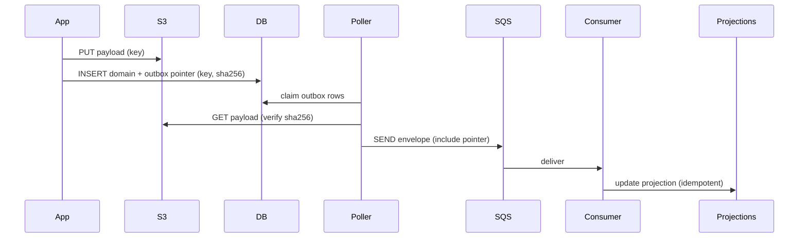

# Event-Driven System-of-Record — Design Summary

Date: 2026-01-14

This document summarizes a design discussion and recommendations for adopting an event-driven system-of-record for application history. It covers the event model, storage choices (S3 + DynamoDB), the Outbox pattern (Postgres), DynamoDB schema suggestions and trade-offs (hot partitions, GSIs), DynamoDB Streams integration, SQS/EventBridge integration, operational concerns, and migration guidance.

## Quick executive summary

- Use an immutable event log as the system of record. Initially emit full-application JSON payloads (stored in S3) and evolve to smaller domain events (e.g., `IndividualAdded`, `ProceedingUpdated`).
- Keep a lightweight event index in DynamoDB (pointers + metadata) or in Postgres (outbox) depending on your write path. Store heavy payloads in S3 and reference them via pointers + checksums.
- Use the Outbox pattern in Postgres when your write path is transactional with Postgres. Have a publisher push envelopes to SQS/EventBridge or write DynamoDB items and let DynamoDB Streams do the messaging.
- If using DynamoDB as the event index, prefer single-table naming `pk` / `sk` and GS1 (`gs1pk` / `gs1sk`) for alternate access patterns. Keep items small; use S3 pointers for payloads.
- Rely on DynamoDB Streams -> Lambda -> EventBridge/SQS to reduce custom polling whenever possible, but ensure idempotency and checksum validation.

## Checklist (what this doc covers)

- [x] Event envelope and payload separation
- [x] S3 for heavy payloads and pointer model
- [x] DynamoDB schema recommendation for event index (single-table `pk`/`sk`)
- [x] Outbox pattern with Postgres and SQS integration
- [x] DynamoDB Streams usage and caveats
- [x] Ordering, idempotency, and de-duplication
- [x] Security, retention, and operational monitoring
- [x] Migration and testing recommendations

---

## 1. Canonical event shape (envelope + payload pointer)

Keep a small, stable envelope that brokers and queues carry. Keep full payloads in S3 and reference them from the envelope.

Example envelope (JSON-like):

```json
{
  "eventId": "uuid",
  "occurredAt": "2026-01-01T12:34:56Z",
  "type": "APPLICATION_UPDATED",
  "aggregateType": "Application",
  "aggregateId": "application-uuid",
  "sequenceNumber": 42,
  "schemaVersion": 1,
  "producer": "access-service",
  "payloadPointer": {
    "storage": "s3",
    "bucket": "app-history-payloads",
    "key": "events/application/2026/01/01/<eventId>.json",
    "sha256": "..."
  },
  "metadata": {
    "createdBy": "user@example.com",
    "correlationId": "request-id",
    "traceId": "trace-id"
  }
}
```

Notes:
- Envelope fields should be small, stable and versioned (`schemaVersion`).
- Consumers use `payloadPointer` to fetch the full payload from S3 and validate using `sha256`.

---

## 2. S3-first vs inline payload in outbox

Preferred pattern: S3-first, then insert narrow outbox/index row referencing the S3 object inside the same domain DB transaction.

Why:
- Keeps DB small and transactional for the pointer only.
- If S3 upload succeeds but DB transaction fails, you have orphan S3 objects that are easy to GC.
- If DB commit succeeds but S3 was not uploaded first, consumers may fail when attempting to fetch. Avoid by uploading S3 first.

Alternative: write payload inline into the outbox inside the DB transaction, then run a mover job that uploads to S3 and replaces inline payload with pointer. This increases DB size and transactional cost but provides stronger DB-side durability for the payload.

Recommendation: Use S3-first + pointer in outbox. Implement GC for orphan S3 objects and validate checksums at publish/consume time.

---

## 3. Postgres Outbox + SQS integration (recommended when using Postgres write path)

When your domain writes are in Postgres, use an Outbox table inserted inside the same transaction that mutates domain state. A publisher process claims outbox rows and publishes them to SQS/EventBridge.

Key patterns:
- Insert outbox row (pointer + metadata) in the same `@Transactional` scope as domain changes.
- Publisher uses `SELECT ... FOR UPDATE SKIP LOCKED` to claim rows safely across multiple workers.
- Use SQS FIFO for strict ordering when necessary. Use `MessageGroupId = aggregateId` and `MessageDeduplicationId = eventId` for per-aggregate ordering and de-dup.
- Make publishing idempotent (include `eventId`), and record `published_at` and `sqs_message_id` on success.
- Use DLQ and retry policies; keep `attempts` counter and last_error for poison handling.

Minimal `outbox_event` schema (Postgres):

```text
CREATE TABLE outbox_event (
  id              uuid PRIMARY KEY DEFAULT gen_random_uuid(),
  event_id        uuid NOT NULL UNIQUE,
  aggregate_id    uuid,
  aggregate_type  text,
  event_type      text,
  sequence_number bigint,
  payload_s3_bucket text,
  payload_s3_key   text,
  payload_sha256   text,
  payload_size     bigint,
  payload_inline   jsonb,
  created_at      timestamptz NOT NULL DEFAULT now(),
  published_at    timestamptz,
  attempts        int NOT NULL DEFAULT 0,
  last_error      text
);

CREATE INDEX idx_outbox_pending ON outbox_event (created_at) WHERE published_at IS NULL;
```

Publisher algorithm (high-level): claim rows, verify S3 pointer + checksum, publish to SQS/EventBridge, mark published (conditional UPDATE).

---

## 4. DynamoDB as event index (recommended when you want serverless index + streams)

If you prefer a serverless event index, DynamoDB is a good fit for storing pointers and metadata. Keep items small and use S3 for payloads.

Suggested primary key design for single-table:
- Partition Key (PK): `pk` (value pattern: `<ENTITY>#<id>` e.g., `APPLICATION#123`)
- Sort Key (SK): `sk` (value pattern: `SEQ#<zero-padded-seq>` or `TS#2026-01-01T12:34:56Z#<eventId>`)

Item attributes:
- `eventId`, `eventType`, `occurredAt`, `schemaVersion`
- `payloadPointer` (map: bucket/key/sha256), `payloadSize`
- `producer`, `createdBy`, `correlationId`, `traceId`, `idempotencyKey`
- `gs1pk`, `gs1sk` (used by GSIs for alternate access patterns)
- `publishedFlag` (`PENDING`/`PUBLISHED`) and `publishedAt`
- `ttl` for retention

Recommended GSIs (examples):
- `PublishQueueIndex`: PK = `gs1pk` (e.g. `PUBLISH#PENDING`), SK = `gs1sk` (e.g. `CREATED#2026-01-01T12:34:56Z`) — fast selection of pending events for publisher
- `AggregateTypeIndex`: PK = `gs1pk` (e.g. `AGGTYPE#Application`), SK = `gs1sk` (e.g. `OCCURRED#2026-01-01T12:34:56Z`) — query events by type/time
- `EventTypeIndex`: PK = `gs1pk` (e.g. `EVTYPE#APPLICATION_UPDATED`), SK = `gs1sk` (e.g. `OCCURRED#2026-01-01T12:34:56Z`) — filter by domain event type
- `CorrelationIndex`: PK = `gs1pk` (e.g. `CORR#<correlationId>`), SK = `gs1sk` (e.g. `OCCURRED#...`)

Hot-partition notes:
- Using per-aggregate `pk` values spreads writes broadly unless a single aggregate is extremely hot.
- For extremely hot aggregates, consider sharding (append suffix), rate-limiting, or using a different store.

Ordering notes:
- Prefer explicit per-aggregate sequence encoded in `sk` (e.g., `SEQ#0000000001`) when you need strict ordering. Use a counter item or DynamoDB transactions to generate it atomically.
- If you cannot get strict sequenceNumbers, use timestamp+eventId and make consumers tolerant of reordering and idempotent.

---

## 5. DynamoDB Streams -> EventBridge/SQS option

You can let Streams handle messaging: write the DynamoDB item (pointer + metadata) and rely on DynamoDB Streams (consumed by Lambda) to publish into EventBridge and/or SQS.

Benefits:
- No custom poller; near real-time propagation.
- Managed scaling of the streaming path.

Caveats & responsibilities:
- Streams retention window (24 hours default) — you must keep the canonical log in DynamoDB/S3 for long-term replay.
- Streams deliver at-least-once — consumers must be idempotent and deduplicate by `eventId`.
- Ensure S3 upload happens before DynamoDB write (S3-first) or have the Stream consumer validate presence and handle retry/backoff.
- Configure Lambda retries and DLQ to avoid stalled shards.

---

## 6. Ordering, idempotency, and de-duplication

- Include `eventId` (UUID) and `idempotencyKey` in every event.
- Use `pk`/`sk` patterns with zero-padded sequences (or timestamp+eventId) for deterministic ordering; if using SQS FIFO, set `MessageGroupId = <entity>#<id>`.
- Make all consumers idempotent and durable; maintain last-processed event pointer in projection updaters.
- For at-least-once delivery modes (Streams, SQS Standard, publisher retries), dedupe using `eventId`.

---

## 7. Security, retention and compliance

- S3: enable SSE-KMS; restrict read access to the services that need it; log access via CloudTrail.
- DynamoDB: use fine-grained IAM; enable point-in-time recovery (PITR) if necessary.
- Retention / TTL: apply TTL in DynamoDB or lifecycle rules in S3 for archival/automatic deletion. Consider redaction workflows for PII.
- Audit: maintain immutable index (DynamoDB) + immutable S3 objects (object lock if required) to meet legal/audit needs.

---

## 8. Operational recommendations

- Monitoring: pending outbox count, publisher failure rate, SQS DLQ rates, Stream / Lambda errors, DynamoDB GSI throttling.
- Alerts: high pending count, repeated publish failures, S3 missing objects, GSI throttling or hot partition warnings.
- Testing: unit tests for publisher logic, integration tests for S3 <-> outbox write sequence, replay tests for projections.
- Replays: provide tooling to replay events from DynamoDB/S3 into projections.

---

## 9. Migration & rollout plan (incremental)

1. Implement S3-first + Postgres Outbox (narrow pointer rows) and a poller that publishes to SQS/EventBridge. Build projection updater consumers.
2. Add DynamoDB event index (optional) or keep Postgres index depending on team preference.
3. Start emitting full JSON payloads (S3) in envelopes and let consumers use them.
4. Add snapshots and projection snapshots for fast rehydration.
5. Gradually evolve event payloads to domain-specific deltas; maintain versioning and migration tooling.

---

## 10. Diagrams

Architecture flow (Mermaid):

```mermaid
flowchart LR
  subgraph App
    A[Application / Service] -->|S3 upload (full JSON)| S3[S3]
    A -->|Insert domain + outbox row (pointer)| PG[(Postgres)]
  end

  subgraph Publisher
    PG -->|poll/select FOR UPDATE SKIP LOCKED| Poller[Outbox publisher]
    Poller -->|validate pointer (sha256)| S3
    Poller -->|publish envelope| SQS[SQS / EventBridge]
  end

  subgraph ServerlessOption
    A2[Service writing DynamoDB index] -->|Write index item with pointer| DTable[DynamoDB]
    DTable -->|DynamoDB Stream| Lambda(Lambda)
    Lambda -->|publish envelope| EventBridge(EventBridge) & SQS
  end

  SQS -->|consumed by| Consumer[Projection Updater / Downstream]
  EventBridge -->|routed to| Consumer
  Consumer -->|update| Projections[(Read models / RDS)]
```

DynamoDB table schema (Mermaid entity diagram):

```mermaid
erDiagram
  EVENTTABLE {
    pk PK
    sk PK
    eventId
    eventType
    occurredAt
    schemaVersion
    payloadPointer
    payloadSize
    payloadSha256
    gs1pk
    gs1sk
    publishedFlag
    publishedAt
  }

  EVENTTABLE ||--|| S3 : "payloadPointer -> bucket/key"
```

Simplified sequence (Mermaid):



---

## 11. Short decisions & recommendations (TL;DR)

- Use S3 for the payload; keep DynamoDB/Postgres as the lightweight index/outbox.
- Prefer S3-first + pointer-in-outbox to keep DB small and transactional for pointers.
- Use DynamoDB Streams + Lambda -> EventBridge/SQS when moving to serverless index to remove pollers.
- Use Postgres Outbox + poller + SQS when you prefer a simpler, fully controlled publisher process.
- For strict ordering use per-aggregate `sequenceNumber` + FIFO SQS (MessageGroupId) or DynamoDB transactions to generate sequence numbers.
- Ensure idempotent consumers and checksum validation.

---

## 12. Implemented components

The following components have been implemented as part of this design:

### DynamoKeyBuilder (data-access-shared)

A utility class for building DynamoDB partition key (`pk`) and sort key (`sk`) values following the single-table design pattern.

**Location:** `data-access-shared/src/main/java/uk/gov/justice/laa/dstew/access/shared/dynamo/DynamoKeyBuilder.java`

**Key formats:**

| Key | Format | Example |
|-----|--------|---------|
| `pk` | `<type>#<uuid>` | `application#123e4567-e89b-12d3-a456-426614174000` |
| `sk` | `<timestamp>` | `2026-01-15T12:34:56.789Z` |
| `gs1pk` | `<PREFIX>#<value>` | `PUBLISH#PENDING` |
| `gs1sk` | `<PREFIX>#<timestamp>` | `CREATED#2026-01-15T12:34:56.789Z` |

**Usage example:**

```java
import uk.gov.justice.laa.dstew.access.spike.DynamoKeyBuilder;
import software.amazon.awssdk.enhanced.dynamodb.Key;

// Build a Key for DynamoDB Enhanced Client
Key key = DynamoKeyBuilder.key("application", UUID.randomUUID(), Instant.now());

// Use with DynamoDB Enhanced Client
MyEntity entity = table.getItem(key);
```

### DynamoDbService (data-access-service)

Service class for storing events in DynamoDB.

**Location:** `data-access-service/src/main/java/uk/gov/justice/laa/dstew/access/service/DynamoDbService.java`

### TestDynamoEventController (data-access-service)

Test controller for verifying DynamoDB writes end-to-end during local development.

**Location:** `data-access-service/src/main/java/uk/gov/justice/laa/dstew/access/controller/TestDynamoEventController.java`

**Endpoint:** `POST /test/dynamo/events`

**Sample request:**

```json
{
  "eventType": "application",
  "eventId": "22222222-2222-2222-2222-222222222222",
  "timestamp": "2026-01-15T12:24:24.123Z",
  "description": "event with millis timestamp"
}
```

### AwsConfig (data-access-service)

AWS client configuration that:
- Uses `StaticCredentialsProvider` when explicit credentials are provided (local dev with LocalStack)
- Falls back to `DefaultCredentialsProvider` for Kubernetes/IRSA

**Location:** `data-access-service/src/main/java/uk/gov/justice/laa/dstew/access/config/convertors/AwsConfig.java`

### DynamoDbStartupValidator (data-access-service)

Validates DynamoDB connectivity at startup and logs configuration details for debugging.

**Location:** `data-access-service/src/main/java/uk/gov/justice/laa/dstew/access/config/DynamoDbStartupValidator.java`

### Local development setup

See [localstack-setup.md](localstack-setup.md) for detailed instructions on:
- Installing `awslocal`
- Starting LocalStack with Docker Compose
- Creating the DynamoDB table and S3 bucket
- Running the application
- Testing the event controller

---

## 13. Next steps & suggested small tasks

- Implement minimal `outbox_event` table in Postgres and a poller that publishes to SQS with `eventId` as dedupe id.
- Add S3 lifecycle rules and a small GC job for orphan objects.
- Add monitoring dashboards for pending outbox count, publisher errors and DynamoDB/S3 failures.
- Build replay tooling for projections from S3 + DynamoDB index.

---

## Assumptions

- The system currently uses Java/Spring Boot + Postgres for domain writes (if not, adapt outbox pattern to the existing DB).
- AWS (S3, DynamoDB, SQS, EventBridge, Lambda) is available and acceptable for hosting the event components.
- Long-term replayability will be achieved by the combination of DynamoDB (index) + S3 (payloads) or Postgres (outbox) + S3 depending on chosen path.

---

If you'd like, I can also:
- produce sample Java/Spring Boot code for the outbox entity + poller + publisher to SQS,
- create CloudFormation / CDK snippets for the DynamoDB table and Lambda that bridges Streams -> EventBridge,
- or convert this README into the repository root `README.md` or a GitHub wiki page.
