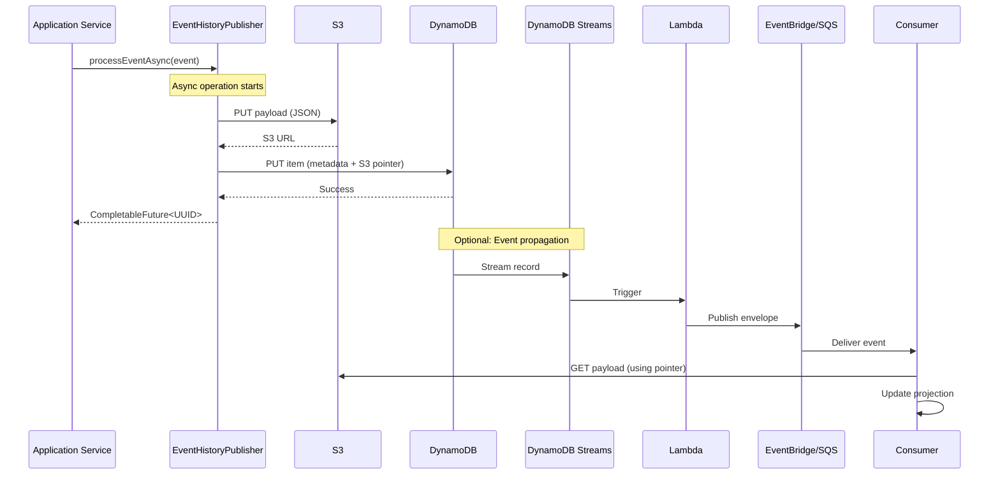
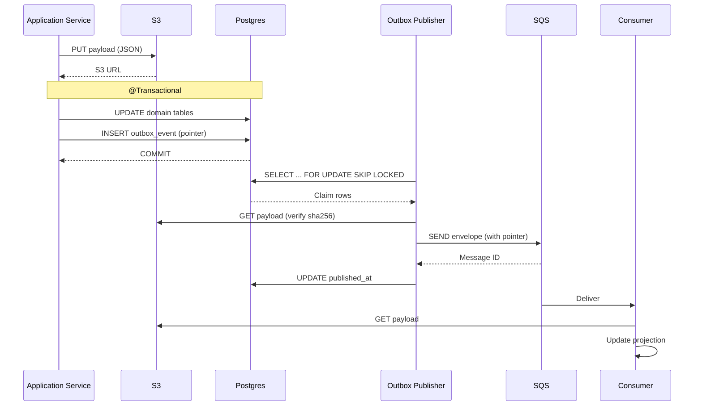
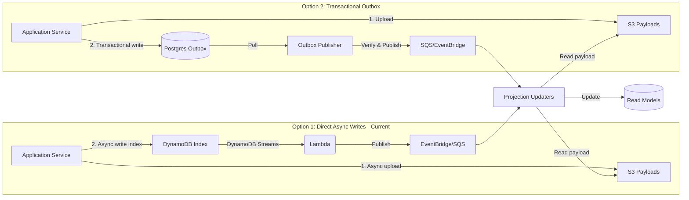

# Event-Driven System-of-Record — Design Summary

Date: 2026-01-14  
Last Updated: 2026-02-13

This document summarizes a design discussion and recommendations for adopting an event-driven system-of-record for application history. It covers the event model, storage choices (S3 + DynamoDB), two implementation approaches (async writes vs. outbox pattern), DynamoDB schema suggestions and trade-offs (hot partitions, GSIs), DynamoDB Streams integration, SQS/EventBridge integration, operational concerns, and migration guidance.

## Document Updates

**2026-02-13:**
- Restructured document to clearly present **two implementation options**
- **Option 1 (Current Implementation):** Direct async writes to S3 and DynamoDB without outbox table
  - Detailed the async processing flow using `EventHistoryPublisher` and `DynamoDbService`
  - Documented advantages (simplicity, low latency) and disadvantages (no transactional guarantees)
  - Added operational considerations for monitoring and orphan object cleanup
- **Option 2:** Transactional Outbox pattern with Postgres for guaranteed delivery
  - Positioned as an alternative for systems requiring strict consistency
  - Included implementation details, schema, and tradeoffs
- Added comparison table between both options
- Updated all diagrams to show both approaches
- Clarified which sections apply to which option

## Quick executive summary

- Use an immutable event log as the system of record. Initially emit full-application JSON payloads (stored in S3) and evolve to smaller domain events (e.g., `IndividualAdded`, `ProceedingUpdated`).
- Store heavy payloads in S3 and reference them via pointers + metadata in DynamoDB.
- **Two implementation approaches are documented:**
  - **Option 1 (Current Implementation):** Direct async writes to S3 and DynamoDB without an outbox table. Simple, low-latency, suitable when you don't need transactional guarantees with domain writes.
  - **Option 2:** Transactional Outbox pattern with Postgres when your write path requires atomic consistency between domain data and event publishing.
- If using DynamoDB as the event index, prefer single-table naming `pk` / `sk` and GS1 (`gs1pk` / `gs1sk`) for alternate access patterns. Keep items small; use S3 pointers for payloads.
- Consider DynamoDB Streams -> Lambda -> EventBridge/SQS for event propagation to reduce custom polling, but ensure idempotency and checksum validation.

## Checklist (what this doc covers)

- [x] Event envelope and payload separation
- [x] S3 for heavy payloads and pointer model
- [x] DynamoDB schema recommendation for event index (single-table `pk`/`sk`)
- [x] **Option 1: Direct async writes to S3 and DynamoDB (current implementation)**
- [x] **Option 2: Outbox pattern with Postgres and SQS integration**
- [x] DynamoDB Streams usage and caveats
- [x] Ordering, idempotency, and de-duplication
- [x] Security, retention, and operational monitoring
- [x] Migration and testing recommendations

---

## 1. Canonical event shape (envelope + payload pointer)

Keep a small, stable envelope that brokers and queues carry. Keep full payloads in S3 and reference them from the envelope.

Example envelope (JSON-like):

```json
{
  "eventId": "uuid",
  "occurredAt": "2026-01-01T12:34:56Z",
  "type": "APPLICATION_UPDATED",
  "aggregateType": "Application",
  "aggregateId": "application-uuid",
  "sequenceNumber": 42,
  "schemaVersion": 1,
  "producer": "access-service",
  "payloadPointer": {
    "storage": "s3",
    "bucket": "app-history-payloads",
    "key": "events/application/2026/01/01/<eventId>.json",
    "sha256": "..."
  },
  "metadata": {
    "createdBy": "user@example.com",
    "correlationId": "request-id",
    "traceId": "trace-id"
  }
}
```

Notes:
- Envelope fields should be small, stable and versioned (`schemaVersion`).
- Consumers use `payloadPointer` to fetch the full payload from S3 and validate using `sha256`.

---

## 2. Implementation Options: Async Writes vs. Outbox Pattern

This section compares two approaches for persisting events to S3 and DynamoDB.

### Option 1: Direct Async Writes to S3 and DynamoDB (Current Implementation)

**Description:**

This is the current implementation. When a domain event occurs, the service directly writes to both S3 (for the full payload) and DynamoDB (for the event index) using asynchronous methods. There is no intermediate outbox table or transactional coordination between these writes.

**Implementation Flow:**

1. **S3 Upload First:** The event payload (full JSON) is uploaded to S3 asynchronously via `S3Service.upload()`.
2. **DynamoDB Write Second:** Once the S3 upload succeeds and returns the S3 URL, a DynamoDB item (containing metadata + S3 pointer) is written asynchronously via `DynamoDbService.saveDomainEvent()`.
3. **Both operations run in async threads** managed by Spring's `@Async` executor.
4. **No transactional guarantees:** If S3 succeeds but DynamoDB fails (or vice versa), you may have orphan S3 objects or missing index entries.

**Code Example (Current Implementation):**

```java
@Component
public class EventHistoryPublisher {
  
  @Async
  public CompletableFuture<UUID> processEventAsync(Event event) {
    return CompletableFuture.supplyAsync(() -> uploadToS3(event), executor)
        .thenComposeAsync(s3Url -> {
          if (s3Url == null) {
            return CompletableFuture.completedFuture(null);
          }
          return dynamoDbService.saveDomainEvent(event, s3Url)
              .thenApply(__ -> event.domainEventId());
        }, executor);
  }
  
  private String uploadToS3(Event event) {
    S3UploadResult result = s3Service.upload(event.requestPayload(), bucketName, key);
    return result.isSuccess() ? result.getS3Url() : null;
  }
}
```

**Advantages:**

- **Simple:** No additional outbox table or polling infrastructure required.
- **Low Latency:** Events are published immediately upon domain write completion.
- **Serverless-Friendly:** Works well with DynamoDB Streams -> Lambda -> EventBridge for downstream event propagation without custom pollers.
- **Minimal Operational Overhead:** Fewer moving parts (no outbox poller).

**Disadvantages:**

- **No Transactional Guarantees:** S3 and DynamoDB writes are not atomic. Partial failures can lead to:
  - Orphan S3 objects if DynamoDB write fails
  - Missing event index entries if S3 succeeds but DynamoDB fails
- **No Automatic Retry for Partial Failures:** If DynamoDB write fails, you rely on application-level error handling and manual intervention.
- **No Built-in Event Ordering Guarantee:** If you don't enforce sequence numbers atomically, concurrent writes may result in out-of-order events.
- **Harder to Replay/Reconcile:** Without a durable outbox, identifying and replaying failed events requires custom tooling (e.g., scanning S3 for orphaned objects).

**When to Use:**

- You do **not** require strict transactional consistency between domain state and event publishing.
- Your system can tolerate occasional orphan S3 objects (which can be cleaned up via lifecycle rules or GC jobs).
- You prioritize simplicity and low latency over guaranteed delivery.
- You are building a greenfield system without existing Postgres domain writes.

**Operational Considerations:**

- **Implement S3 orphan detection and cleanup:** Periodically scan for S3 objects without corresponding DynamoDB entries and delete or retry.
- **Monitor async failures:** Track CompletableFuture failures and alert on high error rates.
- **Implement idempotency:** Ensure consumers can handle duplicate events (if retries are implemented).
- **Checksum validation:** Include SHA256 checksums in DynamoDB items and validate on read.

---

### Option 2: Transactional Outbox Pattern with Postgres

**Description:**

When your domain writes occur in a Postgres transaction, you can use the Outbox pattern to achieve transactional consistency between domain state changes and event publishing. An outbox table (in the same Postgres database) stores event pointers inside the same transaction that updates domain data. A separate publisher process polls the outbox and publishes events to SQS/EventBridge.

**Implementation Flow:**

1. **S3 Upload First:** Upload the event payload to S3 before starting the database transaction.
2. **Transactional Write:** Within a single `@Transactional` scope:
   - Update domain tables (e.g., applications, individuals)
   - Insert an outbox row with event metadata + S3 pointer
3. **Publisher Polls Outbox:** A background process (scheduled task or dedicated service) claims unpublished rows using `SELECT ... FOR UPDATE SKIP LOCKED` and publishes them to SQS/EventBridge.
4. **Mark Published:** After successful publish, update the outbox row with `published_at` timestamp.

**Code Example (Conceptual):**

```java
@Service
@Transactional
public class ApplicationService {
  
  public void updateApplication(Application app, JsonNode payload) {
    // 1. Upload to S3 first (outside transaction or with rollback compensation)
    String s3Url = s3Service.uploadSync(payload, bucketName, key);
    
    // 2. Update domain state
    applicationRepository.save(app);
    
    // 3. Insert outbox row (atomic with domain write)
    OutboxEvent outboxEvent = OutboxEvent.builder()
        .eventId(UUID.randomUUID())
        .aggregateId(app.getId())
        .eventType("APPLICATION_UPDATED")
        .payloadS3Bucket(bucketName)
        .payloadS3Key(key)
        .payloadSha256(calculateSha256(payload))
        .build();
    outboxRepository.save(outboxEvent);
    
    // 4. Commit transaction (both domain + outbox are atomic)
  }
}
```

**Publisher Poller:**

```java
@Scheduled(fixedDelay = 1000)
public void publishPendingEvents() {
  List<OutboxEvent> pending = outboxRepository.claimPending(BATCH_SIZE);
  for (OutboxEvent event : pending) {
    try {
      String envelope = buildEnvelope(event);
      sqsClient.sendMessage(queueUrl, envelope);
      outboxRepository.markPublished(event.getId());
    } catch (Exception e) {
      outboxRepository.incrementAttempts(event.getId(), e.getMessage());
    }
  }
}
```

**Advantages:**

- **Transactional Consistency:** Domain writes and event publishing are atomic. Either both succeed or both roll back.
- **Guaranteed Delivery:** Events in the outbox will eventually be published (with retries).
- **Built-in Retry Logic:** Failed publishes can be retried automatically by the poller.
- **Easier Replay:** The outbox serves as a durable event log for replay and reconciliation.
- **Ordering Control:** Use explicit sequence numbers or rely on insertion order to maintain event ordering per aggregate.

**Disadvantages:**

- **Increased Complexity:** Requires an additional outbox table, poller infrastructure, and monitoring.
- **Higher Latency:** Events are published after the transaction commits and the poller picks them up (typically 100ms to a few seconds delay).
- **Operational Overhead:** Must monitor outbox lag, poller health, and handle poison messages.
- **Database Load:** The outbox table adds write load to Postgres and requires regular cleanup of published events.
- **S3-First Complication:** If S3 upload fails after transaction commit, you have an outbox entry pointing to a non-existent S3 object (requires compensation logic).

**When to Use:**

- You **require strict transactional consistency** between domain state and event publishing.
- Your domain writes occur in Postgres (or another RDBMS).
- You can tolerate slightly higher latency (typically < 5 seconds).
- You need guaranteed event delivery and built-in retry logic.
- You want a durable, queryable event log for debugging and replay.

**Operational Considerations:**

- **Monitor outbox lag:** Alert if pending events exceed a threshold (e.g., > 1000 or > 60 seconds old).
- **Implement poison message handling:** Move repeatedly failing events to a DLQ after N attempts.
- **Cleanup published events:** Archive or delete old outbox rows to prevent unbounded growth.
- **Use SKIP LOCKED:** Ensure your poller query uses `SELECT ... FOR UPDATE SKIP LOCKED` to avoid lock contention.
- **Idempotency:** Include `eventId` in SQS messages and ensure consumers deduplicate.

---

### Minimal `outbox_event` schema (Postgres)

```sql
CREATE TABLE outbox_event (
  id              uuid PRIMARY KEY DEFAULT gen_random_uuid(),
  event_id        uuid NOT NULL UNIQUE,
  aggregate_id    uuid,
  aggregate_type  text,
  event_type      text,
  sequence_number bigint,
  payload_s3_bucket text,
  payload_s3_key   text,
  payload_sha256   text,
  payload_size     bigint,
  created_at      timestamptz NOT NULL DEFAULT now(),
  published_at    timestamptz,
  attempts        int NOT NULL DEFAULT 0,
  last_error      text
);

CREATE INDEX idx_outbox_pending ON outbox_event (created_at) WHERE published_at IS NULL;
CREATE INDEX idx_outbox_aggregate ON outbox_event (aggregate_id, sequence_number);
```

---

### Comparison Table

| Aspect | Option 1: Async Writes | Option 2: Outbox Pattern |
|--------|------------------------|--------------------------|
| **Transactional Consistency** | ❌ No | ✅ Yes |
| **Guaranteed Delivery** | ❌ No (requires custom retry) | ✅ Yes (built-in retry) |
| **Latency** | ✅ Low (immediate) | ⚠️ Higher (1-5 seconds) |
| **Complexity** | ✅ Simple | ⚠️ More complex |
| **Operational Overhead** | ✅ Low | ⚠️ Higher (poller, monitoring) |
| **Orphan S3 Objects** | ⚠️ Possible | ⚠️ Possible if S3-first fails |
| **Durable Event Log** | ⚠️ DynamoDB only | ✅ Postgres outbox |
| **Replay Support** | ⚠️ Custom tooling needed | ✅ Built-in (query outbox) |
| **Best For** | Greenfield, eventual consistency OK | Transactional systems, strong consistency |

---

### Recommendation

- **Use Option 1 (Current Implementation)** if you prioritize simplicity, low latency, and can tolerate eventual consistency. This is suitable for most event-driven microservices where strict transactional guarantees are not required.
- **Use Option 2 (Outbox Pattern)** if you have existing Postgres domain writes and require atomic consistency between domain state and event publishing, or if you need guaranteed delivery with built-in retries.

For the current system (Option 1), ensure you implement:
1. **Checksum validation** for S3 payloads
2. **Orphan object detection and cleanup** for S3
3. **Async failure monitoring** with alerts
4. **Idempotent consumers** to handle retries


---

## 3. Option 2 Implementation Details: Postgres Outbox + SQS integration

**Note:** This section provides implementation details for Option 2 (Outbox Pattern). The current system uses Option 1 (Direct Async Writes).

When your domain writes are in Postgres, use an Outbox table inserted inside the same transaction that mutates domain state. A publisher process claims outbox rows and publishes them to SQS/EventBridge.

Key patterns:
- Insert outbox row (pointer + metadata) in the same `@Transactional` scope as domain changes.
- Publisher uses `SELECT ... FOR UPDATE SKIP LOCKED` to claim rows safely across multiple workers.
- Use SQS FIFO for strict ordering when necessary. Use `MessageGroupId = aggregateId` and `MessageDeduplicationId = eventId` for per-aggregate ordering and de-dup.
- Make publishing idempotent (include `eventId`), and record `published_at` and `sqs_message_id` on success.
- Use DLQ and retry policies; keep `attempts` counter and last_error for poison handling.

Publisher algorithm (high-level): claim rows, verify S3 pointer + checksum, publish to SQS/EventBridge, mark published (conditional UPDATE).

**See Section 2 for the minimal `outbox_event` schema.**

---

## 4. DynamoDB as event index (Option 1 - Current Implementation)

**Note:** This section describes the current implementation (Option 1: Direct Async Writes).

DynamoDB is used as a serverless event index for storing pointers and metadata. Items are kept small with full payloads stored in S3.

Suggested primary key design for single-table:
- Partition Key (PK): `pk` (value pattern: `<ENTITY>#<id>` e.g., `APPLICATION#123`)
- Sort Key (SK): `sk` (value pattern: `SEQ#<zero-padded-seq>` or `TS#2026-01-01T12:34:56Z#<eventId>`)

Item attributes:
- `eventId`, `eventType`, `occurredAt`, `schemaVersion`
- `payloadPointer` (map: bucket/key/sha256), `payloadSize`
- `producer`, `createdBy`, `correlationId`, `traceId`, `idempotencyKey`
- `gs1pk`, `gs1sk` (used by GSIs for alternate access patterns)
- `publishedFlag` (`PENDING`/`PUBLISHED`) and `publishedAt`
- `ttl` for retention

Recommended GSIs (examples):
- `PublishQueueIndex`: PK = `gs1pk` (e.g. `PUBLISH#PENDING`), SK = `gs1sk` (e.g. `CREATED#2026-01-01T12:34:56Z`) — fast selection of pending events for publisher
- `AggregateTypeIndex`: PK = `gs1pk` (e.g. `AGGTYPE#Application`), SK = `gs1sk` (e.g. `OCCURRED#2026-01-01T12:34:56Z`) — query events by type/time
- `EventTypeIndex`: PK = `gs1pk` (e.g. `EVTYPE#APPLICATION_UPDATED`), SK = `gs1sk` (e.g. `OCCURRED#2026-01-01T12:34:56Z`) — filter by domain event type
- `CorrelationIndex`: PK = `gs1pk` (e.g. `CORR#<correlationId>`), SK = `gs1sk` (e.g. `OCCURRED#...`)

Hot-partition notes:
- Using per-aggregate `pk` values spreads writes broadly unless a single aggregate is extremely hot.
- For extremely hot aggregates, consider sharding (append suffix), rate-limiting, or using a different store.

Ordering notes:
- Prefer explicit per-aggregate sequence encoded in `sk` (e.g., `SEQ#0000000001`) when you need strict ordering. Use a counter item or DynamoDB transactions to generate it atomically.
- If you cannot get strict sequenceNumbers, use timestamp+eventId and make consumers tolerant of reordering and idempotent.

---

## 5. DynamoDB Streams -> EventBridge/SQS option (primarily for Option 1)

When using DynamoDB as your event index (Option 1), you can let Streams handle downstream messaging: write the DynamoDB item (pointer + metadata) and rely on DynamoDB Streams (consumed by Lambda) to publish into EventBridge and/or SQS.

Benefits:
- No custom poller; near real-time propagation.
- Managed scaling of the streaming path.

Caveats & responsibilities:
- Streams retention window (24 hours default) — you must keep the canonical log in DynamoDB/S3 for long-term replay.
- Streams deliver at-least-once — consumers must be idempotent and deduplicate by `eventId`.
- Ensure S3 upload happens before DynamoDB write (S3-first) or have the Stream consumer validate presence and handle retry/backoff.
- Configure Lambda retries and DLQ to avoid stalled shards.

---

## 6. Ordering, idempotency, and de-duplication

- Include `eventId` (UUID) and `idempotencyKey` in every event.
- Use `pk`/`sk` patterns with zero-padded sequences (or timestamp+eventId) for deterministic ordering; if using SQS FIFO, set `MessageGroupId = <entity>#<id>`.
- Make all consumers idempotent and durable; maintain last-processed event pointer in projection updaters.
- For at-least-once delivery modes (Streams, SQS Standard, publisher retries), dedupe using `eventId`.

---

## 7. Security, retention and compliance

- S3: enable SSE-KMS; restrict read access to the services that need it; log access via CloudTrail.
- DynamoDB: use fine-grained IAM; enable point-in-time recovery (PITR) if necessary.
- Retention / TTL: apply TTL in DynamoDB or lifecycle rules in S3 for archival/automatic deletion. Consider redaction workflows for PII.
- Audit: maintain immutable index (DynamoDB) + immutable S3 objects (object lock if required) to meet legal/audit needs.

---

## 8. Operational recommendations

- Monitoring: pending outbox count, publisher failure rate, SQS DLQ rates, Stream / Lambda errors, DynamoDB GSI throttling.
- Alerts: high pending count, repeated publish failures, S3 missing objects, GSI throttling or hot partition warnings.
- Testing: unit tests for publisher logic, integration tests for S3 <-> outbox write sequence, replay tests for projections.
- Replays: provide tooling to replay events from DynamoDB/S3 into projections.

---

## 9. Migration & rollout plan (incremental)

**Current State (Option 1 - Direct Async Writes):**

1. ✅ S3 storage for event payloads implemented
2. ✅ DynamoDB event index with single-table design implemented
3. ✅ `EventHistoryPublisher` with async S3 + DynamoDB writes implemented
4. ✅ `DynamoDbService` with query capabilities implemented
5. ✅ DynamoDB Enhanced Client with `DomainEventDynamoDB` entity

**Next Steps (Enhancing Option 1):**

1. Add checksum (SHA256) calculation and storage for S3 payloads
2. Implement orphan S3 object detection and cleanup job
3. Add monitoring and alerting for async failures
4. Build replay tooling for projections from S3 + DynamoDB
5. Consider DynamoDB Streams -> Lambda -> EventBridge for event propagation
6. Add snapshots and projection snapshots for fast rehydration
7. Gradually evolve event payloads from full JSON to domain-specific deltas

**Migration to Option 2 (if needed):**

1. Create `outbox_event` table in Postgres
2. Implement `@Transactional` services that write domain + outbox atomically
3. Build outbox poller with `SELECT ... FOR UPDATE SKIP LOCKED`
4. Integrate with SQS/EventBridge for event publishing
5. Migrate existing events from DynamoDB to outbox (backfill)
6. Deploy projection updater consumers
7. Deprecate direct DynamoDB writes

---

## 10. Diagrams

### Option 1: Direct Async Writes (Current Implementation)


```mermaid
sequenceDiagram
  participant App as Application Service
  participant EPub as EventHistoryPublisher
  participant S3
  participant DDB as DynamoDB
  participant Streams as DynamoDB Streams
  participant Lambda
  participant EB as EventBridge/SQS
  participant Consumer

  App->>EPub: processEventAsync(event)
  Note over EPub: Async operation starts
  EPub->>S3: PUT payload (JSON)
  S3-->>EPub: S3 URL
  EPub->>DDB: PUT item (metadata + S3 pointer)
  DDB-->>EPub: Success
  EPub-->>App: CompletableFuture<UUID>
  
  Note over DDB,Streams: Optional: Event propagation
  DDB->>Streams: Stream record
  Streams->>Lambda: Trigger
  Lambda->>EB: Publish envelope
  EB->>Consumer: Deliver event
  Consumer->>S3: GET payload (using pointer)
  Consumer->>Consumer: Update projection
```

### Option 2: Transactional Outbox Pattern


```mermaid
sequenceDiagram
  participant App as Application Service
  participant S3
  participant PG as Postgres
  participant Poller as Outbox Publisher
  participant SQS
  participant Consumer

  App->>S3: PUT payload (JSON)
  S3-->>App: S3 URL
  
  Note over App,PG: @Transactional
  App->>PG: UPDATE domain tables
  App->>PG: INSERT outbox_event (pointer)
  PG-->>App: COMMIT
  
  Poller->>PG: SELECT ... FOR UPDATE SKIP LOCKED
  PG-->>Poller: Claim rows
  Poller->>S3: GET payload (verify sha256)
  Poller->>SQS: SEND envelope (with pointer)
  SQS-->>Poller: Message ID
  Poller->>PG: UPDATE published_at
  
  SQS->>Consumer: Deliver
  Consumer->>S3: GET payload
  Consumer->>Consumer: Update projection
```

### Architecture Overview (Both Options)


```mermaid
flowchart LR
  subgraph Option1[Option 1: Direct Async Writes - Current]
    A1[Application Service] -->|1. Async upload| S3_1[S3 Payloads]
    A1 -->|2. Async write index| DDB[DynamoDB Index]
    DDB -->|DynamoDB Streams| Lambda(Lambda)
    Lambda -->|Publish| EB1[EventBridge/SQS]
  end

  subgraph Option2[Option 2: Transactional Outbox]
    A2[Application Service] -->|1. Upload| S3_2[S3 Payloads]
    A2 -->|2. Transactional write| PG[(Postgres Outbox)]
    PG -->|Poll| Poller[Outbox Publisher]
    Poller -->|Verify & Publish| SQS_2[SQS/EventBridge]
  end

  EB1 --> Consumer[Projection Updaters]
  SQS_2 --> Consumer
  Consumer -->|Read payload| S3_1
  Consumer -->|Read payload| S3_2
  Consumer -->|Update| Projections[(Read Models)]
```

DynamoDB table schema (Option 1):

DynamoDB table schema (Option 1):

```mermaid
erDiagram
  EVENTTABLE {
    pk PK
    sk PK
    eventId
    eventType
    occurredAt
    schemaVersion
    payloadPointer
    payloadSize
    payloadSha256
    gs1pk
    gs1sk
    publishedFlag
    publishedAt
  }

  EVENTTABLE ||--|| S3 : "payloadPointer -> bucket/key"
```

---

## 11. Short decisions & recommendations (TL;DR)

**Current Implementation (Option 1):**
- Uses direct async writes to S3 (payload) and DynamoDB (index) without an outbox table.
- Simple, low-latency approach suitable for systems that can tolerate eventual consistency.
- Requires monitoring for orphan S3 objects and async write failures.
- Implemented via `EventHistoryPublisher` and `DynamoDbService` classes.

**Alternative Approach (Option 2):**
- Use Postgres Outbox + poller + SQS when you prefer transactional consistency and a fully controlled publisher process.
- Provides guaranteed delivery and atomic consistency between domain state and events.
- Higher latency and operational complexity.

**General Recommendations:**
- Use S3 for the payload; keep DynamoDB/Postgres as the lightweight index/outbox.
- Use DynamoDB Streams + Lambda -> EventBridge/SQS with Option 1 to remove need for custom pollers.
- For strict ordering use per-aggregate `sequenceNumber` + FIFO SQS (MessageGroupId) or DynamoDB transactions to generate sequence numbers.
- Ensure idempotent consumers and checksum validation.
- Monitor async failures, orphan objects, and implement cleanup jobs.

---

## 12. Implemented components (Option 1: Direct Async Writes)

The following components have been implemented as part of the Option 1 (Direct Async Writes) design:

### EventHistoryPublisher (data-access-service)

The core service that orchestrates async writes to S3 and DynamoDB for event publishing.

**Location:** `data-access-service/src/main/java/uk/gov/justice/laa/dstew/access/service/EventHistoryPublisher.java`

**Key methods:**

- `processEventAsync(Event event)`: Asynchronously uploads event payload to S3, then saves event metadata to DynamoDB
- Returns `CompletableFuture<UUID>` for non-blocking operation
- Uses Spring's `@Async` executor for parallel processing

**Implementation pattern:**

1. Upload full JSON payload to S3 (via `S3Service`)
2. On successful upload, save event index to DynamoDB with S3 URL pointer (via `DynamoDbService`)
3. Both operations run asynchronously using `CompletableFuture`
4. Failures are logged but do not block the caller

**Example flow:**

```text
processEventAsync(event)
  -> uploadToS3(payload) [async]
  -> saveDomainEvent(event, s3Url) [async]
  -> return eventId or null on failure
```

### DynamoDbService (data-access-service)

Service class for storing and querying events in DynamoDB.

**Location:** `data-access-service/src/main/java/uk/gov/justice/laa/dstew/access/service/DynamoDbService.java`

**Key methods:**

- `saveDomainEvent(Event, String s3Url)`: Async method (annotated with `@Async`) that writes event metadata to DynamoDB
- `getAllApplicationsById(String id)`: Query all events for an application
- `getAllApplicationsByIdAndEventType(...)`: Filter events by type
- `getDomainEventDynamoDBForCasework(...)`: Query events by caseworker using GSI

**Implementation details:**

- Uses DynamoDB Enhanced Client with `DomainEventDynamoDB` entity class
- Stores S3 URL pointer, event metadata, and timestamps
- Returns `CompletableFuture<Event>` for async processing
- Logs consumed capacity for monitoring

### DynamoKeyBuilder (data-access-shared)

A utility class for building DynamoDB partition key (`pk`) and sort key (`sk`) values following the single-table design pattern.

**Location:** `data-access-shared/src/main/java/uk/gov/justice/laa/dstew/access/shared/dynamo/DynamoKeyBuilder.java`

**Key formats:**

| Key | Format | Example |
|-----|--------|---------|
| `pk` | `<type>#<uuid>` | `application#123e4567-e89b-12d3-a456-426614174000` |
| `sk` | `<timestamp>` | `2026-01-15T12:34:56.789Z` |
| `gs1pk` | `<PREFIX>#<value>` | `PUBLISH#PENDING` |
| `gs1sk` | `<PREFIX>#<timestamp>` | `CREATED#2026-01-15T12:34:56.789Z` |

**Usage example:**

```java
import uk.gov.justice.laa.dstew.access.utilities.DynamoKeyBuilder;
import software.amazon.awssdk.enhanced.dynamodb.Key;

// Build a Key for DynamoDB Enhanced Client
Key key = DynamoKeyBuilder.key("application", UUID.randomUUID(), Instant.now());

// Use with DynamoDB Enhanced Client
MyEntity entity = table.getItem(key);
```

### DynamoDbService (data-access-service)

Service class for storing events in DynamoDB.

**Location:** `data-access-service/src/main/java/uk/gov/justice/laa/dstew/access/service/DynamoDbService.java`

### TestDynamoEventController (data-access-service)

Test controller for verifying DynamoDB writes end-to-end during local development.

**Location:** `data-access-service/src/main/java/uk/gov/justice/laa/dstew/access/controller/TestDynamoEventController.java`

**Endpoint:** `POST /test/dynamo/events`

**Sample request:**

```json
{
  "eventType": "application",
  "eventId": "22222222-2222-2222-2222-222222222222",
  "timestamp": "2026-01-15T12:24:24.123Z",
  "description": "event with millis timestamp"
}
```

### AwsConfig (data-access-service)

AWS client configuration that:
- Uses `StaticCredentialsProvider` when explicit credentials are provided (local dev with LocalStack)
- Falls back to `DefaultCredentialsProvider` for Kubernetes/IRSA

**Location:** `data-access-service/src/main/java/uk/gov/justice/laa/dstew/access/config/convertors/AwsConfig.java`

### DynamoDbStartupValidator (data-access-service)

Validates DynamoDB connectivity at startup and logs configuration details for debugging.

**Location:** `data-access-service/src/main/java/uk/gov/justice/laa/dstew/access/config/DynamoDbStartupValidator.java`

### Local development setup

See [localstack-setup.md](localstack-setup.md) for detailed instructions on:
- Installing `awslocal`
- Starting LocalStack with Docker Compose
- Creating the DynamoDB table and S3 bucket
- Running the application
- Testing the event controller

---

## 13. Next steps & suggested improvements

**For Current Implementation (Option 1):**
- Implement checksum validation (SHA256) for S3 payloads stored in DynamoDB items.
- Add monitoring dashboards for:
  - Async write failure rates (S3 and DynamoDB)
  - Orphan S3 object detection
  - DynamoDB write latency and throttling
- Implement GC job for orphan S3 objects (objects without DynamoDB index entries).
- Add S3 lifecycle rules for automatic archival/deletion based on retention policies.
- Consider adding DynamoDB Streams -> Lambda -> EventBridge for downstream event propagation.
- Build replay tooling for projections from S3 + DynamoDB index.

**For Option 2 (if/when migrating to Outbox Pattern):**
- Implement minimal `outbox_event` table in Postgres.
- Build a poller that publishes to SQS with `eventId` as dedupe id.
- Add monitoring for pending outbox count and publisher errors.
- Implement poison message handling (DLQ after N failed attempts).

---

## Assumptions

**Current Implementation (Option 1):**
- The system uses Java/Spring Boot with async processing capabilities.
- AWS (S3, DynamoDB) is available and configured.
- The application can tolerate eventual consistency between S3 and DynamoDB writes.
- No strict transactional guarantees are required between domain state and event publishing.

**Option 2 Considerations:**
- If migrating to Option 2, the system would require Postgres (or another RDBMS) for domain writes.
- Transactional consistency between domain state and event publishing is required.
- Additional infrastructure for outbox polling and SQS/EventBridge integration would be needed.

**General:**
- AWS (S3, DynamoDB, SQS, EventBridge, Lambda) is available for hosting event components.
- Long-term replayability is achieved by the combination of DynamoDB (index) + S3 (payloads).

---

## Additional Resources & Support

If you'd like additional implementation support, consider:

**For Option 1 (Current Implementation):**
- Sample code for checksum validation and S3 orphan detection
- Monitoring dashboard configurations (CloudWatch, Grafana)
- DynamoDB Streams + Lambda setup for event propagation
- Replay tooling for projections from S3 + DynamoDB

**For Option 2 (Outbox Pattern):**
- Sample Java/Spring Boot code for the outbox entity + repository
- Outbox poller implementation with `SELECT ... FOR UPDATE SKIP LOCKED`
- SQS publisher with idempotency and retry logic
- CloudFormation/CDK snippets for infrastructure setup

This document can also be converted into a GitHub wiki page or integrated into the repository root `README.md` as needed.

