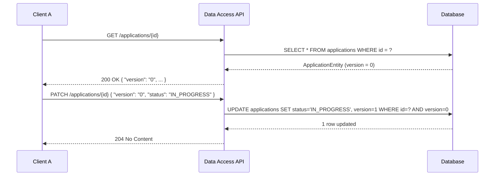
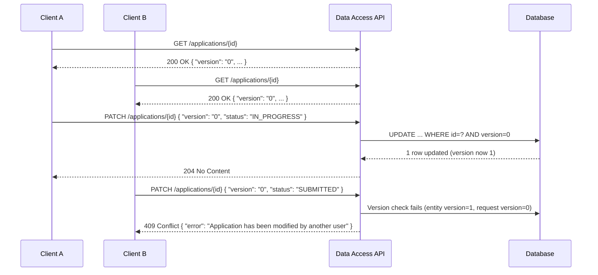
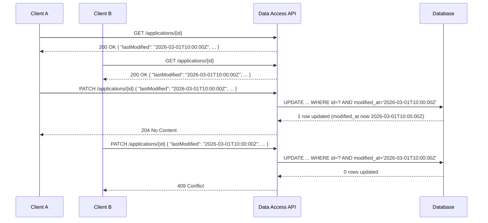
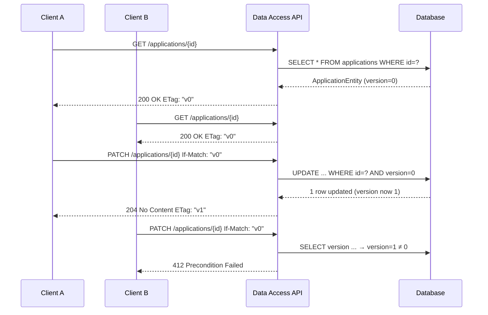

# Optimistic Locking Spike – Approach Documentation

## Table of Contents

- [Problem Summary](#problem-summary)
- [Scope](#scope)
- [Option 1: JPA @Version (Recommended)](#option-1-jpa-version-recommended)
- [Option 2: Last Modified Timestamp](#option-2-last-modified-timestamp)
- [Option 3: HTTP ETags](#option-3-http-etags)
- [Comparison Summary](#comparison-summary)
- [Recommended Approach](#recommended-approach)
- [API Contract Changes](#api-contract-changes)
- [Error Handling](#error-handling)
- [Proof of Concept](#proof-of-concept)
- [Risks, Limitations & Follow-Up Work](#risks-limitations--follow-up-work)

---

## Problem Summary

The LAA Data Access API currently has no mechanism to prevent concurrent update conflicts. When two clients read the same application and both submit PATCH requests, the second write silently overwrites the first — a classic **lost update** problem.

Optimistic locking solves this by attaching a version indicator to each resource. On update, the client must supply the version it read; the server rejects the request if the version has since changed, returning a **409 Conflict** response.

---

## Scope

| Area | Description |
|------|-------------|
| **Investigate** | Optimistic locking mechanisms available in Spring Boot (JPA `@Version`, last-modified timestamps, ETags). |
| **Evaluate** | Pros and cons of each approach in context of the existing application. |
| **Recommend** | A single approach for handling concurrent updates. |
| **Define** | How GET endpoints return version information and how PATCH endpoints require it. |
| **Error handling** | How conflict responses (HTTP 409) are surfaced. |
| **Proof of concept** | Working demonstration of concurrent update detection. |

---

## Option 1: JPA `@Version` (Recommended)

### Description

Hibernate's built-in `@Version` annotation adds a numeric version column to the entity table. On every `save()`, Hibernate automatically appends `WHERE version = ?` to the `UPDATE` SQL. If no row is updated (because the version changed), it throws an `ObjectOptimisticLockingFailureException`.

### Sequence Diagram – Successful Update



### Sequence Diagram – Concurrent Conflict



### Pros and Cons

| | Detail |
|---|--------|
| ✅ **Pro** | Native Hibernate support — minimal custom code required. |
| ✅ **Pro** | Atomic check-and-update in a single SQL statement (`WHERE version = ?`). |
| ✅ **Pro** | Well-understood pattern with extensive community documentation. |
| ✅ **Pro** | Version is a simple, monotonically increasing `Long` — easy to compare. |
| ✅ **Pro** | Already partially implemented — `@Version` field exists on `ApplicationEntity`, migration `V17` adds the column. |
| ✅ **Pro** | No clock synchronisation issues (unlike timestamp-based approaches). |
| ❌ **Con** | Adds a `version` field to the API contract that clients must manage. |
| ❌ **Con** | Existing rows will have `NULL` version initially — requires a data migration or default. |
| ❌ **Con** | Only applies to JPA-managed entities; raw SQL updates bypass the version check. |

---

## Option 2: Last Modified Timestamp

### Description

Instead of a numeric version, the `modified_at` timestamp (already present on `ApplicationEntity`) is used as the concurrency token. The client sends the `modified_at` value it received from GET, and the server checks it matches before applying the update.

### Sequence Diagram – Concurrent Conflict



### Pros and Cons

| | Detail |
|---|--------|
| ✅ **Pro** | Uses an existing column (`modified_at`) — no new column required. |
| ✅ **Pro** | Timestamp is human-readable and already meaningful to consumers. |
| ❌ **Con** | Timestamp precision issues — two updates within the same millisecond could collide silently. |
| ❌ **Con** | Clock skew across application instances can cause incorrect conflict detection. |
| ❌ **Con** | Requires custom implementation — Hibernate's `@Version` with `Instant` is less commonly used and less predictable. |
| ❌ **Con** | Serialisation/deserialisation of timestamps across JSON introduces rounding risk. |
| ❌ **Con** | Not natively supported by Hibernate's optimistic lock mechanism as cleanly as numeric versions. |

---

## Option 3: HTTP ETags

### Description

The server generates an `ETag` header on GET responses (e.g. a hash of the entity or its version). Clients send `If-Match` headers on PATCH requests. The server compares the ETag and returns `412 Precondition Failed` if they don't match.

### Sequence Diagram – Concurrent Conflict



### Pros and Cons

| | Detail |
|---|--------|
| ✅ **Pro** | Follows HTTP standard semantics (`ETag` / `If-Match`). |
| ✅ **Pro** | Version information is in headers, keeping the request/response body clean. |
| ✅ **Pro** | Can also enable response caching (304 Not Modified). |
| ❌ **Con** | More complex to implement — requires a `Filter` or `Interceptor` for ETag generation and validation. |
| ❌ **Con** | Clients must manage HTTP headers rather than JSON fields — less intuitive for non-browser API consumers. |
| ❌ **Con** | Still requires a version or hash source (typically `@Version` or entity hash) under the hood. |
| ❌ **Con** | Current OpenAPI specification and generated code do not support header-based versioning — significant contract change. |
| ❌ **Con** | Error code differs from conventional `409 Conflict` (uses `412 Precondition Failed`), which may confuse consumers. |

---

## Comparison Summary

| Criteria | JPA `@Version` | Last Modified Timestamp | HTTP ETags |
|----------|:--------------:|:----------------------:|:----------:|
| Implementation complexity | 🟢 Low | 🟡 Medium | 🔴 High |
| Hibernate native support | 🟢 Yes | 🟡 Partial | 🔴 No |
| Clock-independent | 🟢 Yes | 🔴 No | 🟢 Yes |
| Precision / reliability | 🟢 High | 🟡 Medium | 🟢 High |
| API contract impact | 🟡 New field in body | 🟢 Uses existing field | 🟡 New headers |
| Follows HTTP standards | 🟡 N/A | 🟡 N/A | 🟢 Yes |
| Already partially in place | 🟢 Yes | 🟡 Column exists | 🔴 No |
| Client simplicity | 🟢 Simple | 🟢 Simple | 🟡 Moderate |

---

## Recommended Approach

**JPA `@Version`** is the recommended approach for the following reasons:

1. **Lowest implementation effort** — the `@Version` annotation and `version` column already exist.
2. **Atomic and reliable** — Hibernate issues a single `UPDATE ... WHERE version = ?`, eliminating race conditions.
3. **No clock dependency** — a monotonically increasing `Long` avoids all timestamp precision and skew issues.
4. **Well-proven pattern** — widely used across Spring Boot applications with extensive documentation.
5. **Consistent with existing codebase** — proof of concept already in progress (`ApplicationEntity.version`, migration `V17`).

---

## API Contract Changes

### GET Response

The `version` field is returned in the application response body:

```json
{
  "application_id": "f47ac10b-58cc-4372-a567-0e02b2c3d479",
  "status": "IN_PROGRESS",
  "version": "0",
  "laa_reference": "LAA-123456",
  "last_updated": "2026-03-01T10:00:00Z"
}
```

### PATCH Request

The `version` field is **required** in the update request body:

```json
{
  "version": "0",
  "status": "SUBMITTED",
  "application_content": { }
}
```

### PATCH Response – Success

```
HTTP/1.1 204 No Content
```

### PATCH Response – Conflict

```
HTTP/1.1 409 Conflict
Content-Type: application/json

{
  "status": 409,
  "error": "Conflict",
  "message": "Application with id f47ac10b-58cc-4372-a567-0e02b2c3d479 has been modified by another user. Please retrieve the latest version and retry."
}
```

### OpenAPI Specification Changes

- **`Application` schema**: Add `version` property (type: `string`).
- **`ApplicationUpdateRequest` schema**: Add `version` property (type: `string`, **required**).

---

## Error Handling

| Scenario | HTTP Status | Description |
|----------|-------------|-------------|
| Version mismatch on PATCH | `409 Conflict` | The application has been modified since it was last read. |
| Missing version on PATCH | `400 Bad Request` | The `version` field is required but was not provided. |
| Application not found | `404 Not Found` | No application exists with the given ID. |

The service layer should catch `ObjectOptimisticLockingFailureException` (or perform a manual version check as currently implemented) and translate it to a `409 Conflict` response via a `@ControllerAdvice` exception handler.

---

## Proof of Concept

The proof of concept is already partially implemented:

| Component | File | Status |
|-----------|------|--------|
| Entity `@Version` field | `ApplicationEntity.java` | ✅ Done — `@Version private Long version;` |
| DB migration | `V17__add_version_to_application.sql` | ✅ Done — `ALTER TABLE applications ADD COLUMN version BIGINT NULL;` |
| Version in GET response | `ApplicationMapper.toApplication()` | ✅ Done — `application.setVersion(entity.getVersion().toString());` |
| Version in PATCH request | `ApplicationUpdateRequest` | ✅ Done — `version` field present |
| Version check on update | `ApplicationService.updateApplication()` | ✅ Done — manual check comparing request version to entity version |
| Conflict error response | Exception handling | ⚠️ Needs improvement — currently throws `ResourceNotFoundException`; should throw a dedicated `ConflictException` returning HTTP 409 |

### Suggested Improvement

Replace the current manual version check in `ApplicationService.updateApplication()`:

```java
// Current (throws 404 — incorrect semantics)
if (Long.valueOf(req.getVersion()) != entity.getVersion()) {
    throw new ResourceNotFoundException(...);
}

// Recommended (throws 409 — correct semantics)
if (!Long.valueOf(req.getVersion()).equals(entity.getVersion())) {
    throw new OptimisticLockConflictException(
        String.format("Application %s has been modified. Expected version %s but found %s.",
            id, req.getVersion(), entity.getVersion()));
}
```

> **Note:** Use `.equals()` instead of `!=` for `Long` comparison to avoid reference comparison issues with values outside the cached range (-128 to 127).

---

## Risks, Limitations & Follow-Up Work

| Category | Detail |
|----------|--------|
| **Risk** | Existing rows have `NULL` version — Hibernate treats `NULL` as version `0` on first save, but a backfill migration (`UPDATE applications SET version = 0 WHERE version IS NULL`) is recommended. |
| **Risk** | The current version check uses `!=` for `Long` comparison which can fail for values > 127 due to Java autoboxing — must switch to `.equals()`. |
| **Limitation** | Only JPA-managed updates are protected. Direct SQL or batch operations bypass the version check. |
| **Limitation** | Optimistic locking does not prevent conflicts — it only detects them. Clients must implement retry/refresh logic. |
| **Follow-up** | Create a dedicated `ConflictException` class and map it to HTTP 409 in `@ControllerAdvice`. |
| **Follow-up** | Add the `version` field as **required** in the OpenAPI `ApplicationUpdateRequest` schema. |
| **Follow-up** | Write integration tests simulating concurrent PATCH requests to validate 409 behaviour. |
| **Follow-up** | Consider applying `@Version` to other entities (e.g. `DecisionEntity`, `ProceedingEntity`) if they are also subject to concurrent updates. |
| **Follow-up** | Document client retry strategy (re-fetch → re-apply changes → re-submit). |
