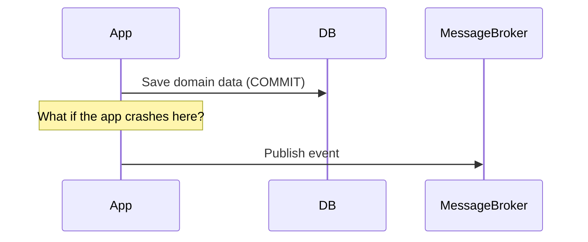
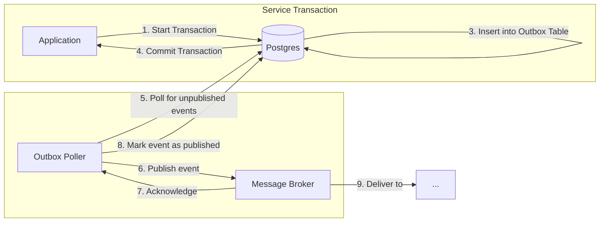

# Summary of Outbox Pattern for Reliable Event-Driven Architecture

This document summarizes the design discussion regarding the implementation of a reliable event publishing mechanism using the Outbox Pattern.

## The Challenge: Ensuring Consistency Across Services

In our event-driven architecture, we need to update our primary Postgres database and publish an event to notify other services of the change. Performing these two actions separately (a "dual write") creates a consistency risk: one might succeed while the other fails, leaving the system in an inconsistent state.

## The Solution: The Outbox Pattern

The Outbox Pattern solves this by making the event part of the main database transaction.

1.  **Atomicity:** The application saves both the domain data and the event data in the same database transaction. The event is written to a dedicated `outbox_event` table.
2.  **Reliable Publishing:** A separate, asynchronous process (the "poller") reads events from the outbox table and reliably publishes them to a message broker (like SQS or EventBridge).
3.  **State Tracking:** The poller updates the event's status in the outbox table upon successful publication, preventing duplicate sends.

### High-Level Flow

## Pros and Cons of the Outbox Pattern

| Pros | Cons |
| :--- | :--- |
| **Guaranteed Atomicity:** Events are created if and only if the business transaction succeeds. No lost events. | **Increased Complexity:** Requires an outbox table, a poller process, and logic to prevent duplicate publishing. |
| **Increased System Resilience:** The message broker can be down without affecting the primary application's ability to process transactions. | **Eventual Consistency:** Events are not published in real-time. There is a delay (latency) introduced by the polling interval. |
| **Single Source of Truth:** The database remains the single source of truth for both state and outgoing events. | **Requires Careful Implementation:** The poller must be robust, handling concurrency (`SKIP LOCKED`) and failures gracefully. |

## Recommendations for Implementation

1.  **Start with an Embedded Poller:** For initial simplicity, the poller can be implemented within the existing Spring Boot application using `@Scheduled`. This avoids the overhead of a separate service.
2.  **Plan for Gradual Adoption:** The pattern can be introduced for new events first. Existing Postgres tables will continue to serve as the projection of the current state.
3.  **Use Feature Toggles (Spring Profiles):** Use profiles (`local`, `dev`, `prod`) to toggle between local (LocalStack) and cloud (AWS) resources for S3, DynamoDB, and SQS. This is crucial for local development and testing.
4.  **Design for Extraction:** The embedded poller logic should be well-encapsulated. This makes it easier to extract into a separate microservice or a serverless function (e.g., AWS Lambda) if the polling workload becomes a performance concern or requires independent scaling.

By adopting the Outbox Pattern, we can build a robust and reliable event-driven system that guarantees data consistency between our services.

